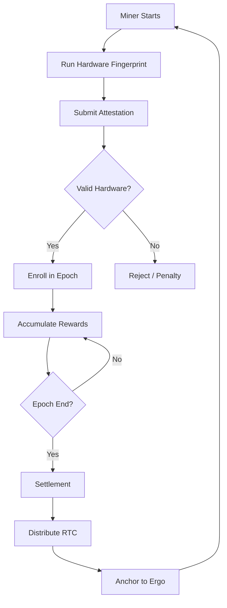
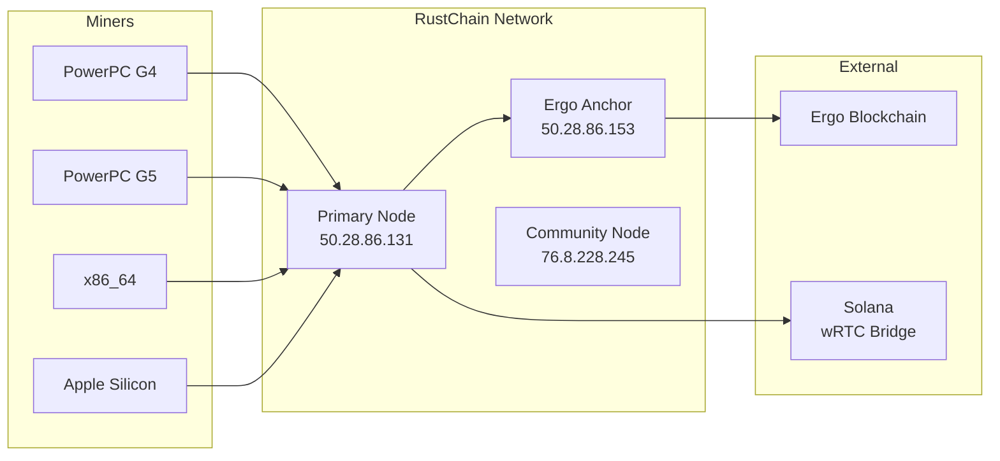

# System Architecture

RustChain is a memory-preservation blockchain built on Proof-of-Antiquity consensus. This document covers the protocol design, network topology, consensus flow, and security model.

---

## High-Level Overview

RustChain validates and rewards miners based on three pillars:

1. **Hardware authenticity** -- cryptographic fingerprinting proves real silicon
2. **Hardware age** -- antiquity multipliers reward vintage equipment
3. **Fair consensus** -- 1 CPU = 1 vote, regardless of speed or cores

---

## RIP-200 Consensus Flow



### Epoch System

- **Duration**: ~24 hours (144 slots of 10 minutes each)
- **Reward Pool**: 1.5 RTC per epoch
- **Distribution**: Proportional to antiquity multipliers
- **Settlement**: Anchored to the Ergo blockchain for immutability

---

## Hardware Fingerprinting (RIP-PoA)

Six cryptographic checks verify that miners run on real physical hardware:

```
+-------------------------------------------------------------+
|                   6 Hardware Checks                         |
+-------------------------------------------------------------+
| 1. Clock-Skew & Oscillator Drift   <- Silicon aging pattern |
| 2. Cache Timing Fingerprint        <- L1/L2/L3 latency     |
| 3. SIMD Unit Identity              <- AltiVec/SSE/NEON bias |
| 4. Thermal Drift Entropy           <- Heat curves unique    |
| 5. Instruction Path Jitter         <- Microarch jitter map  |
| 6. Anti-Emulation Checks           <- Detect VMs/emulators  |
+-------------------------------------------------------------+
```

Results are packaged in `proof_of_antiquity.json`, signed with Ed25519, and submitted to the chain.

### Anti-Emulation Detection

VMs and emulators fail fingerprint checks due to:

- **Clock Virtualization Artifacts** -- host clock passthrough is too perfect
- **Simplified Cache Models** -- emulators flatten cache hierarchy
- **Missing Thermal Sensors** -- VMs report static or host temperatures
- **Deterministic Execution** -- real silicon has nanosecond-scale jitter

Detected emulators receive a **1 billionth** reward penalty (0.0000000025x multiplier).

---

## Network Topology



### Live Nodes

| Node | IP | Role | Status |
|------|----|------|--------|
| Node 1 | 50.28.86.131 | Primary + Explorer | Active |
| Node 2 | 50.28.86.153 | Ergo Anchor | Active |
| Node 3 | 76.8.228.245 | Community | Active |

---

## Block Structure

Each block contains:

- **Validator ID** -- wallet from Ergo backend
- **BIOS Timestamp** -- hardware age + entropy duration
- **NFT Unlocks** -- badge metadata
- **Lore Metadata** -- optional attached data
- **Score Metadata** -- for leaderboard and faucet access

---

## Ergo Blockchain Anchoring

RustChain periodically anchors state to the Ergo blockchain for cryptographic immutability:

```
RustChain Epoch -> Commitment Hash -> Ergo Transaction (R4 register)
```

This provides external proof that RustChain state existed at a specific point in time, independent of RustChain's own validators.

---

## Token Emission

| Parameter | Value |
|-----------|-------|
| Total Supply | 8,000,000 RTC |
| Block Reward | 1.5 RTC per epoch |
| Premine | 75,000 RTC (dev/bounty fund) |
| Halving | Every 2 years or epoch milestone |
| Annual Inflation | ~0.68% (decreasing) |

---

## wRTC Bridge (Solana)

RTC is bridged to Solana as **wRTC** via the BoTTube Bridge:

- **Token Mint**: `12TAdKXxcGf6oCv4rqDz2NkgxjyHq6HQKoxKZYGf5i4X`
- **DEX**: Raydium
- **Bridge Operator**: BoTTube

### wRTC on Coinbase Base

wRTC is also available on Coinbase Base for agent-to-agent payments:

- **Contract**: `0x5683C10596AaA09AD7F4eF13CAB94b9b74A669c6`
- **DEX**: Aerodrome Finance
- **Protocol**: x402 (HTTP 402 Payment Required)

---

## Security Model

### Sybil Resistance

- **Hardware Binding**: Each physical CPU maps to exactly one wallet
- **Fingerprint Uniqueness**: Silicon aging patterns cannot be cloned
- **Economic Disincentive**: Vintage hardware is expensive and scarce

### Cryptographic Security

- **Signatures**: Ed25519 for all transactions and attestations
- **Wallet Format**: Simple UTF-8 identifiers (e.g., `scott`, `pffs1802`)
- **Replay Protection**: Unix timestamps on all signed payloads

### Governance Security

- Proposals require > 10 RTC balance to create
- Votes require active miner status and Ed25519 signature
- Vote weight: `1 RTC = 1 base vote` x antiquity multiplier
- 7-day voting period with pass condition: `yes_weight > no_weight`

---

## Repository Structure

```
Rustchain/
+-- install-miner.sh                    # Universal miner installer
+-- node/
|   +-- rustchain_v2_integrated_*.py    # Full node implementation
|   +-- fingerprint_checks.py           # Hardware verification
+-- miners/
|   +-- linux/rustchain_linux_miner.py  # Linux miner
|   +-- macos/rustchain_mac_miner_*.py  # macOS miner
+-- docs/
|   +-- RustChain_Whitepaper_*.pdf      # Technical whitepaper
|   +-- chain_architecture.md           # Architecture details
+-- tools/
|   +-- validator_core.py               # Block validation
+-- bridge/                             # Solana bridge components
+-- contracts/                          # Smart contracts
+-- sdk/                                # SDK libraries
+-- nfts/                               # Badge definitions
+-- explorer/                           # Block explorer frontend
```

---

## Design Goals

- Keep validator requirements low (Pentium III or older can participate)
- Preserve retro OS compatibility (Mac OS X Tiger, DOS)
- Limit bloat via badge logs and off-chain metadata anchors
- Democratic consensus where money cannot buy votes

---

## Related Protocols

| RIP | Name | Description |
|-----|------|-------------|
| RIP-200 | 1 CPU = 1 Vote | Round-robin consensus protocol |
| RIP-PoA | Proof-of-Antiquity | Hardware fingerprinting specification |
| RIP-302 | Agent Economy | AI agent wallet and reputation system |
| RIP-305 | Cross-Chain Airdrop | Multi-chain token distribution |
