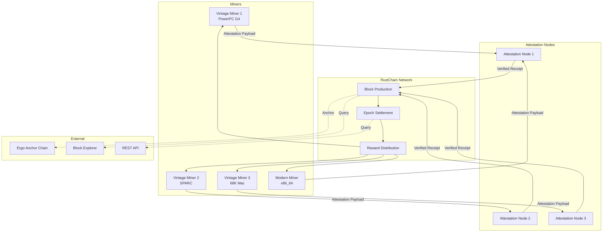
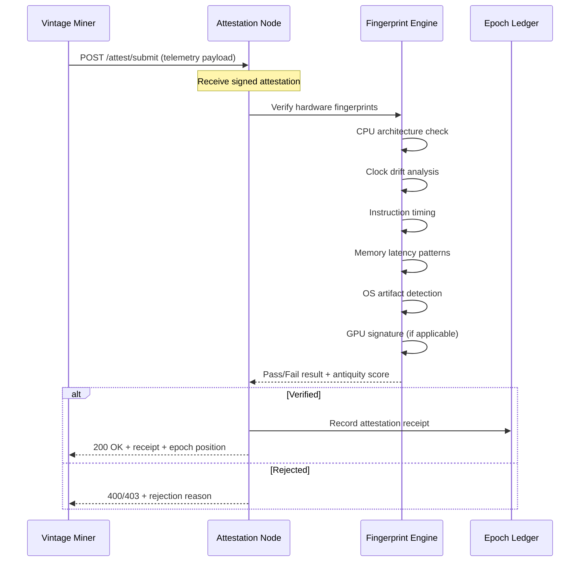
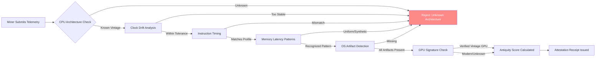
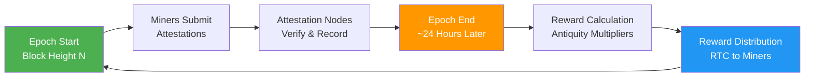

# RustChain Architecture Overview

> A comprehensive guide to the RustChain protocol architecture, consensus mechanism, attestation flow, hardware fingerprinting, and network topology.

**Part of the [Documentation Sprint #72](https://github.com/Scottcjn/rustchain-bounties/issues/72)**

---

## Table of Contents

1. [Protocol Overview](#1-protocol-overview)
2. [RIP-200: Proof of Antiquity Consensus](#2-rip-200-proof-of-antiquity-consensus)
3. [System Architecture](#3-system-architecture)
4. [Network Architecture & P2P Protocol](#4-network-architecture--p2p-protocol)
5. [Attestation Flow](#5-attestation-flow)
6. [Hardware Fingerprinting](#6-hardware-fingerprinting)
7. [Epoch Settlement & Rewards](#7-epoch-settlement--rewards)
8. [Token Economics](#8-token-economics)
9. [Vintage Mining](#9-vintage-mining)
10. [Comparison with Proof-of-Stake](#10-comparison-with-proof-of-stake)
11. [Glossary](#11-glossary)

---

## 1. Protocol Overview

RustChain is a **Proof-of-Antiquity** blockchain that rewards real vintage hardware with higher mining multipliers than modern machines. The network uses **6+ hardware fingerprint checks** to prevent VMs and emulators from earning rewards. There are currently 9 active miners and 3 attestation nodes. The native token is **RTC (RustChain Token)**.

### Key Properties
- **Total Supply:** 8.3M RTC
- **Consensus:** RIP-200 (Proof of Antiquity)
- **Block Time:** ~60 seconds
- **Epoch Duration:** ~24 hours
- **Native Token:** RTC
- **Anchor Chain:** Ergo (for cross-chain bridge)
- **Reference Rate:** 1 RTC = $0.10 USD

### Live Network
- **Node Health:** `curl -sk https://50.28.86.131/health`
- **Active Miners:** `curl -sk https://50.28.86.131/api/miners`
- **Block Explorer:** `https://50.28.86.131/explorer`

---

## 2. RIP-200: Proof of Antiquity Consensus

RIP-200 (RustChain Improvement Proposal 200) defines the Proof of Antiquity consensus mechanism. Unlike Proof of Work (computational waste) or Proof of Stake (capital-weighted), Proof of Antiquity rewards **real vintage hardware** based on verifiable age and authenticity.

### Core Principles
1. **Age-Based Multipliers:** Older hardware earns higher rewards per epoch
2. **Anti-Emulation:** 6+ fingerprint checks prevent VM/fake submissions
3. **Attestation-Gated:** Only attested miners receive settlement rewards
4. **Fair Distribution:** No pre-mine, no VC allocation

### Consensus Flow
1. Miners perform work cycles and collect hardware telemetry
2. Miners submit **attestation payloads** to attestation nodes
3. Attestation nodes verify hardware fingerprints (CPU, GPU, OS, etc.)
4. Verified attestation receipts are included in blocks
5. At epoch boundary, rewards are calculated and distributed based on antiquity multipliers

---

## 3. System Architecture

### High-Level Architecture Diagram



### Component Roles

| Component | Role | Quantity |
|-----------|------|----------|
| **Vintage Miner** | Performs mining work, submits attestation payloads | 9 active |
| **Attestation Node** | Verifies hardware fingerprints, issues receipts | 3 active |
| **Block Producer** | Creates blocks from verified attestations | Network |
| **Epoch Settlement** | Calculates and distributes rewards every ~24h | Protocol |
| **Ergo Bridge** | Cross-chain anchoring for wRTC on Solana | External |

---

## 4. Network Architecture & P2P Protocol

### Network Topology

RustChain uses a peer-to-peer network where miners connect to attestation nodes, and attestation nodes communicate with each other for consensus.

### P2P Protocol

Miners communicate with attestation nodes via HTTP/HTTPS REST API. The protocol supports:

- **Attestation Submission:** POST `/attest/submit` with signed hardware telemetry
- **Status Queries:** GET endpoints for epoch, miner status, network health
- **WebSocket Feed:** Real-time block and epoch event streaming

### Node Discovery
- Boot nodes are configured at startup
- Peer lists are exchanged via `/api/peers` endpoint
- Connection persistence with keepalive

### Message Types
1. **Attestation Payload:** Miner → Node (hardware telemetry + signature)
2. **Attestation Receipt:** Node → Miner (verified result)
3. **Block Announcement:** Node → Peers (new block notification)
4. **Epoch Settlement:** Network-wide (reward calculation event)

---

## 5. Attestation Flow

The attestation process is the core mechanism that validates real hardware and prevents emulation.

### Attestation Flow Diagram



### Attestation Payload Structure

```json
{
  "miner_id": "miner-pubkey-ed25519",
  "epoch": 1234,
  "hardware": {
    "cpu_arch": "ppc",
    "cpu_model": "PowerPC G4 7447A",
    "os": "Linux",
    "fingerprint_hash": "sha256-hash-of-hw-telemetry"
  },
  "work": {
    "cycles_completed": 50000,
    "timestamp_start": 1716800000,
    "timestamp_end": 1716803600
  },
  "signature": "ed25519-signature-of-payload"
}
```

### Rejection Reasons
- **Clock drift too high** — suggests VM/emulator
- **Instruction timing inconsistent** — not matching claimed CPU
- **Memory latency pattern unknown** — unrecognized hardware profile
- **OS artifacts missing** — required system files not present
- **Signature invalid** — tampered or replayed payload

---

## 6. Hardware Fingerprinting

### The 6+1 Fingerprint Checks

RustChain uses a multi-layered fingerprinting system to verify that mining hardware is genuine vintage equipment, not a VM or emulator.

### Fingerprint Pipeline



### Check Details

| # | Check | What It Detects | Vintage Indicator |
|---|-------|-----------------|-------------------|
| 1 | **CPU Architecture** | Claims of unsupported arch | PowerPC, SPARC, 68K, PA-RISC |
| 2 | **Clock Drift** | Perfect clock = VM | Real hardware has micro-drift |
| 3 | **Instruction Timing** | Emulator timing patterns | Vintage CPU has unique timing profile |
| 4 | **Memory Latency** | Synthetic memory patterns | Real RAM has variable latency |
| 5 | **OS Artifacts** | Missing system indicators | Vintage OS leaves specific traces |
| 6 | **GPU Signature** | Modern GPU on old system | Vintage GPU has unique identifiers |
| +1 | **Composite Score** | Combined analysis | Overall antiquity confidence |

### Supported Architectures (15+)
- **PowerPC:** G3, G4, G4+, G5, POWER8, POWER9
- **SPARC:** SPARCv8, SPARCv9
- **68K:** Motorola 68020, 68030, 68040, 68060
- **x86:** Legacy (Pentium, 486) — lower multiplier but supported
- **ARM:** Legacy ARM9, ARM11
- **MIPS:** R3000, R4000
- **PA-RISC:** PA-7100, PA-8000
- **Alpha:** EV5, EV6

---

## 7. Epoch Settlement & Rewards

### Epoch Lifecycle



### Settlement Process
1. **Epoch begins** at a defined block height
2. **Miners submit** attestation payloads throughout the epoch
3. **Attestation nodes verify** each submission against fingerprint criteria
4. **Verified receipts** are recorded in the epoch ledger
5. **At epoch end**, the protocol calculates rewards:
   - Base reward per work cycle
   - Antiquity multiplier based on verified hardware age
   - Deductions for failed attestations
6. **Rewards distributed** to miner wallets automatically

### Antiquity Multipliers

| Hardware Era | Example | Approximate Multiplier |
|-------------|---------|----------------------|
| **1980s** | 68020, SPARCstation 1 | 10x - 20x |
| **1990s** | PowerPC 604, Pentium | 5x - 10x |
| **2000s** | PowerPC G4, Athlon | 2x - 5x |
| **2010s** | x86_64 server | 1x - 2x |
| **Modern** | Latest CPU/GPU | 0.5x - 1x |

---

## 8. Token Economics

### RTC Token

| Property | Value |
|----------|-------|
| **Name** | RustChain Token |
| **Symbol** | RTC |
| **Total Supply** | 8.3M |
| **Distribution** | Mining rewards (100%) |
| **Reference Rate** | 1 RTC = $0.10 USD |

### Distribution Model
- **100% to miners** — no pre-mine, no team allocation, no VC
- **Antiquity-weighted** — vintage hardware earns proportionally more
- **Epoch-based** — rewards distributed every ~24 hours
- **Declining emission** — total supply capped at 8.3M

### Cross-Chain Bridge (wRTC)
- **Bridge Type:** RustChain ↔ Solana via Ergo anchor
- **Wrapped Token:** wRTC on Solana
- **Lock Mechanism:** RTC locked on RustChain → wRTC minted on Solana

---

## 9. Vintage Mining

### Why Vintage Hardware?

Vintage mining is the core innovation of RustChain. By rewarding old hardware more than new, the protocol:

1. **Reduces energy waste** — no incentive for hash rate races
2. **Preserves computing history** — gives old machines economic purpose
3. **Democratizes mining** — cheap/old hardware is competitive
4. **Prevents centralization** — modern data centers have no advantage

### Getting Started
1. Find vintage hardware (eBay, surplus stores, donations)
2. Install RustChain miner software
3. Configure wallet address
4. Connect to attestation node
5. Submit attestations and earn RTC

### Supported Miner Configurations
- **Native:** Run directly on vintage hardware
- **Cross-compiled:** Build on modern machine, deploy to vintage target
- **Remote attestation:** Hardware telemetry collected remotely

---

## 10. Comparison with Proof-of-Stake

| Aspect | Proof-of-Stake (Ethereum) | Proof-of-Antiquity (RustChain) |
|--------|--------------------------|-------------------------------|
| **Resource** | Capital (staked ETH) | Vintage hardware |
| **Energy** | Low | Low |
| **Centralization Risk** | High (whale dominance) | Low (hardware diversity) |
| **Barrier to Entry** | High ($$$ to stake) | Low (cheap vintage HW) |
| **Security Model** | Economic finality | Hardware attestation + consensus |
| **Reward Distribution** | Proportional to stake | Proportional to antiquity |
| **Environmental Impact** | Low | Very low (reuses old HW) |

---

## 11. Glossary

| Term | Definition |
|------|-----------|
| **RIP-200** | RustChain Improvement Proposal 200 — defines Proof of Antiquity consensus |
| **Attestation** | The process of verifying hardware authenticity via fingerprint checks |
| **Attestation Node** | A network node that receives and verifies miner attestations |
| **Attestation Payload** | Data submitted by miners containing hardware telemetry and work proof |
| **Attestation Receipt** | Verification result issued by an attestation node |
| **Antiquity Multiplier** | Reward multiplier based on verified hardware age |
| **Epoch** | A ~24-hour period after which rewards are calculated and distributed |
| **Epoch Settlement** | The process of calculating and distributing rewards at epoch end |
| **Fingerprint Hash** | Cryptographic hash of hardware telemetry used for verification |
| **Lock Ledger** | Tracks locked RTC for bridge operations |
| **PSE** | Proof of Signed Epoch — epoch verification mechanism |
| **RTC** | RustChain Token — the native cryptocurrency |
| **wRTC** | Wrapped RTC on Solana (via cross-chain bridge) |
| **Vintage Hardware** | Computing equipment from pre-2010 era, eligible for higher multipliers |
| **x402** | HTTP payment protocol integration for premium features |

---

## Related Documentation

- [Protocol Specification](docs/PROTOCOL.md) — Detailed RIP-200 protocol spec
- [Quick Start](docs/QUICKSTART.md) — Get mining in 5 minutes
- [API Reference](docs/API_REFERENCE.md) — Complete REST API docs
- [Miner Setup Guide](docs/INSTALLATION_WALKTHROUGH.md) — Detailed installation guide
- [Console Mining Setup](docs/CONSOLE_MINING_SETUP.md) — Mining via console
- [Hardware Fingerprinting](docs/hardware-fingerprinting.md) — Deep dive into fingerprint checks
- [Bridge API](docs/bridge-api.md) — Cross-chain bridge endpoints
- [Wallet Setup](docs/WALLET_SETUP.md) — Configure your wallet
- [Contributing](docs/CONTRIBUTING.md) — How to contribute to RustChain

---

*Last updated: 2026-05-27 | Part of [Documentation Sprint #72](https://github.com/Scottcjn/rustchain-bounties/issues/72)*