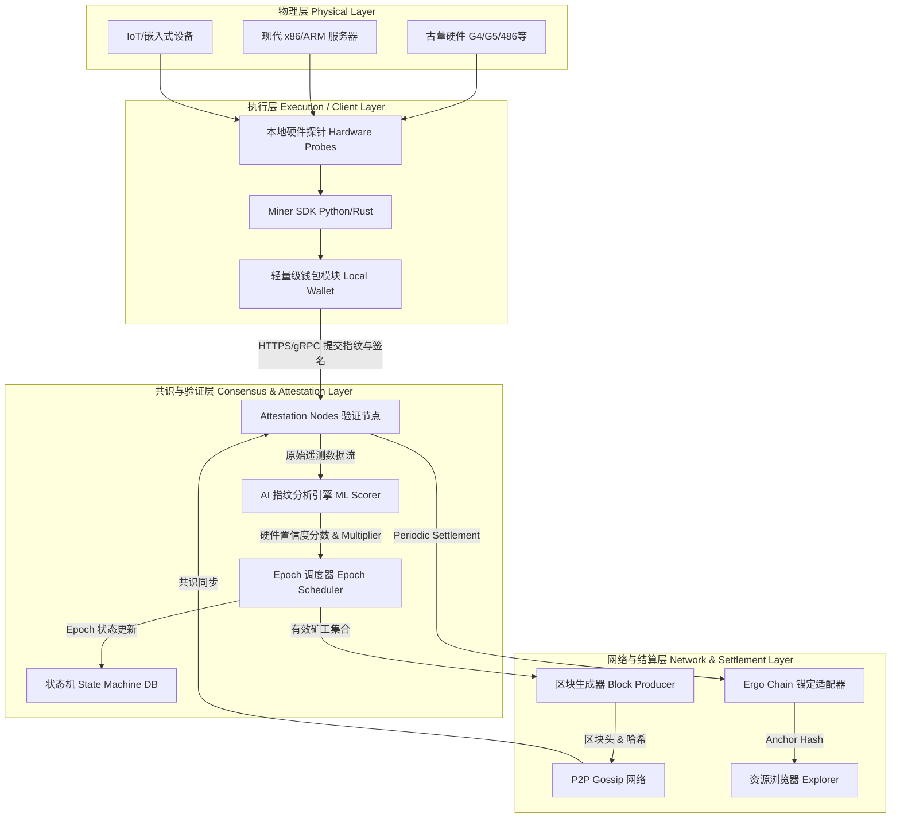

# ARCHITECTURE_OVERVIEW.md

# 🏗️ RustChain 架构概览

本文档为 `RustChain` 项目的系统级架构说明，涵盖整体分层设计、共识机制、硬件指纹验证引擎、节点网络拓扑、核心数据流及组件交互关系。架构设计遵循现代区块链分层原则（执行层、共识层、结算层、数据层），并针对 DePIN（去中心化物理基础设施网络）与古董硬件验证场景进行了深度定制。

---

## 1. 系统整体架构

RustChain 采用 **混合分层架构**，将物理硬件验证、共识排序、状态管理与跨链结算解耦，确保高扩展性与抗女巫攻击能力。



**架构说明**：
- **物理层**：真实硅基设备，包含各类 vintage 硬件与现代算力节点。系统通过底层探针直接采集硬件遥测信号，杜绝虚拟化中间层干扰。
- **执行层**：由轻量级 Miner SDK 构成，负责本地硬件探针调用、非对称加密签名、交易打包与本地状态缓存。支持 Python（快速部署）与 Rust（高性能核心）双版本。
- **共识与验证层**：Attestation 节点承担网络准入与 Epoch 结算职责。AI 指纹引擎对时间序列数据进行推理，输出 `Antiquity Score`。Epoch 调度器维护 144 Slot 生命周期与奖励分配池。
- **网络与结算层**：P2P 网络负责区块与交易广播；区块生成器按权重聚合有效证明；Ergo 锚定模块提供最终性与抗审查保障；资源浏览器对外提供链上查询 API。

---

## 2. 共识机制详解：RIP-200 (Proof of Antiquity)

RustChain 摒弃传统算力堆叠的 PoW 与权益质押的 PoS，采用 **RIP-200（RustChain Iterative Protocol）** 共识。其核心哲学为：**1 CPU = 1 Vote，且投票权重与硬件年代成反比**（越古老，权重越高）。

### 2.1 核心设计原则
| 特性 | 说明 |
|------|------|
| **算力脱钩** | 不依赖哈希碰撞速度，避免 ASIC 垄断与能源浪费 |
| **年代加权 (Antiquity Multiplier)** | 基于发布年份、架构稀有度、停产状态计算 `Multiplier`（如 G4=2.5x, G5=2.0x） |
| **Epoch 批次结算** | 每 144 个 Slot 为一个 Epoch（约 24 小时），集中处理指纹验证、权重计算与代币分发 |
| **跨链锚定** | 结算哈希定期锚定至 Ergo Chain，利用其 UTXO 模型与智能合约保障最终性 |

### 2.2 共识状态机
1. **Epoch 启动**：调度器清空上一轮状态，加载最新硬件档案库与权重参数表。
2. **证明提交**：Miner 在每个 Slot 内提交硬件指纹 + 时间戳 + 钱包签名。
3. **准入校验**：Attestation 节点验证签名合法性、指纹置信度阈值、防重放攻击。
4. **集合打包**：Slot 结束时，有效 Miner 列表被写入区块头，按 `Reward = Base_Pot * Multiplier * Uptime` 分配。
5. **结算与锚定**：Epoch 结束生成 `Epoch Settlement Hash`，推送至 Ergo 链上合约完成跨链记录，并向矿工钱包发放 RTC 代币。

---

## 3. 硬件指纹与 AI 验证系统

硬件指纹是 RIP-200 的核心安全基座。系统通过 **6 维硬件遥测检查** 构建唯一的“硅基 DNA”，结合轻量级机器学习模型实现 AI 增强型真实性证明。

| 序号 | 检查维度 | 技术原理 | 反 VM/模拟器检测逻辑 |
|:---:|:---|:---|:---|
| 1 | **时钟偏移 (Clock Skew)** | 测量晶振物理频率偏差与漂移曲线 | VM 继承宿主机完美时钟，缺乏微观漂移特征 |
| 2 | **缓存时序 (Cache Timing)** | L1/L2 读写延迟分布与命中率曲线 | 模拟器通常扁平化缓存层级，时序呈均匀分布 |
| 3 | **SIMD 指令特征 (SIMD Identity)** | AltiVec/SSE/NEON 执行周期与寄存器溢出模式 | 不同架构模拟需指令翻译，时序抖动异常 |
| 4 | **热力学熵 (Thermal Entropy)** | 负载下的 CPU 温度爬升速率与散热衰减曲线 | VM 无法生成真实物理热传导模型，温度常为静态或线性 |
| 5 | **指令抖动 (Instruction Jitter)** | 微码执行间隔、分支预测失败率、流水线停顿 | 仿真层引入固定开销抖动，与物理芯片随机噪声不符 |
| 6 | **DMI/总线签名 (System Bus & DMI)** | BIOS/UEFI 序列号、主板总线握手特征、`dmidecode` 底层字段 | 虚拟化环境 DMI 字段常为占位符或缺失底层总线拓扑 |

### AI 增强分析引擎
- **输入**：原始遥测时间序列（高频采样，~100Hz）
- **处理**：特征提取（FFT、小波变换、统计矩） → 预训练分类器（LightGBM/ONNX 轻量模型）
- **输出**：`Confidence Score [0.0-1.0]` + `Hardware Class ID` + `Antiquity Multiplier`
- **策略**：仅当 `Confidence Score > 0.92` 且匹配已知物理档案库时，才允许进入 Epoch 结算池。

---

## 4. 节点网络拓扑结构

RustChain 采用 **角色分离型拓扑**，兼顾去中心化与验证效率：

```
                          ┌─────────────────┐
                          │  Ergo Anchor    │
                          │ (L1 Settlement) │
                          └────────┬────────┘
                                   │ HTTPS/WebSocket
                          ┌────────▼────────┐
                          │ Attestation     │
                          │ Nodes (Validators) │
                          └───────┬─────────┘
                   ┌──────────────┼──────────────┐
                   │ P2P Gossip  │  RPC/Attest   │ P2P Sync
          ┌────────▼────────┐ ┌─▼──────────────┐ ┌─▼──────────────┐
          │  Miner Nodes    │ │ Archive/State  │ │ Explorer/API   │
          │ (Bare-metal)    │ │ Nodes          │ │ Nodes          │
          └─────────────────┘ └────────────────┘ └────────────────┘
```

| 节点类型 | 职责 | 硬件要求 | 网络通信 |
|:---|:---|:---|:---|
| **Miner (物理节点)** | 运行探针、采集遥测、生成证明、接收奖励 | 目标硬件本身（G4/486/现代机） | `POST /attest/submit` 至 Attestation 节点 |
| **Attestation (验证节点)** | 运行 AI 指纹引擎、Epoch 调度、区块签名、维护状态树 | 高性能 x86 服务器、16GB+ RAM | P2P 区块广播 + REST API 接收矿工提交 |
| **Archive (归档节点)** | 全量区块存储、历史 Epoch 快照、状态树同步 | SSD 1TB+，稳定网络 | Gossip 订阅 + 定期 Merkle 树校验 |
| **Explorer/API 节点** | 提供链上查询、硬件排行榜、DePIN 统计 | 负载均衡后端、CDN 加速 | 只读 RPC、GraphQL/REST 暴露 |

---

## 5. 核心数据流图 (Data Flow)

以下序列图展示从矿工启动到跨链结算的完整生命周期数据流：

```mermaid
sequenceDiagram
    participant Miner as Miner Client
    local as Local Probes
    participant Net as Attestation Node
    participant AI as AI Fingerprint Engine
    participant Epoch as Epoch Scheduler
    participant Ergo as Ergo Chain
    
    Miner->>local: 初始化探针模块
    local-->>Miner: 返回原始遥测流 (Clock, Cache, Thermal...)
    Miner->>Miner: 聚合 6 维数据 + 本地时间戳
    Miner->>Miner: 使用钱包私钥签名 (Ed25519)
    Miner->>Net: POST /attest/submit {fingerprint, sig, pubkey}
    
    Net->>Net: 验签 & 防重放检查
    alt 签名无效或过期
        Net-->>Miner: 401 Unauthorized
    end
    
    Net->>AI: 推送遥测时间序列
    AI->>AI: 特征提取 & 模型推理
    AI-->>Net: {score: 0.98, class: PowerBook_G4, multiplier: 2.5}
    
    Net->>Net: 与已知物理档案库比对 (Anti-VM Check)
    alt 置信度不足或疑似 VM
        Net-->>Miner: {error: "VM_DETECTED", code: 403}
    end
    
    Net->>Epoch: 注册至当前 Epoch Slot
    Epoch->>Net: {enrolled: true, reward_pool_share: calculated}
    Note over Epoch: Epoch 满 144 Slots
    Epoch->>Epoch: 计算各 Miner 奖励 (Base * Multiplier * Uptime)
    Epoch->>Net: 生成 Epoch 结算哈希
    Net->>Ergo: 提交锚定交易 (Anchor TX)
    Ergo-->>Net: 返回区块高度 & 交易回执
    Net->>Miner: 广播 Epoch 结算块 & 更新 RTC 余额
    Miner->>Miner: 本地钱包余额更新 & 日志归档
```

---

## 6. 组件交互关系

系统内部模块通过定义清晰的接口契约进行通信，关键交互路径如下：

| 组件对 | 通信协议 | 数据格式 | 核心交互内容 |
|:---|:---|:---|:---|
| **Miner ↔ 探针模块** | C-FFI / Python `ctypes` | Struct/Packed Bytes | 读取 MSR 寄存器、温度传感器、CPUID、RDTSC 时间戳 |
| **Miner ↔ Attestation Node** | HTTPS REST + gRPC | JSON / Protobuf | 提交签名证明、获取 Epoch 状态、接收奖励分发通知 |
| **Attestation Node ↔ AI Engine** | 本地 IPC / ZeroMQ | NDArray / Tensor | 流式传输遥测数据、返回置信度评分与硬件分类标签 |
| **Attestation Node ↔ 状态机 DB** | RocksDB / SQLite | LevelDB Key-Value | 存储 Epoch 矿工集合、权重快照、Merkle 树根、交易池 |
| **Attestation Node ↔ P2P 网络** | libp2p / TCP / QUIC | Binary Block/Msg | 广播区块头、同步状态树、处理邻居节点发现与心跳 |
| **Attestation Node ↔ Ergo 适配器** | REST API / Node RPC | JSON-RPC | 构造锚定交易、签名提交、查询确认状态、处理 Gas 费 |
| **Wallet SDK ↔ Miner** | 本地 Keystore | Encrypted JSON / BIP32 | 管理密钥派生、交易签名、余额追踪、助记词恢复 |

**状态管理设计**：
- 采用 **Merkle-Patricia Tries** 维护 Epoch 内矿工状态，确保可验证性与轻量级同步。
- 历史 Epoch 数据压缩归档，仅保留根哈希与关键审计轨迹，满足 DePIN 透明化要求。

---

## 7. 安全与反作弊架构

1. **防虚拟化与云实例滥用**：
   - Docker/VM 环境默认标记为 `Reduced Reward` 模式（通过 `MINER_TYPE` 环境变量区分）。
   - AI 引擎针对容器化环境（cgroups 限制、虚拟网络设备、共享内核时钟）建立黑名单特征库。
2. **抗女巫攻击 (Sybil Resistance)**：
   - `1 CPU = 1 Vote` 结合物理指纹唯一性，使批量创建虚假节点成本极高。
   - 钱包地址与硬件 DNA 绑定，同一指纹不可重复注册至不同 Epoch。
3. **密码学保障**：
   - 矿工证明使用 Ed25519 签名，时间戳防重放。
   - 区块哈希链式关联，Ergo 锚定提供不可篡改的最终性证明。
4. **降级与容错**：
   - 若 AI 引擎模型漂移，节点可回退至确定性阈值校验模式。
   - Epoch 结算失败时，自动延长至下一 Slot，保证网络活性不中断。

---

## 8. 部署架构与可扩展性

### 8.1 部署模式
- **裸金属部署（推荐）**：直接运行于物理硬件，获取完整 `Antiquity Multiplier`。通过 Systemd 服务管理，支持低资源老旧系统（macOS Tiger, Linux 2.6+）。
- **Docker 容器化**：提供 `Dockerfile.miner`，适用于现代硬件测试、CI/CD 集成与边缘网关部署。自动识别环境并应用奖励衰减系数。
- **边缘计算集成**：支持树莓派、老式 NAS、工控机作为轻量级矿工，通过 MQTT 桥接上传遥测数据。

### 8.2 扩展性规划
- **分片验证 (Sharding)**：未来引入地理/架构分片，将 AI 推理负载分散至区域 Attestation 集群。
- **硬件档案库 DAO 治理**：社区可通过链上提案提交新硬件指纹参数与权重，由多签节点审核后热更新。
- **跨链互操作**：除 Ergo 外，预留 Polkadot/Cosmos IBC 适配接口，支持多链资产桥接与 DePIN 信用流转。

---

> 📜 **架构版本**：`v1.2.0` | **最后更新**：`2026-04` | **规范依据**：`PROTOCOL.md`, `RustChain_Whitepaper_Flameholder_v0.97.pdf`, `DOI: 10.5281/zenodo.19442753`  
> 本架构文档随协议迭代持续演进。贡献者请参考 `CONTRIBUTING.md` 提交 RFC。