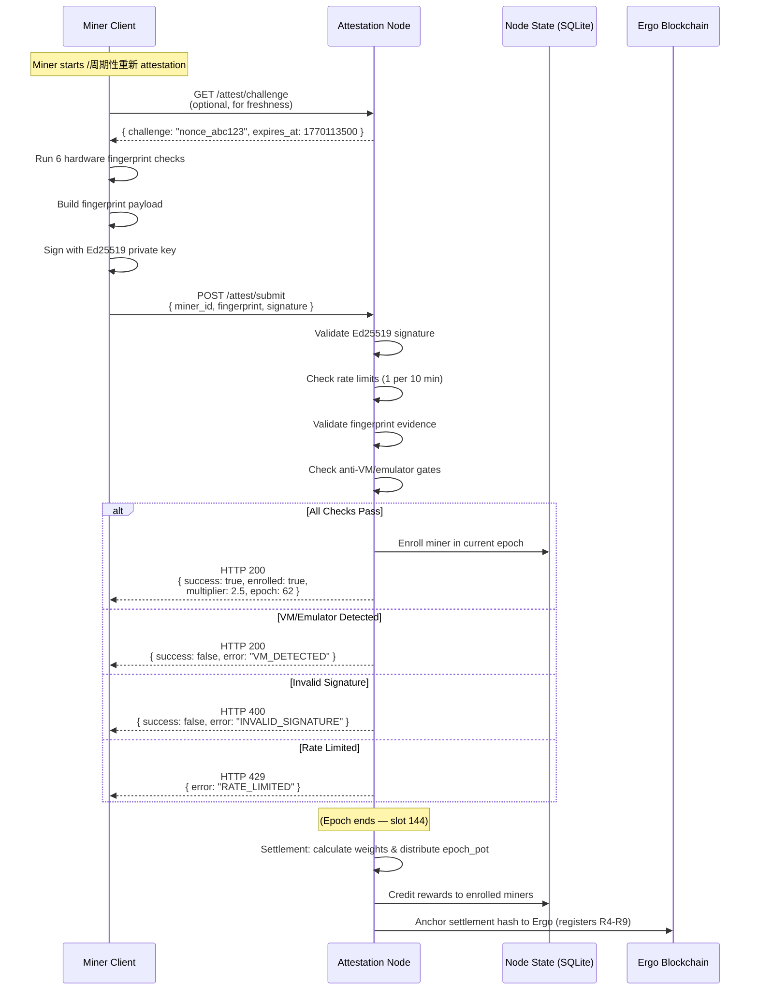
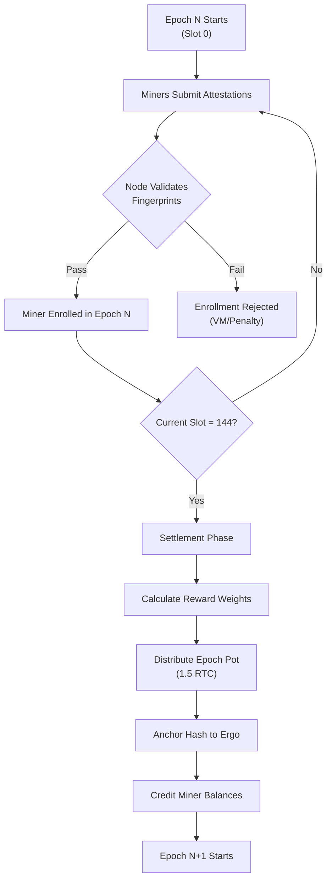
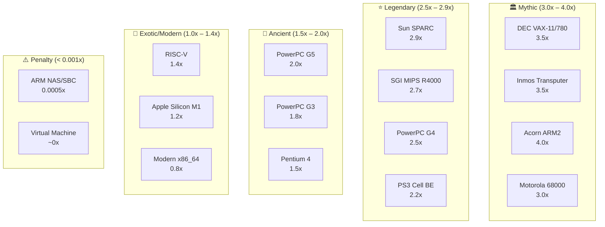
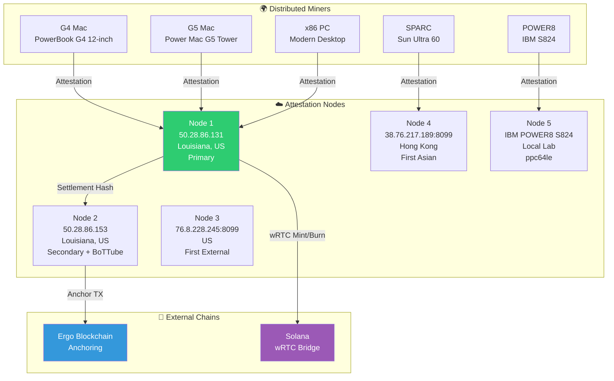
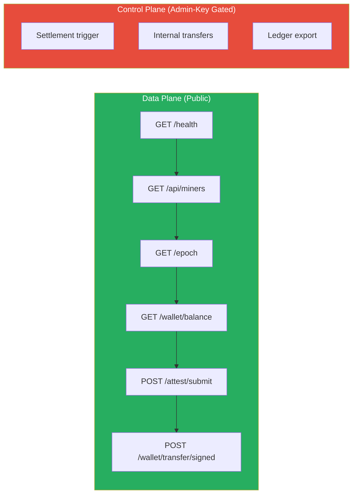

# RustChain Protocol Specification v2.0

**Version:** 2.2.1-rip200  
**Last Updated:** 2026-03-31  
**Consensus:** RIP-200 (RustChain Iterative Protocol — Proof-of-Antiquity)

---

## Table of Contents

1. [Overview](#1-overview)
2. [RIP-200 Consensus Mechanism](#2-rip-200-consensus-mechanism)
3. [Attestation Flow](#3-attestation-flow)
4. [Epoch Settlement](#4-epoch-settlement)
5. [Hardware Fingerprinting](#5-hardware-fingerprinting)
6. [Token Economics](#6-token-economics)
7. [Network Architecture](#7-network-architecture)
8. [API Reference](#8-api-reference)
9. [Glossary](#9-glossary)

---

## 1. Overview

RustChain is a **Proof-of-Antiquity (PoA)** blockchain that rewards real, vintage hardware for continued operation. Unlike Proof-of-Work chains that reward raw compute power, or Proof-of-Stake chains that reward token ownership, RustChain's scarce resource is **verifiable physical hardware age**.

The core principle is **1 CPU = 1 vote**, weighted by hardware antiquity. Older machines earn higher multipliers because keeping them alive prevents manufacturing emissions and e-waste.

| Property | Value |
|----------|-------|
| Native Token | RTC (RustChain Token) |
| Consensus | RIP-200 (Proof-of-Antiquity) |
| Epoch Duration | ~24 hours (144 slots, 10 min/slot) |
| Epoch Reward Pot | 1.5 RTC |
| Total Supply | 8,300,000 RTC (fixed) |
| Block Time | ~10 minutes per slot |
| Node Primary | `50.28.86.131` |
| Explorer | `https://50.28.86.131/explorer` |
| Protocol Version | `2.2.1-rip200` |

### Live Network Quick Check

```bash
# Node health
curl -sk https://50.28.86.131/health

# Active miners
curl -sk https://50.28.86.131/api/miners

# Current epoch
curl -sk https://50.28.86.131/epoch
```

> **Note:** The node uses a self-signed TLS certificate. Always use `-k` (or `--insecure`) with `curl` when connecting to `50.28.86.131`.

---

## 2. RIP-200 Consensus Mechanism

### 2.1 Core Concept

RIP-200 (RustChain Iterative Protocol) replaces hashpower with **hardware identity and attestation**. Rather than miners competing to solve a cryptographic puzzle, they compete to prove their physical existence through repeated hardware attestation.

**Key design invariants:**

- **1 CPU = 1 vote** (one enrolled device = one vote per epoch)
- Votes are **weighted by antiquity** (older hardware earns higher multipliers)
- The network runs in **epochs**; rewards are settled at epoch boundaries
- Hardware fingerprinting is the primary Sybil-resistance mechanism

### 2.2 How RIP-200 Differs from Other Consensus Families

| Consensus | Sybil Resistance | Leader Election | Reward Basis |
|----------|-----------------|-----------------|--------------|
| PoW (Bitcoin) | Energy expenditure | Probabilistic (hash race) | Hashrate |
| PoS (Ethereum) | Token stake | Probabilistic (RANDAO) | Validator stake |
| RIP-200 (RustChain) | Hardware attestation | Round-robin enrollment | Antiquity weight |

### 2.3 Deterministic Participation

RIP-200 uses a **round-robin** enrollment model within each epoch. Rather than probabilistic leader election, miner participation is tracked over an epoch and the network deterministically computes distribution and ordering from enrolled identities.

The invariant: **uniqueness of hardware identity matters more than raw throughput.**

---

## 3. Attestation Flow

Attestation is the process by which a miner proves its physical hardware to the network. It is the core security mechanism of RIP-200.

### 3.1 Attestation Sequence Diagram


```mermaid
sequenceDiagram
    participant M as Miner Client
    participant N as Attestation Node
    participant DB as Node State (SQLite)
    participant E as Ergo Blockchain

    Note over M: Miner starts /周期性重新 attestation

    M->>N: GET /attest/challenge<br/>(optional, for freshness)
    N-->>M: { challenge: "nonce_abc123", expires_at: 1770113500 }

    M->>M: Run 6 hardware fingerprint checks
    M->>M: Build fingerprint payload
    M->>M: Sign with Ed25519 private key

    M->>N: POST /attest/submit<br/>{ miner_id, fingerprint, signature }
    N->>N: Validate Ed25519 signature
    N->>N: Check rate limits (1 per 10 min)
    N->>N: Validate fingerprint evidence
    N->>N: Check anti-VM/emulator gates

    alt All Checks Pass
        N->>DB: Enroll miner in current epoch
        N-->>M: HTTP 200<br/>{ success: true, enrolled: true,<br/>multiplier: 2.5, epoch: 62 }
    else VM/Emulator Detected
        N-->>M: HTTP 200<br/>{ success: false, error: "VM_DETECTED" }
    else Invalid Signature
        N-->>M: HTTP 400<br/>{ success: false, error: "INVALID_SIGNATURE" }
    else Rate Limited
        N-->>M: HTTP 429<br/>{ error: "RATE_LIMITED" }
    end

    Note over N: (Epoch ends — slot 144)

    N->>N: Settlement: calculate weights & distribute epoch_pot
    N->>DB: Credit rewards to enrolled miners
    N->>E: Anchor settlement hash to Ergo (registers R4-R9)
```

### 3.2 Attestation Challenge Flow (Optional Freshness)

Before submitting an attestation, a miner may request a fresh challenge:

```bash
curl -sk -X POST https://50.28.86.131/attest/challenge \
  -H "Content-Type: application/json" \
  -d '{"miner_id": "my-wallet-name"}'
```

**Response:**
```json
{
  "challenge": "f8d3a9c1e2b4...",
  "expires_at": 1770113500,
  "slot": 8912
}
```

The challenge nonce is included in the attestation payload to prevent replay attacks. This step is optional but recommended.

### 3.3 Attestation Submit

```bash
curl -sk -X POST https://50.28.86.131/attest/submit \
  -H "Content-Type: application/json" \
  -d '{
    "miner_id": "my-wallet-name",
    "fingerprint": {
      "clock_skew": {
        "drift_ppm": 12.5,
        "jitter_ns": 847,
        "samples": 1000,
        "cv": 0.0123
      },
      "cache_timing": {
        "l1_latency_ns": 4,
        "l2_latency_ns": 12,
        "l3_latency_ns": 42
      },
      "simd_identity": {
        "instruction_set": "AltiVec",
        "pipeline_bias": 0.73,
        "x86_features": [],
        "altivec": true
      },
      "thermal_entropy": {
        "idle_temp": 38.2,
        "load_temp": 67.8,
        "variance": 4.2
      },
      "instruction_jitter": {
        "mean_ns": 2.3,
        "stddev_ns": 0.8
      },
      "behavioral_heuristics": {
        "cpuid_clean": true,
        "mac_oui_valid": true,
        "no_hypervisor": true,
        "paths_checked": ["/proc/cpuinfo", "/sys/class/dmi/id"],
        "vm_indicators": []
      },
      "anti_emulation": {
        "passed": true,
        "data": {
          "paths_checked": ["/proc/cpuinfo"],
          "vm_indicators": []
        }
      },
      "rom_fingerprint": {
        "passed": true,
        "data": {
          "emulator_detected": false
        }
      }
    },
    "signature": "Ed25519_base64_signature",
    "timestamp": 1770112912
  }'
```

**Response (Success):**
```json
{
  "success": true,
  "enrolled": true,
  "epoch": 62,
  "multiplier": 2.5,
  "next_settlement_slot": 9216
}
```

**Response (VM Detected):**
```json
{
  "success": false,
  "error": "VM_DETECTED",
  "check_failed": "behavioral_heuristics",
  "detail": "Hypervisor signature detected in CPUID"
}
```

### 3.4 Epoch Eligibility Check

Miners can check their eligibility for the current epoch:

```bash
curl -sk "https://50.28.86.131/lottery/eligibility?miner_id=my-wallet-name"
```

**Response (Eligible):**
```json
{
  "eligible": true,
  "reason": null,
  "rotation_size": 27,
  "slot": 13840,
  "slot_producer": "my-wallet-name"
}
```

**Response (Not Eligible):**
```json
{
  "eligible": false,
  "reason": "not_attested",
  "rotation_size": 27,
  "slot": 13839,
  "slot_producer": null
}
```

### 3.5 Server-Side Validation Strategy

The node performs multi-phase validation on attestation submissions:

**Phase 1 — Require Evidence for Critical Checks:**
Two checks are treated as high-signal and require raw evidence:
- **Anti-emulation**: requires evidence such as scanned indicators, checked paths, or detected CPU flags
- **Clock drift / timing variability**: requires a non-trivial sample count (≥100 samples) and variability statistics (CV > 0)

If these checks claim success without evidence, the node **rejects the fingerprint**.

**Phase 2 — Cross-Validate Device Claims:**
The node cross-validates claimed device architecture against signals:
- A miner claiming **PowerPC** should not present **x86 SIMD features**
- Vintage hardware is expected to exhibit higher timing drift than modern hosts

**Phase 3 — ROM Fingerprint (Retro Platforms):**
When provided, a ROM fingerprint check identifies known emulator ROM signatures. If emulator detection triggers, the fingerprint fails.

**Phase 4 — Hard vs Soft Failures:**
- **Hard failures** cause rejection (e.g., VM detected, signature invalid)
- **Soft failures** reduce confidence or multiplier without hard rejection (e.g., timing heuristics borderline)

---

## 4. Epoch Settlement

### 4.1 Epoch Lifecycle


```mermaid
graph TD
    A["Epoch N Starts<br/>(Slot 0)"] --> B["Miners Submit Attestations"]
    B --> C{"Node Validates<br/>Fingerprints"}
    C -->|Pass| D["Miner Enrolled in Epoch N"]
    C -->|Fail| E["Enrollment Rejected<br/>(VM/Penalty)"]
    D --> F{"Current Slot = 144?"}
    F -->|No| B
    F -->|Yes| G["Settlement Phase"]
    G --> H["Calculate Reward Weights"]
    H --> I["Distribute Epoch Pot<br/>(1.5 RTC)"]
    I --> J["Anchor Hash to Ergo"]
    J --> K["Credit Miner Balances"]
    K --> L["Epoch N+1 Starts"]
```

### 4.2 Epoch Parameters

| Parameter | Value | Description |
|-----------|-------|-------------|
| Slots per epoch | 144 | |
| Slot duration | ~10 minutes | |
| Epoch duration | ~24 hours | |
| Epoch pot | 1.5 RTC | Distributed per epoch |
| Settlement | Idempotent | Re-settling settled epoch returns `already_settled` |

### 4.3 Reward Distribution Formula

At epoch end, the pot (1.5 RTC) is split proportionally by weight:

```
miner_reward = epoch_pot × (miner_multiplier / total_weight)
```

**Example (3 miners, epoch pot = 1.5 RTC):**

| Miner | Hardware | Multiplier | Weight | Share |
|-------|----------|------------|--------|-------|
| G4-Miner | PowerPC G4 | 2.5x | 2.5 | 1.5 × (2.5/5.3) = **0.708 RTC** |
| G5-Miner | PowerPC G5 | 2.0x | 2.0 | 1.5 × (2.0/5.3) = **0.566 RTC** |
| PC-Miner | Modern x86 | 0.8x | 0.8 | 1.5 × (0.8/5.3) = **0.226 RTC** |
| **Total** | | | **5.3** | **1.5 RTC** |

### 4.4 Settlement Idempotency

The settlement implementation follows a defensive pattern:
- Settlement is **idempotent** — re-settling an already-settled epoch returns `already_settled`
- All writes are wrapped in a **DB transaction** to reduce race conditions

This gives the chain predictable payout cadence and makes auditing easier (epoch-by-epoch ledgers).

### 4.5 Epoch State Endpoints

```bash
# Get current epoch info
curl -sk https://50.28.86.131/epoch
```

**Response:**
```json
{
  "epoch": 62,
  "slot": 9010,
  "blocks_per_epoch": 144,
  "epoch_pot": 1.5,
  "enrolled_miners": 2
}
```

---

## 5. Hardware Fingerprinting

RustChain uses **6 hardware fingerprint checks** to distinguish real physical hardware from virtual machines and emulators. Each check targets a different physical property that is difficult or expensive to fake in software.

### 5.1 The 6+1 Checks

| # | Check | Physical Property | What It Measures | VM Detection |
|---|-------|------------------|------------------|--------------|
| 1 | **Clock Skew & Oscillator Drift** | Crystal oscillator imperfections | Frequency drift and jitter over time | VMs use host clock — too perfect |
| 2 | **Cache Timing Fingerprint** | CPU cache hierarchy latency | L1/L2/L3 latency curves | Emulators flatten cache hierarchy |
| 3 | **SIMD Unit Identity** | AltiVec / SSE / NEON execution | Instruction set + pipeline bias | Emulated SIMD has different timing |
| 4 | **Thermal Drift Entropy** | CPU thermal characteristics | Temperature under synthetic load | VMs report static/zero temps |
| 5 | **Instruction Path Jitter** | Microarchitectural execution variance | Opcode execution variance over time | Real silicon has nanosecond jitter |
| 6 | **Behavioral Heuristics / Anti-Emulation** | Hypervisor signatures | CPUID, DMI data, MAC OUI | Detects VMware, QEMU, Hyper-V |
| +1 | **ROM Fingerprint** (optional) | ROM contents for retro platforms | Known emulator ROM signatures | Clusters identical ROM dumps |

### 5.2 Why the Checks Work

Real hardware has **physical imperfection**. Crystals oscillators drift. Cache hierarchy latency varies by CPU microarchitecture. Thermal response curves are unique to each chip. None of these can be perfectly replicated in a VM because they depend on the underlying physical silicon.

VMs can fake individual signals, but faking all six simultaneously while maintaining consistent cross-validated behavior is expensive. RustChain's defense is **layered checks** — each check raises the cost of spoofing.

### 5.3 Fingerprint Data Model

The structured fingerprint format (preferred):

```json
{
  "checks": {
    "anti_emulation": {
      "passed": true,
      "data": {
        "paths_checked": ["/proc/cpuinfo", "/sys/class/dmi/id"],
        "vm_indicators": []
      }
    },
    "clock_drift": {
      "passed": true,
      "data": {
        "samples": 1000,
        "cv": 0.0123,
        "drift_ppm": 12.5,
        "jitter_ns": 847
      }
    },
    "simd_identity": {
      "passed": true,
      "data": {
        "x86_features": [],
        "altivec": true,
        "instruction_set": "AltiVec",
        "pipeline_bias": 0.73
      }
    },
    "rom_fingerprint": {
      "passed": true,
      "data": {
        "emulator_detected": false
      }
    }
  },
  "all_passed": true
}
```

The legacy boolean format is accepted but scored with reduced confidence:

```json
{
  "checks": {
    "clock_drift": true,
    "anti_emulation": true
  },
  "all_passed": true
}
```

### 5.4 Anti-Multi-Wallet: Hardware Binding

RustChain includes a **hardware binding mechanism** that ensures one physical machine corresponds to one miner wallet. The node derives a `hardware_id` from:

- **Source IP** (server-observed, not client-reported)
- **Device model / architecture / family**
- **Core count**
- **Optional MAC address list** (when reported)
- **Optional serial-like entropy** (not trusted as primary key)

This approach limits multi-wallet attacks from a single host. NAT environments can cause IP sharing; the system treats this as an acceptable tradeoff for home networks.

### 5.5 Penalty Multipliers

VMs that are detected but not fully rejected receive a **penalty multiplier**:

| Detection Level | Multiplier |
|-----------------|-----------|
| All checks pass | 1.0x – 4.0x (by architecture) |
| Soft failures | 0.1x – 0.5x |
| VM/Emulator detected | 0.000000001x (effectively zero) |

---

## 6. Token Economics

### 6.1 Supply

| Metric | Value |
|--------|-------|
| Total Supply | 8,300,000 RTC (fixed) |
| Premine | 75,000 RTC (dev/bounties) |
| Epoch Pot | 1.5 RTC / epoch |
| Micro-unit | 1 RTC = 1,000,000 micro-RTC (uRTC) |
| Transfer Fee | None (fee-free transfers) |

### 6.2 Antiquity Multipliers

Older hardware earns higher multipliers because keeping vintage machines alive prevents manufacturing emissions and e-waste.


```mermaid
graph TD
    subgraph Tier1["🏛️ Mythic (3.0x – 4.0x)"]
        VAX["DEC VAX-11/780<br/>3.5x"]
        TRANSPUTER["Inmos Transputer<br/>3.5x"]
        ARM2["Acorn ARM2<br/>4.0x"]
        M68K["Motorola 68000<br/>3.0x"]
    end

    subgraph Tier2["⭐ Legendary (2.5x – 2.9x)"]
        SPARC["Sun SPARC<br/>2.9x"]
        MIPS["SGI MIPS R4000<br/>2.7x"]
        G4["PowerPC G4<br/>2.5x"]
        PS3["PS3 Cell BE<br/>2.2x"]
    end

    subgraph Tier3["🔧 Ancient (1.5x – 2.0x)"]
        G5["PowerPC G5<br/>2.0x"]
        G3["PowerPC G3<br/>1.8x"]
        P4["Pentium 4<br/>1.5x"]
    end

    subgraph Tier4["🔄 Exotic/Modern (1.0x – 1.4x)"]
        RISC_V["RISC-V<br/>1.4x"]
        M1["Apple Silicon M1<br/>1.2x"]
        MODERN["Modern x86_64<br/>0.8x"]
    end

    subgraph Tier5["⚠️ Penalty (< 0.001x)"]
        SBC["ARM NAS/SBC<br/>0.0005x"]
        VM["Virtual Machine<br/>~0x"]
    end
```

**Full Multiplier Table:**

| Hardware | Multiplier | Era | Notes |
|----------|-----------|-----|-------|
| DEC VAX-11/780 (1977) | 3.5x | MYTHIC | "Shall we play a game?" |
| Inmos Transputer (1984) | 3.5x | MYTHIC | Parallel computing pioneer |
| Acorn ARM2 (1987) | 4.0x | MYTHIC | Where ARM began |
| Motorola 68000 (1979) | 3.0x | MYTHIC | Amiga, Atari ST, classic Mac |
| Sun SPARC (1987) | 2.9x | LEGENDARY | Workstation royalty |
| SGI MIPS R4000 (1991) | 2.7x | LEGENDARY | 64-bit before it was cool |
| PS3 Cell BE (2006) | 2.2x | ANCIENT | 7 SPE cores of legend |
| PowerPC G4 (2003) | 2.5x | ANCIENT | Still running, still earning |
| PowerPC G5 (2003) | 2.0x | ANCIENT | Power Mac G5 towers |
| PowerPC G3 (1997) | 1.8x | ANCIENT | Bondi Blue iMac era |
| IBM POWER8 | 1.5x | EXOTIC | Enterprise server iron |
| Pentium 4 | 1.5x | RETRO | Early 2000s |
| RISC-V (2014) | 1.4x | EXOTIC | Open ISA, the future |
| Apple Silicon M1-M4 (2020) | 1.2x | MODERN | Efficient, welcome |
| Modern x86_64 (AMD/Intel) | 0.8x | MODERN | Baseline |
| ARM NAS/SBC (Raspberry Pi etc.) | 0.0005x | PENALTY | Too cheap, too farmable |
| Virtual Machine | ~0x | PENALTY | Detected and penalized |

### 6.3 Time Decay Formula

Vintage hardware (>5 years old) experiences 15% annual decay to prevent indefinite multiplier escalation:

```
decay_factor = 1.0 - (0.15 × (age_in_years - 5) / 5)
final_multiplier = 1.0 + (vintage_bonus × decay_factor)
```

**Example**: G4 (base 2.5x, 24 years old, vintage bonus = 1.5)
- Decay: `1.0 - (0.15 × 19 / 5) = 0.43`
- Final: `1.0 + (1.5 × 0.43) = 1.645x`

### 6.4 Loyalty Bonus

Modern hardware earns +15%/year uptime (capped at +50%):

```
loyalty_bonus = min(0.5, uptime_years × 0.15)
final_multiplier = base + loyalty_bonus
```

### 6.5 Fee Model

RustChain has **no gas-style transfer fees**. Spam protection is handled via:
- **Per-IP rate limiting** on attestation and transfer endpoints
- **Admin-key gating** for sensitive operations
- **Nonce-based replay protection** for signed transfers

---

## 7. Network Architecture

### 7.1 Network Topology


```mermaid
graph TB
    subgraph Miners["🌍 Distributed Miners"]
        M1["G4 Mac<br/>PowerBook G4 12-inch"]
        M2["G5 Mac<br/>Power Mac G5 Tower"]
        M3["x86 PC<br/>Modern Desktop"]
        M4["SPARC<br/>Sun Ultra 60"]
        M5["POWER8<br/>IBM S824"]
    end

    subgraph Nodes["☁️ Attestation Nodes"]
        N1["Node 1<br/>50.28.86.131<br/>Louisiana, US<br/>Primary"]
        N2["Node 2<br/>50.28.86.153<br/>Louisiana, US<br/>Secondary + BoTTube"]
        N3["Node 3<br/>76.8.228.245:8099<br/>US<br/>First External"]
        N4["Node 4<br/>38.76.217.189:8099<br/>Hong Kong<br/>First Asian"]
        N5["Node 5<br/>IBM POWER8 S824<br/>Local Lab<br/>ppc64le"]
    end

    subgraph External["🔗 External Chains"]
        ERGO["Ergo Blockchain<br/>Anchoring"]
        SOLANA["Solana<br/>wRTC Bridge"]
    end

    M1 -->|Attestation| N1
    M2 -->|Attestation| N1
    M3 -->|Attestation| N1
    M4 -->|Attestation| N4
    M5 -->|Attestation| N5

    N1 -->|Settlement Hash| N2
    N2 -->|Anchor TX| ERGO
    N1 -->|wRTC Mint/Burn| SOLANA

    style N1 fill:#2ecc71,color:#fff
    style ERGO fill:#3498db,color:#fff
    style SOLANA fill:#9b59b6,color:#fff
```

### 7.2 Node Roles

| Node | Location | Role | Notes |
|------|----------|------|-------|
| Node 1 (50.28.86.131) | Louisiana, US | Primary attestation + explorer | Mainnet gateway |
| Node 2 (50.28.86.153) | Louisiana, US | Secondary + BoTTube | Backup + app backend |
| Node 3 (76.8.228.245:8099) | US | External/experimental | Proxmox host |
| Node 4 (38.76.217.189:8099) | Hong Kong | Asia-Pacific | CognetCloud |
| Node 5 (IBM POWER8 S824) | Local Lab | Non-x86 attestation | ppc64le, 512GB RAM |

### 7.3 Ergo Anchoring

Each epoch settlement hash is written to the **Ergo blockchain** for external existence proof:

- Settlement hash stored in Ergo box registers **R4–R9**
- Provides **immutable timestamp** for epoch settlement
- Enables **cross-chain verification** of RustChain state

### 7.4 Trust Architecture


```mermaid
graph LR
    subgraph DataPlane["Data Plane (Public)"]
        A1["GET /health"]
        A2["GET /api/miners"]
        A3["GET /epoch"]
        A4["GET /wallet/balance"]
        A5["POST /attest/submit"]
        A6["POST /wallet/transfer/signed"]
    end

    subgraph ControlPlane["Control Plane (Admin-Key Gated)"]
        C1["Settlement trigger"]
        C2["Internal transfers"]
        C3["Ledger export"]
    end

    A1 --> A2 --> A3 --> A4 --> A5 --> A6

    style ControlPlane fill:#e74c3c,color:#fff
    style DataPlane fill:#27ae60,color:#fff
```

### 7.5 Explorer / Block Museum

The block explorer at `https://50.28.86.131/explorer` is a read-only web application that consumes the public API endpoints. It displays:

- Network-wide miner list with antiquity multipliers
- Epoch history and settlement records
- Wallet balances and transfer history
- Real-time network health

---

## 8. API Reference

**Base URL:** `https://50.28.86.131`  
**Note:** Node uses self-signed TLS. Always use `-k` flag with `curl`.  
**Format:** JSON for all requests and responses.

---

### 8.1 Health & Status

#### `GET /health`

Check node health and version.

```bash
curl -sk https://50.28.86.131/health | jq .
```

**Response:**
```json
{
  "ok": true,
  "version": "2.2.1-rip200",
  "uptime_s": 18728,
  "db_rw": true,
  "backup_age_hours": 6.75,
  "tip_age_slots": 0
}
```

| Field | Type | Description |
|-------|------|-------------|
| `ok` | boolean | `true` if node is healthy |
| `version` | string | Protocol version (e.g., `2.2.1-rip200`) |
| `uptime_s` | integer | Seconds since node process started |
| `db_rw` | boolean | `true` if database is writable |
| `backup_age_hours` | float | Hours since last backup |
| `tip_age_slots` | integer | Slots behind chain tip (`0` = fully synced) |

---

### 8.2 Epoch Information

#### `GET /epoch`

Get current epoch details.

```bash
curl -sk https://50.28.86.131/epoch | jq .
```

**Response:**
```json
{
  "epoch": 62,
  "slot": 9010,
  "blocks_per_epoch": 144,
  "epoch_pot": 1.5,
  "enrolled_miners": 2
}
```

| Field | Type | Description |
|-------|------|-------------|
| `epoch` | integer | Current epoch number |
| `slot` | integer | Current slot within the epoch (0–143) |
| `blocks_per_epoch` | integer | Number of slots per epoch (144) |
| `epoch_pot` | float | RTC reward pool for this epoch (1.5 RTC) |
| `enrolled_miners` | integer | Number of miners enrolled for current epoch |

---

### 8.3 Miners

#### `GET /api/miners`

List all active (enrolled) miners in the current epoch.

```bash
curl -sk https://50.28.86.131/api/miners | jq .
```

**Response:**
```json
[
  {
    "miner": "eafc6f14eab6d5c5362fe651e5e6c23581892a37RTC",
    "device_family": "PowerPC",
    "device_arch": "G4",
    "hardware_type": "PowerPC G4 (Vintage)",
    "antiquity_multiplier": 2.5,
    "entropy_score": 0.0,
    "last_attest": 1770112912
  },
  {
    "miner": "g5-selena-179",
    "device_family": "PowerPC",
    "device_arch": "G5",
    "hardware_type": "PowerPC G5 (Vintage)",
    "antiquity_multiplier": 2.0,
    "entropy_score": 0.0,
    "last_attest": 1770112865
  }
]
```

| Field | Type | Description |
|-------|------|-------------|
| `miner` | string | Unique miner ID (wallet address or name) |
| `device_family` | string | CPU family (e.g., `PowerPC`, `x86_64`) |
| `device_arch` | string | Specific architecture (e.g., `G4`, `G5`, `M1`) |
| `hardware_type` | string | Human-readable hardware description |
| `antiquity_multiplier` | float | Reward multiplier (0.8x – 4.0x range) |
| `entropy_score` | float | Hardware entropy quality score |
| `last_attest` | integer | Unix timestamp of last successful attestation |

---

### 8.4 Attestation

#### `POST /attest/challenge` *(optional)*

Request a fresh challenge nonce for attestation replay protection.

```bash
curl -sk -X POST https://50.28.86.131/attest/challenge \
  -H "Content-Type: application/json" \
  -d '{"miner_id": "my-wallet-name"}' | jq .
```

**Response:**
```json
{
  "challenge": "f8d3a9c1e2b4f7...",
  "expires_at": 1770113500,
  "slot": 8912
}
```

| Field | Type | Description |
|-------|------|-------------|
| `challenge` | string | Nonce to include in attestation payload |
| `expires_at` | integer | Unix timestamp when challenge expires |
| `slot` | integer | Current slot when challenge was issued |

---

#### `POST /attest/submit`

Submit hardware fingerprint attestation. **Rate limited:** 1 per 10 minutes per miner.

```bash
curl -sk -X POST https://50.28.86.131/attest/submit \
  -H "Content-Type: application/json" \
  -d '{
    "miner_id": "my-wallet-name",
    "fingerprint": {
      "clock_skew": {"drift_ppm": 12.5, "jitter_ns": 847, "samples": 1000, "cv": 0.0123},
      "cache_timing": {"l1_latency_ns": 4, "l2_latency_ns": 12, "l3_latency_ns": 42},
      "simd_identity": {"instruction_set": "AltiVec", "pipeline_bias": 0.73, "altivec": true},
      "thermal_entropy": {"idle_temp": 38.2, "load_temp": 67.8, "variance": 4.2},
      "instruction_jitter": {"mean_ns": 2.3, "stddev_ns": 0.8},
      "behavioral_heuristics": {
        "cpuid_clean": true, "mac_oui_valid": true, "no_hypervisor": true,
        "paths_checked": ["/proc/cpuinfo"], "vm_indicators": []
      }
    },
    "signature": "base64_Ed25519_signature",
    "timestamp": 1770112912
  }' | jq .
```

**Response (Success):**
```json
{
  "success": true,
  "enrolled": true,
  "epoch": 62,
  "multiplier": 2.5,
  "next_settlement_slot": 9216
}
```

**Response (VM Detected):**
```json
{
  "success": false,
  "error": "VM_DETECTED",
  "check_failed": "behavioral_heuristics",
  "detail": "Hypervisor signature detected in CPUID"
}
```

**Response (Rate Limited):**
```json
{
  "success": false,
  "error": "RATE_LIMITED"
}
```

| Field | Type | Description |
|-------|------|-------------|
| `success` | boolean | Whether attestation was accepted |
| `enrolled` | boolean | Whether miner is enrolled in current epoch |
| `epoch` | integer | Epoch number at enrollment |
| `multiplier` | float | Awarded antiquity multiplier |
| `next_settlement_slot` | integer | Slot number of next epoch settlement |

---

#### `GET /lottery/eligibility`

Check if a miner is eligible for the current epoch's reward lottery.

```bash
curl -sk "https://50.28.86.131/lottery/eligibility?miner_id=my-wallet-name" | jq .
```

**Response (Eligible):**
```json
{
  "eligible": true,
  "reason": null,
  "rotation_size": 27,
  "slot": 13840,
  "slot_producer": "my-wallet-name"
}
```

**Response (Not Eligible):**
```json
{
  "eligible": false,
  "reason": "not_attested",
  "rotation_size": 27,
  "slot": 13839,
  "slot_producer": null
}
```

| Field | Type | Description |
|-------|------|-------------|
| `eligible` | boolean | Whether miner can produce this slot |
| `reason` | string\|null | Reason if not eligible (e.g., `not_attested`) |
| `rotation_size` | integer | Total enrolled miners in rotation |
| `slot` | integer | Current slot number |
| `slot_producer` | string\|null | Miner assigned to produce this slot |

---

### 8.5 Wallet

#### `GET /wallet/balance`

Check RTC balance for a miner/wallet. Use `miner_id` (canonical) or `address` (backward-compatible alias).

```bash
curl -sk "https://50.28.86.131/wallet/balance?miner_id=my-wallet-name" | jq .
```

**Response:**
```json
{
  "miner_id": "my-wallet-name",
  "amount_rtc": 118.357193,
  "amount_i64": 118357193
}
```

| Field | Type | Description |
|-------|------|-------------|
| `miner_id` | string | Wallet/miner identifier queried |
| `amount_rtc` | float | Balance in RTC (human-readable, 6 decimal places) |
| `amount_i64` | integer | Balance in micro-RTC (1 RTC = 1,000,000 uRTC) |

---

#### `GET /wallet/history`

Read recent transfer history for a wallet. Returns pending, confirmed, and voided transfers. Use `miner_id` (canonical) or `address` (alias).

```bash
curl -sk "https://50.28.86.131/wallet/history?miner_id=my-wallet-name&limit=10" | jq .
```

**Parameters:**

| Parameter | Type | Required | Description |
|-----------|------|----------|-------------|
| `miner_id` | string | Yes* | Wallet identifier (canonical) |
| `address` | string | Yes* | Backward-compatible alias for `miner_id` |
| `limit` | integer | No | Max records (1–200, default: 50) |

*Either `miner_id` or `address` is required.

**Response:**
```json
[
  {
    "tx_id": "6df5d4d25b6deef8f0b2e0fa726cecf1",
    "tx_hash": "6df5d4d25b6deef8f0b2e0fa726cecf1",
    "from_addr": "aliceRTC",
    "to_addr": "bobRTC",
    "amount": 1.25,
    "amount_i64": 1250000,
    "amount_rtc": 1.25,
    "timestamp": 1772848800,
    "created_at": 1772848800,
    "confirmed_at": null,
    "confirms_at": 1772935200,
    "status": "pending",
    "raw_status": "pending",
    "status_reason": null,
    "confirmations": 0,
    "direction": "sent",
    "counterparty": "bobRTC",
    "reason": "signed_transfer:payment",
    "memo": "payment"
  },
  {
    "tx_id": "abc123def456...",
    "tx_hash": "abc123def456...",
    "from_addr": "carolRTC",
    "to_addr": "aliceRTC",
    "amount": 5.0,
    "amount_i64": 5000000,
    "amount_rtc": 5.0,
    "timestamp": 1772762400,
    "created_at": 1772762400,
    "confirmed_at": 1772848800,
    "confirms_at": 1772848800,
    "status": "confirmed",
    "raw_status": "confirmed",
    "status_reason": null,
    "confirmations": 1,
    "direction": "received",
    "counterparty": "carolRTC",
    "reason": null,
    "memo": null
  }
]
```

| Field | Type | Description |
|-------|------|-------------|
| `tx_id` | string | Transaction hash, or `pending_{id}` for pending |
| `from_addr` | string | Sender wallet address |
| `to_addr` | string | Recipient wallet address |
| `amount` | float | Amount in RTC (human-readable) |
| `amount_i64` | integer | Amount in micro-RTC (6 decimals) |
| `timestamp` | integer | Transfer creation Unix timestamp |
| `created_at` | integer | Alias for `timestamp` |
| `confirmed_at` | integer\|null | Confirmation timestamp (null if pending) |
| `confirms_at` | integer\|null | Scheduled confirmation time |
| `status` | string | `pending`, `confirmed`, or `failed` |
| `raw_status` | string | Raw DB status (`pending`, `confirmed`, `voided`) |
| `status_reason` | string\|null | Reason for failure or void |
| `confirmations` | integer | `1` if confirmed, `0` otherwise |
| `direction` | string | `sent` or `received` (relative to queried wallet) |
| `counterparty` | string | The other wallet in the transfer |
| `reason` | string\|null | Raw reason field from ledger |
| `memo` | string\|null | Extracted memo from `signed_transfer:` prefix |

**Notes:**
- Transactions ordered by `created_at DESC, id DESC` (newest first)
- `memo` extracted from `reason` when it starts with `signed_transfer:`
- Pending transfers use `pending_{id}` as `tx_id` until confirmed
- Empty array `[]` returned for wallets with no history

---

#### `POST /wallet/transfer/signed`

Transfer RTC to another wallet. Requires a valid Ed25519 signature. **Rate limited:** 10 per minute per wallet.

```bash
curl -sk -X POST https://50.28.86.131/wallet/transfer/signed \
  -H "Content-Type: application/json" \
  -d '{
    "from_address": "RTC_sender_address",
    "to_address": "RTC_recipient_address",
    "amount_rtc": 1.5,
    "nonce": "unique_value",
    "memo": "",
    "public_key": "ed25519_public_key_hex",
    "signature": "ed25519_signature_hex",
    "chain_id": "rustchain-mainnet-v2"
  }' | jq .
```

**Response (Success):**
```json
{
  "ok": true,
  "verified": true,
  "phase": "pending",
  "tx_hash": "abc123...",
  "amount_rtc": 1.5,
  "chain_id": "rustchain-mainnet-v2",
  "confirms_in_hours": 24
}
```

**Canonical JSON Signing:**

The message that is signed uses a canonical form with sorted keys:

```json
{
  "from": "RTC_sender_address",
  "to": "RTC_recipient_address",
  "amount": 1.5,
  "nonce": "unique_value",
  "memo": "",
  "chain_id": "rustchain-mainnet-v2"
}
```

> **Note on Addresses:** RustChain uses `RTC...` format addresses (43 characters: `RTC` prefix + 40 hex characters derived from the Ed25519 public key hash). Simple wallet names or ETH/SOL addresses are not valid for signed transfers.

---

### 8.6 Error Codes

| Code | HTTP Status | Meaning |
|------|-------------|---------|
| `VM_DETECTED` | 200 | Attestation failed — virtual machine or emulator detected |
| `INVALID_SIGNATURE` | 400 | Ed25519 signature verification failed |
| `INSUFFICIENT_BALANCE` | 200 | Not enough RTC in wallet for transfer |
| `MINER_NOT_FOUND` | 200 | Unknown miner ID / wallet not on network |
| `RATE_LIMITED` | 429 | Too many requests; try again later |
| `admin_required` | 200 | Endpoint requires admin key (not a public endpoint) |
| `not_attested` | 200 | Miner has not submitted a valid attestation this epoch |

---

### 8.7 Rate Limits

| Endpoint | Limit | Window |
|----------|-------|--------|
| `GET /health` | 100 | requests/minute |
| `GET /epoch` | 100 | requests/minute |
| `GET /api/miners` | 100 | requests/minute |
| `GET /wallet/balance` | 100 | requests/minute |
| `GET /wallet/history` | 100 | requests/minute |
| `POST /attest/challenge` | 10 | requests/minute |
| `POST /attest/submit` | 1 | request/10 minutes per miner |
| `POST /wallet/transfer/signed` | 10 | requests/minute per wallet |

Rate limiting is enforced via **per-IP** tracking backed by SQLite.

---

### 8.8 Python SDK Examples

Install the SDK:
```bash
pip install rustchain-sdk
```

```python
from rustchain_sdk import Client

client = Client("https://50.28.86.131", verify=False)

# Check node health
health = client.get_health()
print(f"Node OK: {health['ok']}, Version: {health['version']}")

# Get current epoch
epoch = client.get_epoch()
print(f"Epoch {epoch['epoch']}, Slot {epoch['slot']}/{epoch['blocks_per_epoch']}")

# List active miners
miners = client.get_miners()
for m in miners:
    print(f"{m['miner'][:20]}... | {m['device_arch']} | mult={m['antiquity_multiplier']:.1f}x")

# Check wallet balance
balance = client.get_balance("my-wallet-name")
print(f"Balance: {balance['amount_rtc']} RTC")

# Submit attestation (requires signed payload)
# See install script: curl -sSL https://raw.githubusercontent.com/Scottcjn/Rustchain/main/install-miner.sh | bash
```

---

## 9. Glossary

| Term | Definition |
|------|------------|
| **RIP-200** | RustChain Iterative Protocol — the Proof-of-Antiquity consensus algorithm. Iterates on hardware attestation rather than solving puzzles. |
| **Proof-of-Antiquity (PoA)** | A consensus model where mining power is determined by hardware age and authenticity, not hash rate or stake. |
| **Attestation** | The process by which a miner proves its physical hardware identity to the network via 6 hardware fingerprint checks. |
| **Epoch** | A fixed time window (~24 hours, 144 slots of 10 minutes each) at the end of which mining rewards are distributed. |
| **Epoch Pot** | The pool of RTC (1.5 RTC) distributed to enrolled miners at the end of each epoch, split proportionally by antiquity weight. |
| **Antiquity Multiplier** | A hardware-age-based reward bonus (0.0005x–4.0x) applied at epoch settlement. Older/vintage hardware earns higher multipliers. |
| **Hardware Fingerprint** | A set of 6+1 physical measurements (clock skew, cache timing, SIMD identity, thermal drift, instruction jitter, behavioral heuristics, ROM fingerprint) used to verify real hardware. |
| **PSE** | Physical Silicon Entropy — the entropy derived from real hardware's physical properties, used as the basis for anti-VM detection. |
| **Settlement** | The epoch-end process of calculating reward weights and distributing the epoch pot to enrolled miners. |
| **Ergo Anchoring** | Writing epoch settlement hashes to the Ergo blockchain (registers R4–R9) for immutable external existence proof. |
| **Ed25519** | The elliptic curve signature scheme used for all signed transfers and attestation signatures in RustChain. |
| **hardware_id** | A server-derived identifier for a physical machine, computed from source IP + device properties, used to enforce one-wallet-per-machine policy. |
| **wRTC** | Wrapped RTC — an ERC-20 representation of RTC on Solana (and Base L2), mintable/burnable via the bridge at bottube.ai/bridge. |
| **micro-RTC (uRTC)** | The smallest unit of RTC: 1 RTC = 1,000,000 uRTC. Internal accounting uses uRTC; API responses include both formats. |
| **slot** | A 10-minute unit of time within an epoch. Each epoch contains 144 slots. |
| **enrolled miner** | A miner who has successfully passed attestation checks and is eligible to receive epoch rewards. |
| **miner_id** | The canonical identifier for a miner/wallet (a name like `scott-laptop` or a derived `RTC...` address). |
| **chain_id** | A network identifier string (e.g., `rustchain-mainnet-v2`) included in signed transfer payloads to prevent cross-chain replay. |
| **Settlement Hash** | A cryptographic hash of the epoch settlement state, anchored to Ergo for external verifiability. |
| **attestation nonce** | A server-issued challenge included in attestation payloads to prevent replay attacks. |
| **Sybil Resistance** | Protection against an entity creating multiple fake identities. RustChain's sybil resistance comes from physical hardware requirements, not stake or compute. |

---

*Protocol version: RIP-200 v2.2.1*  
*Primary node: 50.28.86.131*  
*Explorer: https://50.28.86.131/explorer*  
*Bounties: https://github.com/Scottcjn/rustchain-bounties*  
*Built by Elyan Labs — $0 VC, a room full of pawn shop hardware, and a belief that old machines still have dignity.*
