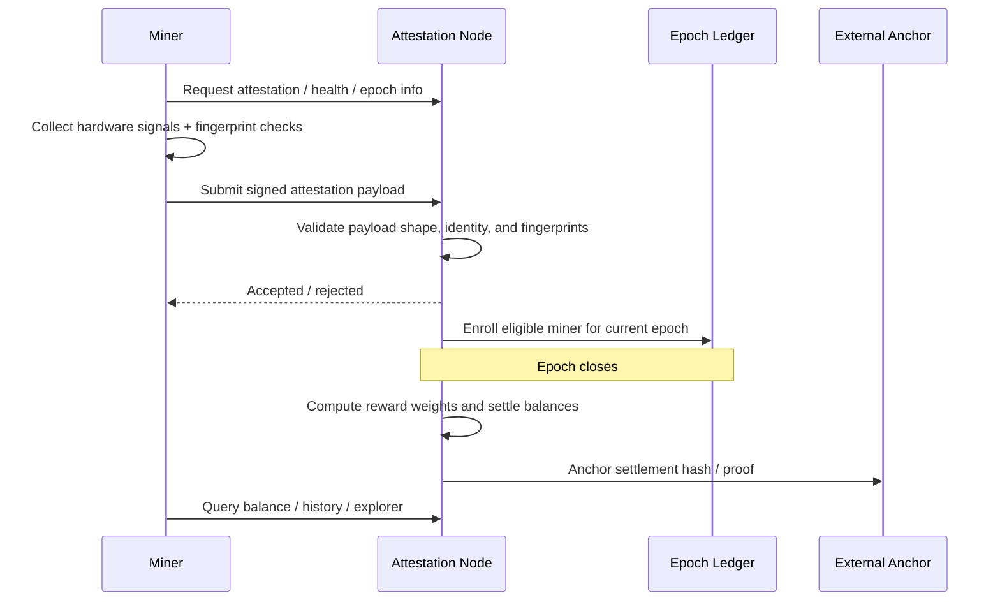
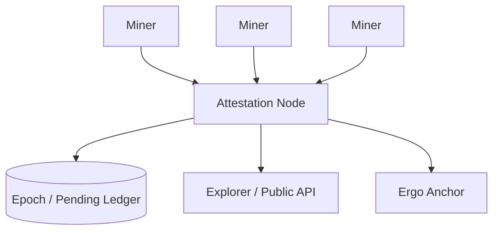

# RustChain Protocol Specification

> **Scope:** This document describes the live RustChain protocol at a developer level: RIP-200 consensus, attestation, epoch settlement, hardware fingerprinting, network roles, and the public API surface.
>
> **Related docs:**
> - [API Reference](./API.md)
> - [Glossary](./GLOSSARY.md)
> - [Tokenomics](./tokenomics_v1.md)
> - [Hardware Fingerprinting](./hardware-fingerprinting.md)

---

## 1. Overview

RustChain is a **Proof-of-Antiquity** network. It rewards *real physical hardware* rather than synthetic compute, and it deliberately favors older or rarer machines that are harder to fake in software.

The protocol is built around three core ideas:

- **1 CPU = 1 vote** for baseline participation
- **Hardware antiquity** changes reward weight
- **Attestation** proves the machine is real enough to participate

Current implementation notes:

- The node is a Python/Flask application with a SQLite-backed state layer.
- Miners and utility scripts perform hardware fingerprinting and submit attestation data.
- Settlement proofs are anchored externally for auditability.

---

## 2. RIP-200 Consensus

RIP-200 is the RustChain consensus and settlement flow. It is not traditional PoW and not a typical PoS design.

### 2.1 High-level lifecycle


```mermaid
sequenceDiagram
    participant Miner as Miner
    participant Node as Attestation Node
    participant Epoch as Epoch Ledger
    participant Ergo as External Anchor

    Miner->>Node: Request attestation / health / epoch info
    Miner->>Miner: Collect hardware signals + fingerprint checks
    Miner->>Node: Submit signed attestation payload
    Node->>Node: Validate payload shape, identity, and fingerprints
    Node-->>Miner: Accepted / rejected
    Node->>Epoch: Enroll eligible miner for current epoch

    Note over Node,Epoch: Epoch closes
    Node->>Node: Compute reward weights and settle balances
    Node->>Ergo: Anchor settlement hash / proof
    Miner->>Node: Query balance / history / explorer
```

### 2.2 Epoch settlement

At the end of an epoch, the protocol computes an eligible weight for each miner and allocates the epoch pot proportionally.

Conceptually:

```text
reward_i = epoch_pot × (weight_i / sum(weight_all_eligible_miners))
```

Where `weight_i` is influenced by:

- validated hardware presence
- antiquity multiplier
- fingerprint confidence / anti-emulation checks
- any additional policy knobs exposed by the node

---

## 3. Attestation flow

Attestation is the main trust primitive. The node does not rely on self-reported claims alone; it expects hardware-derived evidence.

### 3.1 What the miner sends

The miner payload is expected to carry a structured report containing some combination of:

- miner identifier
- timestamp / nonce / challenge context
- hardware identity fields
- fingerprint results
- optional signed proof material

Typical data classes include:

- `miner` / `miner_id`
- `device` (`family`, `arch`, `model`, `cpu`, `cores`, etc.)
- `signals` (host- or machine-specific metadata)
- `fingerprint` (check results)
- `signature` / public-key material where required

### 3.2 What the node validates

The validation pipeline generally checks:

1. request shape and required fields
2. miner identity formatting
3. timestamp / nonce / challenge consistency
4. hardware signal sanity
5. anti-abuse or rate-limit constraints
6. fingerprint pass/fail status
7. eligibility for enrollment in the epoch ledger

### 3.3 Simplified request model

```json
{
  "miner_id": "RTC_example",
  "device": {
    "family": "PowerPC",
    "arch": "G4",
    "model": "PowerBook5,4"
  },
  "fingerprint": {
    "clock_drift": true,
    "cache_timing": true,
    "simd_identity": true,
    "thermal_entropy": true,
    "instruction_jitter": true,
    "anti_emulation": true
  }
}
```

---

## 4. Hardware fingerprinting

RustChain’s anti-spoofing model relies on hardware behavior that is difficult to reproduce accurately in a VM or emulator.

### 4.1 The six core checks

1. **Clock drift / oscillator variance**
2. **Cache timing characteristics**
3. **SIMD identity and timing**
4. **Thermal entropy / load response**
5. **Instruction-path jitter**
6. **Anti-emulation heuristics**

### 4.2 Why these checks matter

- VMs tend to have cleaner, more deterministic timing than physical machines.
- Emulators often flatten cache and thermal behavior.
- Real hardware shows small imperfections caused by silicon, aging, and heat.
- The goal is not perfect certainty; the goal is to make spoofing expensive and brittle.

### 4.3 Behavioral model

RustChain treats a machine as more trustworthy when multiple signals agree:

- claimed architecture matches measured behavior
- timing distributions look physical, not synthetic
- the machine does not expose hypervisor artifacts
- repeat observations remain consistent over time

---

## 5. Token economics and rewards

RTC is the native token used for rewards and settlement.

Key economic ideas:

- epoch rewards are distributed to eligible miners
- the final share depends on validated weight
- older and rarer hardware can receive higher multipliers
- reward accounting is visible via wallet and explorer APIs

For exact supply, emission, and distribution policy, see:

- [Tokenomics](./tokenomics_v1.md)
- [API Reference](./API.md) for live balance and epoch endpoints

This protocol spec focuses on mechanics rather than duplicating every tokenomics constant.

---

## 6. Network architecture


```mermaid
graph TD
    Miner1[Miner] --> Node[Attestation Node]
    Miner2[Miner] --> Node
    Miner3[Miner] --> Node

    Node --> Ledger[(Epoch / Pending Ledger)]
    Node --> Explorer[Explorer / Public API]
    Node --> Anchor[Ergo Anchor]
```

### 6.1 Components

- **Miners**: collect hardware data and submit attestations
- **Attestation node**: validates miners, tracks epoch state, exposes APIs
- **Ledger**: stores pending and settled reward state
- **Explorer/API**: public visibility into miners, epochs, balances, and health
- **External anchor**: immutable proof / settlement anchor

### 6.2 Operator model

The public network is designed to be inspectable via HTTPS endpoints, while some operator routes are intentionally restricted.

---

## 7. Public API reference

The exhaustive endpoint reference lives in [API.md](./API.md). This section highlights the core public calls that are most relevant to protocol understanding.

### 7.1 Health

```bash
curl -sk https://rustchain.org/health | jq .
```

Returns node health, version, uptime, database status, and related status fields.

### 7.2 Epoch state

```bash
curl -sk https://rustchain.org/epoch | jq .
```

Returns the current epoch number, slot, epoch pot, enrolled miner count, and supply-related metadata.

### 7.3 Active miners

```bash
curl -sk https://rustchain.org/api/miners | jq .
```

Returns the live miner list, including device family, architecture, multiplier, and recent attestation info.

### 7.4 Wallet balance

```bash
curl -sk "https://rustchain.org/wallet/balance?miner_id=YOUR_MINER_ID" | jq .
```

Returns the current RTC balance for the provided miner or wallet identifier.

### 7.5 Wallet history

```bash
curl -sk "https://rustchain.org/wallet/history?miner_id=YOUR_MINER_ID&limit=10" | jq .
```

Returns recent transfers and wallet-scoped ledger activity.

### 7.6 API navigation

If you need the full list of request/response shapes, use:

- [API.md](./API.md)
- [docs/postman/README.md](./postman/README.md)
- [docs/api/openapi.yaml](./api/openapi.yaml)

---

## 8. Security model

### 8.1 Anti-emulation

RustChain expects VMs and emulators to fail at least one of the hardware checks or to produce low-confidence behavior. This protects reward fairness.

### 8.2 Sybil resistance

The network’s identity model is hardware-bound rather than purely account-bound, which makes large-scale fake miner creation more expensive.

### 8.3 Settlement integrity

Reward settlement is tracked in ledger state and anchored externally to make reward history harder to tamper with.

### 8.4 Key handling

- Transaction signing uses Ed25519-style key material in the wallet tooling.
- Private keys must remain offline and permission-restricted.
- Wallet backups are operationally sensitive and should be treated as secrets.

---

## 9. Glossary

- **RIP-200**: RustChain’s consensus and attestation protocol family.
- **Proof of Antiquity**: Reward model that favors real, older, rarer hardware.
- **Attestation**: A signed or structured hardware proof submitted to the node.
- **Epoch**: Reward accounting window.
- **Antiquity multiplier**: Reward factor based on hardware class and age.
- **Pending ledger**: Intermediate settlement state before final confirmation.
- **Ergo anchoring**: External proof mechanism used to preserve settlement integrity.
- **Anti-emulation**: Detection logic that discourages VMs and synthetic hardware.

---

## 10. Implementation notes

If you are extending the protocol or writing a client:

- prefer the live API docs over hard-coded assumptions
- use `curl -sk` when testing against the public node if TLS verification is expected to fail locally
- validate device-family and architecture fields before comparing rewards
- keep documentation aligned with `API.md`, `tokenomics_v1.md`, and the live explorer

---

*Protocol documentation maintained as part of the RustChain docs set.*
