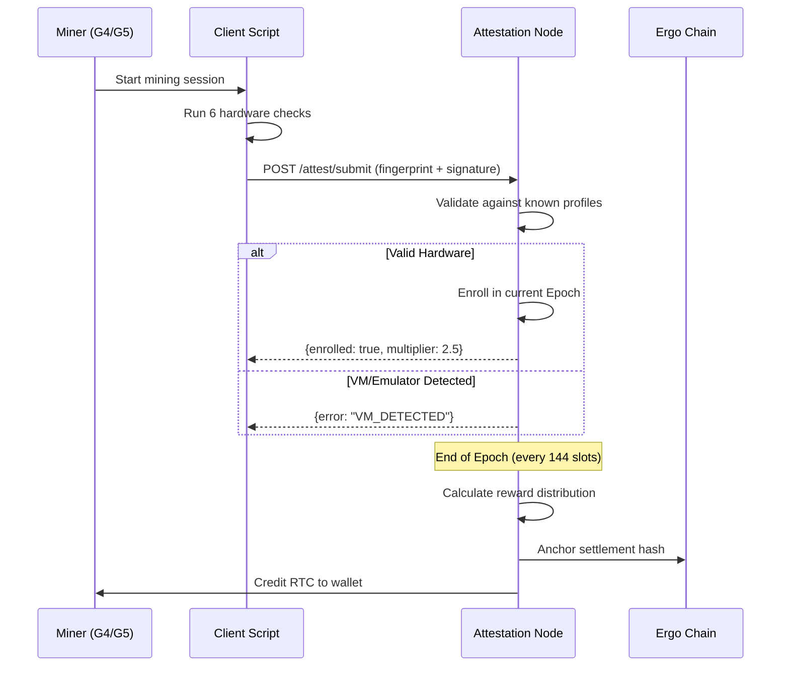
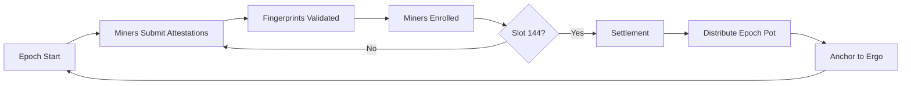
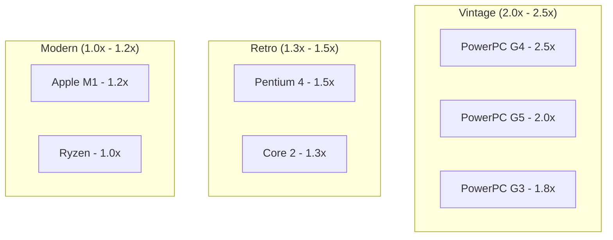
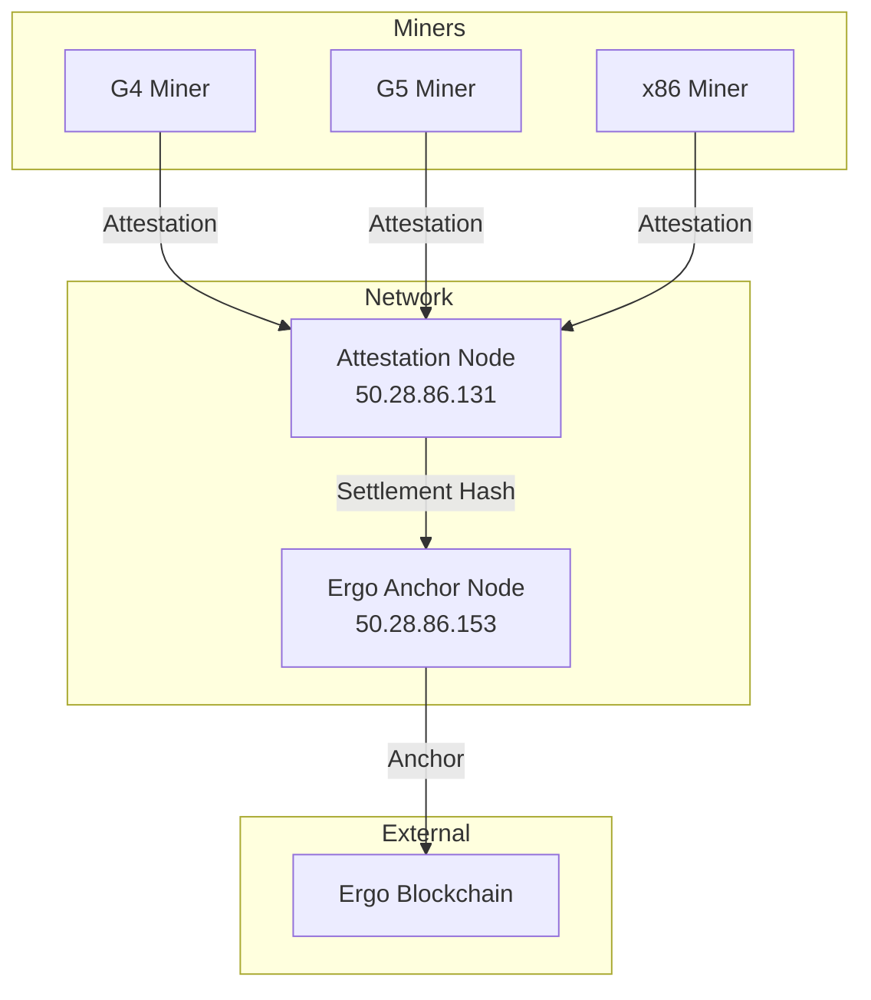

# RustChain Protocol Specification

## 1. Overview

**RustChain** is a Proof-of-Antiquity blockchain that validates and rewards vintage hardware. Unlike traditional Proof-of-Work, RustChain uses **RIP-200** (RustChain Iterative Protocol), a Proof-of-Attestation consensus where miners prove physical hardware ownership to earn **RTC** tokens.

**Core Principle**: 1 CPU = 1 Vote, weighted by hardware antiquity.

## 2. Consensus: RIP-200

### 2.1 Attestation Flow



### 2.2 Epoch Lifecycle



## 3. Hardware Fingerprinting

Six checks must pass for valid attestation:

| # | Check | Purpose | VM Detection |
|---|-------|---------|--------------|
| 1 | **Clock Skew** | Crystal oscillator imperfections | VMs use host clock (too perfect) |
| 2 | **Cache Timing** | L1/L2 latency curves | Emulators flatten cache hierarchy |
| 3 | **SIMD Identity** | AltiVec/SSE/NEON biases | Different timing in emulation |
| 4 | **Thermal Entropy** | CPU temp under load | VMs report static temps |
| 5 | **Instruction Jitter** | Opcode execution variance | Real silicon has nanosecond jitter |
| 6 | **Behavioral Heuristics** | Hypervisor signatures | Detects VMware, QEMU, etc. |

### 3.1 Fingerprint Structure

```json
{
  "miner_id": "abc123RTC",
  "timestamp": 1770112912,
  "fingerprint": {
    "clock_skew": {
      "drift_ppm": 12.5,
      "jitter_ns": 847
    },
    "cache_timing": {
      "l1_latency_ns": 4,
      "l2_latency_ns": 12,
      "l3_latency_ns": 42
    },
    "simd_identity": {
      "instruction_set": "AltiVec",
      "pipeline_bias": 0.73
    },
    "thermal_entropy": {
      "idle_temp": 38.2,
      "load_temp": 67.8,
      "variance": 4.2
    },
    "instruction_jitter": {
      "mean_ns": 2.3,
      "stddev_ns": 0.8
    },
    "behavioral_heuristics": {
      "cpuid_clean": true,
      "mac_oui_valid": true,
      "no_hypervisor": true
    }
  },
  "signature": "Ed25519_base64..."
}
```

## 4. Token Economics

### 4.1 Supply

| Metric | Value |
|--------|-------|
| Total Supply | 8,000,000 RTC |
| Premine | 75,000 RTC (dev/bounties) |
| Epoch Pot | 1.5 RTC / epoch |
| Epoch Duration | ~24 hours (144 slots) |

### 4.2 Antiquity Multipliers



### 4.3 Time Decay Formula

Vintage hardware (>5 years) experiences 15% annual decay:

```
decay_factor = 1.0 - (0.15 × (age - 5) / 5)
final_multiplier = 1.0 + (vintage_bonus × decay_factor)
```

**Example**: G4 (base 2.5x, 24 years old)
- Vintage bonus: 1.5 (2.5 - 1.0)
- Decay: 1.0 - (0.15 × 19/5) = 0.43
- Final: 1.0 + (1.5 × 0.43) = **1.645x**

### 4.4 Loyalty Bonus

Modern hardware earns +15%/year uptime (capped at +50%):

```
loyalty_bonus = min(0.5, uptime_years × 0.15)
final = base + loyalty_bonus
```

## 5. Network Architecture

### 5.1 Node Topology



### 5.2 Ergo Anchoring

Each epoch settlement is written to Ergo blockchain:
- Hash stored in box registers R4-R9
- Provides immutable timestamp
- External existence proof

## 6. Reward Distribution

At epoch end, the pot (1.5 RTC) is split by weight:

```
miner_reward = epoch_pot × (miner_multiplier / total_weight)
```

**Example** (2 miners):
- G4 miner: 2.5x weight
- x86 miner: 1.0x weight
- Total weight: 3.5

G4 receives: 1.5 × (2.5/3.5) = **1.07 RTC**
x86 receives: 1.5 × (1.0/3.5) = **0.43 RTC**

## 7. Security Considerations

### 7.1 Anti-Emulation
The 6-check fingerprint system targets known VM/emulator weaknesses:
- Clock virtualization artifacts
- Simplified cache models
- Missing thermal sensors
- Deterministic execution (no jitter)

### 7.2 Sybil Resistance
- Hardware-bound identity prevents account multiplication
- Physical device required for each "vote"
- Antiquity bias makes attack economically unfeasible

### 7.3 Key Management
- Ed25519 signatures for all transactions
- Miner ID derived from public key
- No private key recovery mechanism

---

*Protocol version: RIP-200 v2.2.1*
*See [API.md](./API.md) for endpoint documentation.*
