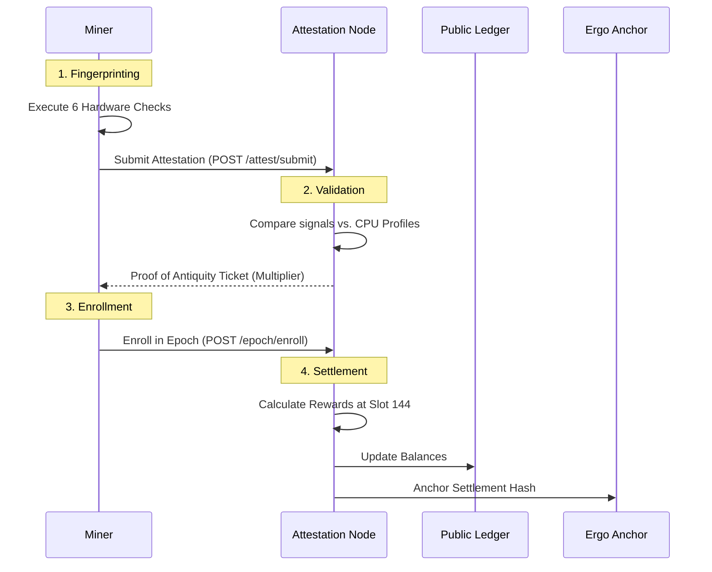

# RIP-200: Proof of Antiquity Consensus

## Executive Summary
**RIP-200 (RustChain Iterative Protocol)** defines the consensus mechanism for the RustChain network. It implements a **Proof of Antiquity (PoA)** model that prioritizes hardware longevity over raw hash power. The goal is to create a decentralized infrastructure network where high-precision hardware fingerprinting ensures 1-CPU-1-Vote democratic participation, weighted by the historical antiquity of the silicon.

---

## 1. The Core Loop
The RIP-200 consensus operates in ~24-hour cycles called **Epochs** (144 slots).

---

## 2. Hardware Fingerprinting (The 6 Checks)
To prevent Sybil attacks and virtualization, RIP-200 requires a mandatory attestation phase consisting of six distinct silicon-level tests:

| Check | Description | Targeted Vulnerability |
|-------|-------------|-----------------------|
| **Clock Skew** | Measures ppm drift of the physical crystal oscillator. | Cloud VMs (host clock passthrough is too precise). |
| **Cache Timing** | Profiles latency curves across L1/L2/L3 cache hierarchies. | Emulators (Simplified cache models flatten curves). |
| **SIMD Identity** | Tests pipeline bias in AltiVec (PPC) or SSE/NEON (x86/ARM). | Instruction translation (JIT compilers mask pipeline state). |
| **Thermal Entropy** | Samples temperature variance during localized stress tests. | Multi-tenant hosts (Static/virtualized thermal reports). |
| **Instruction Jitter** | Analyzes nanosecond-scale variance in opcode execution. | Deterministic execution environments. |
| **Heuristics** | Scans for Hypervisor OUI, CPUID leaves, and I/O artifacts. | VMware, QEMU, KVM, and VirtualBox signatures. |

---

## 3. Antiquity Multipliers
Rewards are not distributed equally. They are weighted by a multiplier determined by the hardware's architecture and chronological age.

### Base Multipliers
- **PowerPC G4**: 2.5x (Ancient Tier)
- **PowerPC G5**: 2.0x (Vintage Tier)
- **Pentium 4**: 1.5x (Retro Tier)
- **Modern x86_64**: 1.0x (Modern Tier)
- **Virtualized/ARM SBC**: 0.0001x (Penalty Tier)

### The Time Decay Formula
Vintage hardware (>5 years old) experiences an annual decay of 15% to incentive new "old" machines to join:
- $$Multiplier_{final} = 1.0 + (Bonus_{base} \times (1.0 - (0.15 \times \frac{Age - 5}{5})))$$

### Loyalty Bonus
Modern hardware (≤5 years old) can earn a +15% annual bonus for continuous uptime, capped at +50%.

---

## 4. Epoch Lifecycle & Settlement
An epoch consists of 144 slots (10 minutes each). 

1. **Enrollment Phase**: Miners must submit a fresh attestation every 24 hours to remain in the active pool.
2. **Mining Phase**: Eligible miners produce signed headers for slots.
3. **Settlement**: At the end of 144 slots, the **Epoch Pot** (1.5 RTC) is distributed.
4. **Anchoring**: The settlement hash is written to the **Ergo Blockchain**. This provides:
    - Immutable proof of reward distribution.
    - Publicly verifiable audit trail for inflation.
    - External timestamping.

---

## 5. Sybil Resistance
RIP-200 achieves Sybil resistance through **Physical Uniqueness**:
1. **MAC Binding**: Harware signals are bound to a single wallet address.
2. **Economic Disincentive**: Acquiring different vintage machines is more expensive and difficult than spinning up 10,000 cloud instances.
3. **AI Validation**: A server-side AI model detects "ROM Clustering" — many different miners sharing identical ROM dumps, indicating an emulator farm.

---

## 6. Comparison Table

| Feature | RIP-200 (PoA) | Bitcoin (PoW) | Ethereum (PoS) |
|---------|---------------|---------------|----------------|
| **Primary Driver** | Authenticity | Hash Power | Capital Stake |
| **Ideal Hardware** | 2003 PowerBook | 2025 Bitmain ASIC | AWS Instance |
| **Social Impact** | Preservation | Industrialization | Financialization |
| **Environmental** | E-waste Prevention | High Energy Use | Low Energy Use |

---
*Reference: RustChain Protocol Spec v2.2.1*
