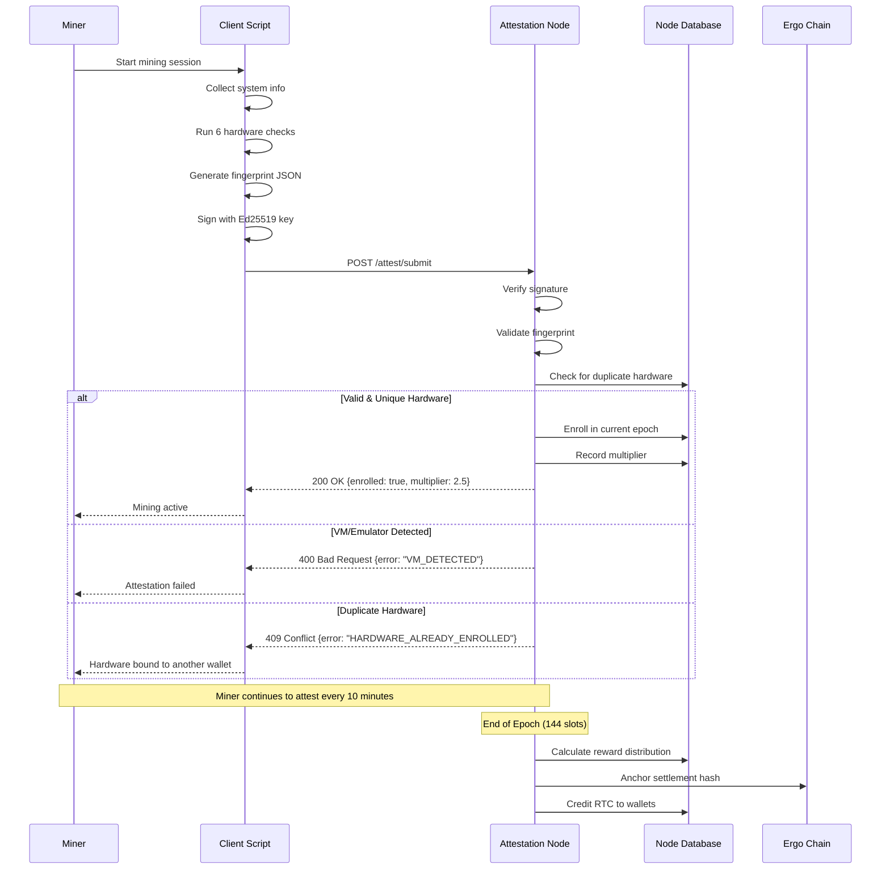

# RustChain Attestation Flow

## Overview

Attestation is the process by which miners prove they are running on **authentic physical hardware** and enroll in the current epoch to earn RTC rewards. This document details what miners send, what nodes validate, and how the enrollment process works.

## Attestation Lifecycle



## What Miners Send

### 1. Attestation Payload Structure

```json
{
  "miner_id": "scott",
  "timestamp": 1770112912,
  "device_info": {
    "arch": "PowerPC",
    "family": "G4",
    "model": "PowerBook5,6",
    "os": "Mac OS X 10.5.8",
    "python_version": "2.5.1"
  },
  "fingerprint": {
    "clock_skew": {
      "drift_ppm": 12.5,
      "jitter_ns": 847,
      "oscillator_age_estimate": 24
    },
    "cache_timing": {
      "l1_latency_ns": 4,
      "l2_latency_ns": 12,
      "l3_latency_ns": null,
      "hierarchy_ratio": 3.0
    },
    "simd_identity": {
      "instruction_set": "AltiVec",
      "pipeline_bias": 0.73,
      "vector_width": 128
    },
    "thermal_entropy": {
      "idle_temp_c": 38.2,
      "load_temp_c": 67.8,
      "variance": 4.2,
      "sensor_count": 3
    },
    "instruction_jitter": {
      "mean_ns": 2.3,
      "stddev_ns": 0.8,
      "samples": 10000
    },
    "behavioral_heuristics": {
      "cpuid_clean": true,
      "mac_oui_valid": true,
      "no_hypervisor": true,
      "dmi_authentic": true
    }
  },
  "signature": "Ed25519_base64_signature_here..."
}
```

### 2. Field Descriptions

#### Device Info
- **arch**: CPU architecture (`PowerPC`, `x86_64`, `ARM`, `ppc64le`)
- **family**: Specific CPU family (`G4`, `G5`, `Pentium4`, `M1`)
- **model**: Hardware model identifier
- **os**: Operating system version
- **python_version**: Miner client version

#### Clock Skew
- **drift_ppm**: Parts-per-million crystal oscillator drift
- **jitter_ns**: Nanosecond-scale timing variance
- **oscillator_age_estimate**: Estimated years since manufacture

#### Cache Timing
- **l1_latency_ns**: L1 cache access time
- **l2_latency_ns**: L2 cache access time
- **l3_latency_ns**: L3 cache access time (null if absent)
- **hierarchy_ratio**: L2/L1 latency ratio (should be 2.5-4.0)

#### SIMD Identity
- **instruction_set**: Vector instruction set name
- **pipeline_bias**: Execution time bias (unique per microarchitecture)
- **vector_width**: SIMD register width in bits

#### Thermal Entropy
- **idle_temp_c**: CPU temperature at idle
- **load_temp_c**: CPU temperature under load
- **variance**: Temperature fluctuation over time
- **sensor_count**: Number of thermal sensors detected

#### Instruction Jitter
- **mean_ns**: Average instruction execution time
- **stddev_ns**: Standard deviation (real silicon has variance)
- **samples**: Number of measurements taken

#### Behavioral Heuristics
- **cpuid_clean**: No hypervisor bits in CPUID
- **mac_oui_valid**: MAC address OUI matches known vendor
- **no_hypervisor**: No VMware/QEMU/VirtualBox signatures
- **dmi_authentic**: DMI/SMBIOS data looks genuine

### 3. Signature Generation

```python
import ed25519
import json
import base64

# Generate key pair (done once)
signing_key, verifying_key = ed25519.create_keypair()

# Create payload
payload = {
    "miner_id": "scott",
    "timestamp": int(time.time()),
    "device_info": {...},
    "fingerprint": {...}
}

# Sign
message = json.dumps(payload, sort_keys=True).encode('utf-8')
signature = signing_key.sign(message)
payload["signature"] = base64.b64encode(signature).decode('ascii')

# Submit
requests.post("https://rustchain.org/attest/submit", json=payload)
```

## What Nodes Validate

### 1. Signature Verification

```python
def verify_attestation(payload):
    # Extract signature
    signature_b64 = payload.pop("signature")
    signature = base64.b64decode(signature_b64)
    
    # Reconstruct message
    message = json.dumps(payload, sort_keys=True).encode('utf-8')
    
    # Verify with miner's public key
    verifying_key = get_miner_pubkey(payload["miner_id"])
    try:
        verifying_key.verify(signature, message)
        return True
    except ed25519.BadSignatureError:
        return False
```

### 2. Hardware Fingerprint Validation

#### Check 1: Clock Skew Analysis
```python
def validate_clock_skew(fingerprint):
    drift = fingerprint["clock_skew"]["drift_ppm"]
    jitter = fingerprint["clock_skew"]["jitter_ns"]
    
    # Real hardware: 5-50 ppm drift, 100-2000 ns jitter
    # VMs: <1 ppm drift, <10 ns jitter (too perfect)
    
    if drift < 1.0 and jitter < 50:
        return False, "VM_CLOCK_TOO_PERFECT"
    
    if drift > 100:
        return False, "CLOCK_DRIFT_EXCESSIVE"
    
    return True, None
```

#### Check 2: Cache Timing Profile
```python
def validate_cache_timing(fingerprint):
    l1 = fingerprint["cache_timing"]["l1_latency_ns"]
    l2 = fingerprint["cache_timing"]["l2_latency_ns"]
    ratio = fingerprint["cache_timing"]["hierarchy_ratio"]
    
    # Real hardware: L2 is 2.5-4x slower than L1
    # Emulators: Flat hierarchy (ratio ~1.0)
    
    if ratio < 2.0:
        return False, "CACHE_HIERARCHY_FLAT"
    
    if l1 < 1 or l1 > 10:
        return False, "L1_LATENCY_UNREALISTIC"
    
    return True, None
```

#### Check 3: SIMD Identity
```python
def validate_simd(fingerprint):
    instruction_set = fingerprint["simd_identity"]["instruction_set"]
    bias = fingerprint["simd_identity"]["pipeline_bias"]
    
    # Each SIMD implementation has unique timing characteristics
    known_profiles = {
        "AltiVec": (0.65, 0.85),  # PowerPC G4/G5
        "SSE2": (0.45, 0.65),     # x86
        "NEON": (0.55, 0.75),     # ARM
    }
    
    if instruction_set not in known_profiles:
        return False, "UNKNOWN_SIMD"
    
    min_bias, max_bias = known_profiles[instruction_set]
    if not (min_bias <= bias <= max_bias):
        return False, "SIMD_BIAS_MISMATCH"
    
    return True, None
```

#### Check 4: Thermal Entropy
```python
def validate_thermal(fingerprint):
    idle = fingerprint["thermal_entropy"]["idle_temp_c"]
    load = fingerprint["thermal_entropy"]["load_temp_c"]
    variance = fingerprint["thermal_entropy"]["variance"]
    
    # Real hardware: 20-50°C idle, 50-90°C load, variance >1°C
    # VMs: Static temps or host passthrough
    
    if variance < 0.5:
        return False, "THERMAL_TOO_STABLE"
    
    if load - idle < 10:
        return False, "NO_THERMAL_RESPONSE"
    
    return True, None
```

#### Check 5: Instruction Jitter
```python
def validate_jitter(fingerprint):
    stddev = fingerprint["instruction_jitter"]["stddev_ns"]
    
    # Real silicon: 0.5-2.0 ns stddev
    # VMs: <0.1 ns (deterministic execution)
    
    if stddev < 0.3:
        return False, "EXECUTION_TOO_DETERMINISTIC"
    
    return True, None
```

#### Check 6: Behavioral Heuristics
```python
def validate_heuristics(fingerprint):
    heuristics = fingerprint["behavioral_heuristics"]
    
    # Check for hypervisor signatures
    if not heuristics["cpuid_clean"]:
        return False, "HYPERVISOR_DETECTED"
    
    if not heuristics["no_hypervisor"]:
        return False, "VM_SIGNATURE_FOUND"
    
    # Check MAC OUI (first 3 bytes)
    if not heuristics["mac_oui_valid"]:
        return False, "INVALID_MAC_OUI"
    
    return True, None
```

### 3. Duplicate Hardware Check

```python
def check_hardware_uniqueness(fingerprint, miner_id):
    # Generate hardware hash from fingerprint
    hw_hash = hashlib.sha256(
        json.dumps(fingerprint, sort_keys=True).encode()
    ).hexdigest()
    
    # Check if this hardware is already enrolled
    existing = db.query(
        "SELECT miner_id FROM enrollments WHERE hw_hash = ?",
        (hw_hash,)
    )
    
    if existing and existing[0] != miner_id:
        return False, "HARDWARE_ALREADY_BOUND"
    
    return True, hw_hash
```

### 4. Antiquity Multiplier Assignment

```python
def calculate_multiplier(device_info):
    arch = device_info["arch"]
    family = device_info["family"]
    
    multipliers = {
        ("PowerPC", "G4"): 2.5,
        ("PowerPC", "G5"): 2.0,
        ("PowerPC", "G3"): 1.8,
        ("ppc64le", "POWER8"): 1.5,
        ("x86_64", "Pentium4"): 1.5,
        ("x86_64", "Core2"): 1.3,
        ("ARM", "M1"): 1.2,
        ("x86_64", "Ryzen"): 1.0,
    }
    
    return multipliers.get((arch, family), 1.0)
```

## Enrollment Process

### 1. First-Time Enrollment

```python
def enroll_miner(miner_id, fingerprint, multiplier, hw_hash):
    current_epoch = get_current_epoch()
    
    db.execute("""
        INSERT INTO enrollments (
            miner_id, epoch, hw_hash, multiplier, 
            first_attest, last_attest
        ) VALUES (?, ?, ?, ?, ?, ?)
    """, (
        miner_id, current_epoch, hw_hash, multiplier,
        int(time.time()), int(time.time())
    ))
    
    return {
        "enrolled": True,
        "epoch": current_epoch,
        "multiplier": multiplier,
        "next_settlement": calculate_epoch_end(current_epoch)
    }
```

### 2. Ongoing Attestations

Miners must re-attest every **10 minutes** (1 slot) to remain enrolled:

```python
def update_attestation(miner_id):
    current_epoch = get_current_epoch()
    
    db.execute("""
        UPDATE enrollments 
        SET last_attest = ?
        WHERE miner_id = ? AND epoch = ?
    """, (int(time.time()), miner_id, current_epoch))
    
    # Check if miner is still active
    last_attest = db.query(
        "SELECT last_attest FROM enrollments WHERE miner_id = ?",
        (miner_id,)
    )[0]
    
    if time.time() - last_attest > 1200:  # 20 minutes
        return {"status": "inactive", "reason": "MISSED_ATTESTATIONS"}
    
    return {"status": "active"}
```

## API Endpoints

### POST /attest/submit

Submit hardware attestation.

**Request**:
```bash
curl -sk -X POST https://rustchain.org/attest/submit \
  -H "Content-Type: application/json" \
  -d @attestation.json
```

**Response (Success)**:
```json
{
  "enrolled": true,
  "epoch": 75,
  "multiplier": 2.5,
  "hw_hash": "abc123...",
  "next_settlement": 1770198000
}
```

**Response (VM Detected)**:
```json
{
  "error": "VM_DETECTED",
  "failed_checks": ["clock_skew", "thermal_entropy"],
  "penalty_multiplier": 0.0000000025
}
```

### GET /lottery/eligibility?miner_id=NAME

Check if miner is enrolled in current epoch.

**Request**:
```bash
curl -sk "https://rustchain.org/lottery/eligibility?miner_id=scott"
```

**Response**:
```json
{
  "eligible": true,
  "epoch": 75,
  "multiplier": 2.5,
  "last_attest": 1770112912,
  "status": "active"
}
```

## Error Codes

| Code | Error | Meaning |
|------|-------|---------|
| 400 | `VM_DETECTED` | Hardware fingerprint failed validation |
| 400 | `INVALID_SIGNATURE` | Ed25519 signature verification failed |
| 409 | `HARDWARE_ALREADY_BOUND` | This hardware is enrolled to another wallet |
| 429 | `RATE_LIMIT_EXCEEDED` | Too many attestations (max 1 per minute) |
| 500 | `NODE_ERROR` | Internal node error |

## Best Practices for Miners

1. **Attest every 10 minutes** to maintain active status
2. **Keep system time synchronized** (NTP recommended)
3. **Don't run multiple wallets** on same hardware (will be rejected)
4. **Monitor attestation responses** for errors
5. **Use persistent wallet IDs** (don't change miner_id)

## Troubleshooting

### "VM_DETECTED" Error

Your hardware failed one or more fingerprint checks. Common causes:
- Running in a virtual machine (VirtualBox, VMware, QEMU)
- Using an emulator (SheepShaver, QEMU-PPC)
- System clock is too stable (disable NTP temporarily during fingerprinting)

### "HARDWARE_ALREADY_BOUND" Error

This physical hardware is already enrolled to another wallet. Solutions:
- Use a different machine
- Contact support to unbind hardware (requires proof of ownership)

### Missed Attestations

If you miss 2+ consecutive attestations (20 minutes), you'll be marked inactive:
- Check network connectivity
- Verify miner service is running
- Check system logs for errors

---

**Next**: See [epoch-settlement.md](./epoch-settlement.md) for reward distribution mechanics.
