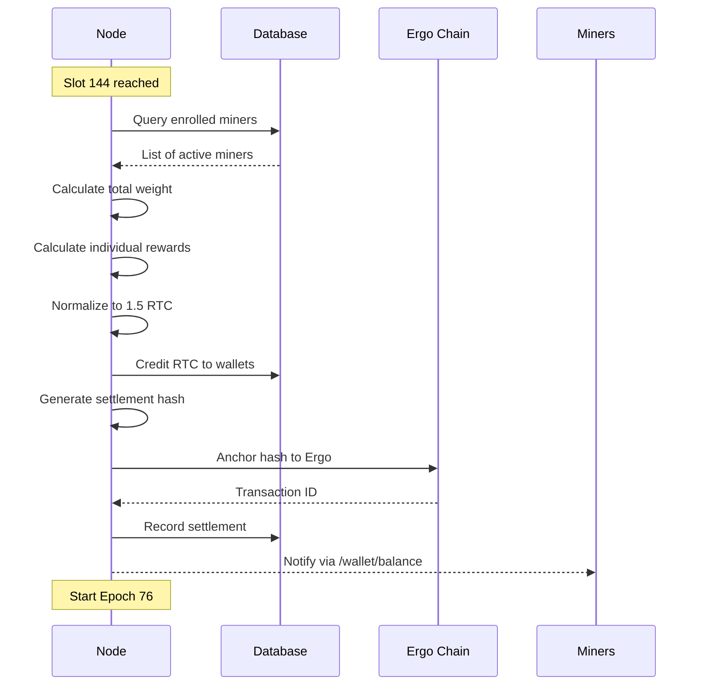

# RustChain Epoch Settlement

## Overview

Epoch settlement is the process by which RustChain distributes the **Epoch Pot** (1.5 RTC) among enrolled miners at the end of each epoch. This document explains how rewards are calculated, distributed, and anchored to the Ergo blockchain.

## Epoch Structure

### Timeline

```
Epoch Duration: ~24 hours (144 slots × 10 minutes)

Slot 0    Slot 1    Slot 2    ...    Slot 143    Slot 144 (Settlement)
├─────────┼─────────┼─────────┼───────┼───────────┼──────────────────────┤
│ Attest  │ Attest  │ Attest  │  ...  │ Attest    │ Calculate & Distribute│
└─────────┴─────────┴─────────┴───────┴───────────┴──────────────────────┘
          ↑                                         ↑
    Miners submit attestations              Rewards credited to wallets
    every 10 minutes                        Settlement hash → Ergo
```

### Key Metrics

| Metric | Value |
|--------|-------|
| **Epoch Duration** | ~24 hours |
| **Slots per Epoch** | 144 |
| **Slot Duration** | 10 minutes (600 seconds) |
| **Epoch Pot** | 1.5 RTC |
| **Settlement Delay** | ~5 minutes (Ergo anchoring) |

## Reward Calculation

### 1. Collect Enrolled Miners

At the end of slot 144, the node queries all active miners:

```python
def get_enrolled_miners(epoch):
    return db.query("""
        SELECT miner_id, multiplier, last_attest
        FROM enrollments
        WHERE epoch = ?
        AND last_attest > ?
    """, (epoch, time.time() - 1200))  # Active in last 20 minutes
```

### 2. Calculate Total Weight

Each miner's weight is their antiquity multiplier:

```python
def calculate_total_weight(miners):
    total = 0.0
    for miner in miners:
        total += miner["multiplier"]
    return total
```

**Example**:
```
Miner A (G4):     2.5×
Miner B (G5):     2.0×
Miner C (x86):    1.0×
Miner D (x86):    1.0×
Miner E (M1):     1.2×
─────────────────────
Total Weight:     7.7
```

### 3. Calculate Individual Rewards

Each miner receives a proportional share:

```python
def calculate_reward(miner_multiplier, total_weight, epoch_pot=1.5):
    return epoch_pot * (miner_multiplier / total_weight)
```

**Example Distribution**:
```
Epoch Pot: 1.5 RTC
Total Weight: 7.7

Miner A: 1.5 × (2.5 / 7.7) = 0.487 RTC  ████████████████████
Miner B: 1.5 × (2.0 / 7.7) = 0.390 RTC  ████████████████
Miner C: 1.5 × (1.0 / 7.7) = 0.195 RTC  ████████
Miner D: 1.5 × (1.0 / 7.7) = 0.195 RTC  ████████
Miner E: 1.5 × (1.2 / 7.7) = 0.234 RTC  █████████
                             ─────────
Total Distributed:           1.501 RTC
```

### 4. Handle Rounding

Due to floating-point precision, the sum may not equal exactly 1.5 RTC:

```python
def normalize_rewards(rewards, epoch_pot=1.5):
    total = sum(rewards.values())
    
    if abs(total - epoch_pot) < 0.001:
        # Close enough, adjust largest reward
        largest_miner = max(rewards, key=rewards.get)
        rewards[largest_miner] += (epoch_pot - total)
    
    return rewards
```

## Settlement Process

### Full Settlement Flow



### Settlement Hash Structure

```python
def generate_settlement_hash(epoch, rewards):
    settlement_data = {
        "epoch": epoch,
        "timestamp": int(time.time()),
        "total_pot": 1.5,
        "total_distributed": sum(rewards.values()),
        "miner_count": len(rewards),
        "rewards": rewards
    }
    
    # SHA-256 hash
    return hashlib.sha256(
        json.dumps(settlement_data, sort_keys=True).encode()
    ).hexdigest()
```

**Example Hash**:
```
Epoch: 75
Hash: 8a3f2e1d9c7b6a5e4f3d2c1b0a9e8d7c6b5a4f3e2d1c0b9a8e7d6c5b4a3f2e1d
```

## Ergo Blockchain Anchoring

### Why Anchor to Ergo?

1. **Immutability**: Provides cryptographic proof that settlement occurred
2. **Timestamp**: External verification of when rewards were distributed
3. **Transparency**: Anyone can verify settlement on Ergo explorer

### Anchoring Process

```python
def anchor_to_ergo(settlement_hash, epoch):
    # Create Ergo transaction with settlement hash in R4 register
    tx = {
        "requests": [{
            "address": ERGO_ANCHOR_ADDRESS,
            "value": 1000000,  # 0.001 ERG
            "registers": {
                "R4": settlement_hash,
                "R5": f"RustChain Epoch {epoch}",
                "R6": int(time.time())
            }
        }]
    }
    
    # Submit to Ergo node
    response = requests.post(
        "http://50.28.86.153:9053/wallet/transaction/send",
        json=tx
    )
    
    return response.json()["id"]
```

### Verification

Anyone can verify a settlement on Ergo:

```bash
# Query Ergo explorer
curl "https://api.ergoplatform.com/api/v1/transactions/TX_ID"

# Check R4 register contains settlement hash
```

## Database Schema

### Enrollments Table

```sql
CREATE TABLE enrollments (
    id INTEGER PRIMARY KEY,
    miner_id TEXT NOT NULL,
    epoch INTEGER NOT NULL,
    hw_hash TEXT NOT NULL,
    multiplier REAL NOT NULL,
    first_attest INTEGER NOT NULL,
    last_attest INTEGER NOT NULL,
    UNIQUE(miner_id, epoch)
);
```

### Settlements Table

```sql
CREATE TABLE settlements (
    id INTEGER PRIMARY KEY,
    epoch INTEGER NOT NULL UNIQUE,
    timestamp INTEGER NOT NULL,
    total_pot REAL NOT NULL,
    total_distributed REAL NOT NULL,
    miner_count INTEGER NOT NULL,
    settlement_hash TEXT NOT NULL,
    ergo_tx_id TEXT,
    rewards_json TEXT NOT NULL
);
```

### Wallets Table

```sql
CREATE TABLE wallets (
    miner_id TEXT PRIMARY KEY,
    balance_rtc REAL NOT NULL DEFAULT 0.0,
    total_earned REAL NOT NULL DEFAULT 0.0,
    epochs_participated INTEGER NOT NULL DEFAULT 0,
    first_epoch INTEGER,
    last_epoch INTEGER
);
```

## Reward Distribution

### 1. Credit Wallets

```python
def distribute_rewards(rewards, epoch):
    for miner_id, amount in rewards.items():
        db.execute("""
            UPDATE wallets
            SET balance_rtc = balance_rtc + ?,
                total_earned = total_earned + ?,
                epochs_participated = epochs_participated + 1,
                last_epoch = ?
            WHERE miner_id = ?
        """, (amount, amount, epoch, miner_id))
        
        # Create wallet if doesn't exist
        if db.rowcount == 0:
            db.execute("""
                INSERT INTO wallets (
                    miner_id, balance_rtc, total_earned,
                    epochs_participated, first_epoch, last_epoch
                ) VALUES (?, ?, ?, 1, ?, ?)
            """, (miner_id, amount, amount, epoch, epoch))
```

### 2. Record Settlement

```python
def record_settlement(epoch, rewards, settlement_hash, ergo_tx_id):
    db.execute("""
        INSERT INTO settlements (
            epoch, timestamp, total_pot, total_distributed,
            miner_count, settlement_hash, ergo_tx_id, rewards_json
        ) VALUES (?, ?, ?, ?, ?, ?, ?, ?)
    """, (
        epoch,
        int(time.time()),
        1.5,
        sum(rewards.values()),
        len(rewards),
        settlement_hash,
        ergo_tx_id,
        json.dumps(rewards)
    ))
```

## Edge Cases

### No Enrolled Miners

If no miners are enrolled at epoch end:

```python
def handle_empty_epoch(epoch):
    # Pot rolls over to next epoch
    db.execute("""
        INSERT INTO settlements (
            epoch, timestamp, total_pot, total_distributed,
            miner_count, settlement_hash, rewards_json
        ) VALUES (?, ?, 1.5, 0.0, 0, 'EMPTY_EPOCH', '{}')
    """, (epoch, int(time.time())))
    
    # Increase next epoch pot
    next_epoch_pot = 1.5 + 1.5  # Rollover
```

### Single Miner

If only one miner is enrolled:

```python
# Miner receives full pot regardless of multiplier
rewards = {miner_id: 1.5}
```

### Inactive Miners

Miners who haven't attested in 20+ minutes are excluded:

```python
def filter_active_miners(miners):
    current_time = time.time()
    return [
        m for m in miners
        if current_time - m["last_attest"] < 1200
    ]
```

## API Endpoints

### GET /epoch

Get current epoch information.

**Request**:
```bash
curl -sk https://50.28.86.131/epoch
```

**Response**:
```json
{
  "epoch": 75,
  "slot": 10800,
  "blocks_per_epoch": 144,
  "epoch_pot": 1.5,
  "enrolled_miners": 10,
  "next_settlement": 1770198000
}
```

### GET /wallet/balance?miner_id=NAME

Check wallet balance after settlement.

**Request**:
```bash
curl -sk "https://50.28.86.131/wallet/balance?miner_id=scott"
```

**Response**:
```json
{
  "ok": true,
  "miner_id": "scott",
  "balance_rtc": 42.5,
  "total_earned": 156.3,
  "epochs_participated": 87,
  "last_reward": 0.487,
  "last_epoch": 75
}
```

### GET /api/settlement/{epoch}

Query historical settlement data.

**Request**:
```bash
curl -sk https://50.28.86.131/api/settlement/75
```

**Response**:
```json
{
  "epoch": 75,
  "timestamp": 1770198000,
  "total_pot": 1.5,
  "total_distributed": 1.5,
  "miner_count": 5,
  "settlement_hash": "8a3f2e1d...",
  "ergo_tx_id": "abc123...",
  "rewards": {
    "scott": 0.487,
    "pffs1802": 0.390,
    "miner3": 0.195,
    "miner4": 0.195,
    "miner5": 0.234
  }
}
```

## Settlement Timeline Example

### Epoch 75 Settlement

```
2026-02-26 00:00:00 UTC - Epoch 75 starts
2026-02-26 00:10:00 UTC - Slot 1 (10 miners attest)
2026-02-26 00:20:00 UTC - Slot 2 (10 miners attest)
...
2026-02-26 23:50:00 UTC - Slot 143 (9 miners attest, 1 dropped)
2026-02-27 00:00:00 UTC - Slot 144 (Settlement triggered)
2026-02-27 00:01:23 UTC - Rewards calculated
2026-02-27 00:02:45 UTC - Wallets credited
2026-02-27 00:03:12 UTC - Settlement hash generated
2026-02-27 00:04:56 UTC - Anchored to Ergo (TX: abc123...)
2026-02-27 00:05:00 UTC - Epoch 76 starts
```

## Monitoring Settlement

### Node Logs

```bash
# Watch settlement process
tail -f /var/log/rustchain/node.log | grep SETTLEMENT

# Example output:
[2026-02-27 00:00:00] SETTLEMENT: Epoch 75 ended
[2026-02-27 00:01:23] SETTLEMENT: 9 miners enrolled, total weight 7.7
[2026-02-27 00:02:45] SETTLEMENT: Distributed 1.5 RTC
[2026-02-27 00:04:56] SETTLEMENT: Anchored to Ergo (TX: abc123...)
```

### Query Settlement Status

```bash
# Check if settlement completed
curl -sk https://50.28.86.131/api/settlement/75 | jq '.ergo_tx_id'

# Verify on Ergo explorer
curl "https://api.ergoplatform.com/api/v1/transactions/abc123..."
```

## Troubleshooting

### Settlement Delayed

If settlement takes >10 minutes:
- Check Ergo node connectivity
- Verify database isn't locked
- Check node logs for errors

### Incorrect Reward Amount

If your reward seems wrong:
- Verify you were active at epoch end (check `last_attest`)
- Calculate expected share: `1.5 × (your_multiplier / total_weight)`
- Query settlement data: `/api/settlement/{epoch}`

### Missing Reward

If you didn't receive a reward:
- Check enrollment status: `/lottery/eligibility?miner_id=NAME`
- Verify you attested in the last 20 minutes of the epoch
- Check wallet balance: `/wallet/balance?miner_id=NAME`

## Future Improvements

### Planned Enhancements

1. **Dynamic Epoch Pot**: Adjust based on network activity
2. **Bonus Pools**: Extra rewards for specific hardware types
3. **Loyalty Multipliers**: Bonus for consecutive epochs
4. **Cross-Chain Anchoring**: Anchor to multiple blockchains

---

**Next**: See [hardware-fingerprinting.md](./hardware-fingerprinting.md) for technical details on the 6 hardware checks.
