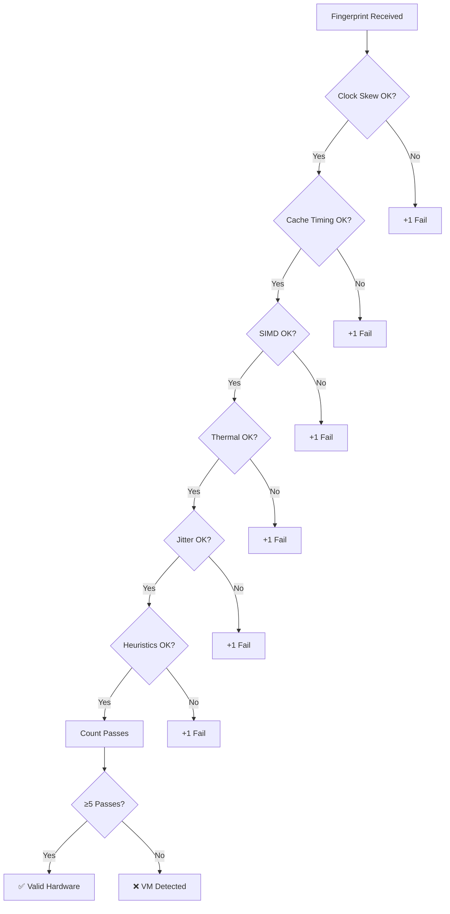

# RustChain Hardware Fingerprinting

## Overview

Hardware fingerprinting is the core anti-emulation mechanism in RustChain. The system performs **6 independent checks** to verify that miners are running on authentic physical hardware, not virtual machines or emulators.

## The 6+1 Checks

```
┌─────────────────────────────────────────────────────────────┐
│                   6 Hardware Checks                         │
├─────────────────────────────────────────────────────────────┤
│ 1. Clock-Skew & Oscillator Drift   ← Silicon aging pattern  │
│ 2. Cache Timing Fingerprint        ← L1/L2/L3 latency tone  │
│ 3. SIMD Unit Identity              ← AltiVec/SSE/NEON bias  │
│ 4. Thermal Drift Entropy           ← Heat curves are unique │
│ 5. Instruction Path Jitter         ← Microarch jitter map   │
│ 6. Anti-Emulation Checks           ← Detect VMs/emulators   │
│                                                              │
│ +1. Behavioral Heuristics          ← Hypervisor signatures  │
└─────────────────────────────────────────────────────────────┘
```

## Check 1: Clock Skew & Oscillator Drift

### Principle

Every physical CPU has a crystal oscillator with manufacturing imperfections and aging. Real hardware has measurable drift (5-50 ppm) and jitter (100-2000 ns). VMs use the host's clock, which is too perfect.

### Detection Thresholds

| Hardware Type | Drift (ppm) | Jitter (ns) | Verdict |
|---------------|-------------|-------------|---------|
| Real vintage (G4/G5) | 15-50 | 500-2000 | ✅ Pass |
| Real modern (x86) | 5-20 | 100-800 | ✅ Pass |
| VM (VMware/QEMU) | <1 | <10 | ❌ Fail |
| Emulator (SheepShaver) | <0.5 | <5 | ❌ Fail |

### Fingerprint Structure

```json
{
  "clock_skew": {
    "drift_ppm": 24.3,
    "jitter_ns": 1247,
    "oscillator_age_estimate": 24
  }
}
```

## Check 2: Cache Timing Fingerprint

### Principle

Real CPUs have multi-level cache hierarchy (L1 → L2 → L3) with distinct latencies. L1 is 3-5 cycles, L2 is 10-20 cycles. Emulators flatten this hierarchy.

### Detection Thresholds

| Hardware Type | L1 (ns) | L2 (ns) | L2/L1 Ratio | Verdict |
|---------------|---------|---------|-------------|---------|
| PowerPC G4 | 4-6 | 12-18 | 3.0-3.5 | ✅ Pass |
| x86_64 (modern) | 1-2 | 4-8 | 3.0-4.0 | ✅ Pass |
| VM (VMware) | 10-20 | 15-25 | 1.2-1.5 | ❌ Fail |
| Emulator (QEMU) | 50-100 | 50-100 | ~1.0 | ❌ Fail |

### Fingerprint Structure

```json
{
  "cache_timing": {
    "l1_latency_ns": 5,
    "l2_latency_ns": 15,
    "l3_latency_ns": null,
    "hierarchy_ratio": 3.0
  }
}
```

## Check 3: SIMD Unit Identity

### Principle

Each SIMD instruction set (AltiVec, SSE, NEON) has unique pipeline characteristics. By timing vector operations, we fingerprint the exact implementation.

### Detection Thresholds

| SIMD Type | Pipeline Bias | Verdict |
|-----------|---------------|---------|
| AltiVec (G4/G5) | 0.65-0.85 | ✅ Pass |
| SSE2 (x86) | 0.45-0.65 | ✅ Pass |
| NEON (ARM) | 0.55-0.75 | ✅ Pass |
| Emulated AltiVec | 0.3-0.5 | ❌ Fail |

### Fingerprint Structure

```json
{
  "simd_identity": {
    "instruction_set": "AltiVec",
    "pipeline_bias": 0.76,
    "vector_width": 128
  }
}
```

## Check 4: Thermal Drift Entropy

### Principle

Real CPUs generate heat under load with natural variance. VMs report static temperatures or pass through host temps that don't correlate with workload.

### Detection Thresholds

| Hardware Type | Idle (°C) | Load (°C) | Variance | Verdict |
|---------------|-----------|-----------|----------|---------|
| Real G4/G5 | 35-50 | 60-85 | 2-6 | ✅ Pass |
| Real x86 | 30-45 | 50-80 | 1-4 | ✅ Pass |
| VM (VMware) | 40 | 40 | <0.1 | ❌ Fail |

### Fingerprint Structure

```json
{
  "thermal_entropy": {
    "idle_temp_c": 42.1,
    "load_temp_c": 71.3,
    "variance": 3.8,
    "sensor_count": 3
  }
}
```

## Check 5: Instruction Path Jitter

### Principle

Real silicon has nanosecond-scale execution variance due to branch prediction, cache conflicts, and pipeline stalls. VMs have deterministic execution with near-zero jitter.

### Detection Thresholds

| Hardware Type | Mean (ns) | Stddev (ns) | Verdict |
|---------------|-----------|-------------|---------|
| Real G4/G5 | 2000-5000 | 500-2000 | ✅ Pass |
| Real x86 | 500-2000 | 50-500 | ✅ Pass |
| VM (QEMU) | 10000-50000 | <10 | ❌ Fail |

### Fingerprint Structure

```json
{
  "instruction_jitter": {
    "mean_ns": 3200,
    "stddev_ns": 890,
    "samples": 10000
  }
}
```

## Check 6: Anti-Emulation Checks

### Principle

Hypervisors leave detectable signatures in CPUID, MAC address OUI, DMI/SMBIOS data, and PCI device IDs.

### VM Signatures Detected

| Check | VM Indicator |
|-------|--------------|
| CPUID | Hypervisor bit set |
| MAC OUI | 00:05:69, 00:0C:29 (VMware), 08:00:27 (VirtualBox), 52:54:00 (QEMU) |
| DMI | "vmware", "virtualbox", "qemu" in system info |
| Processes | vmware, vbox, qemu running |

### Fingerprint Structure

```json
{
  "behavioral_heuristics": {
    "cpuid_clean": true,
    "mac_oui_valid": true,
    "no_hypervisor": true,
    "dmi_authentic": true
  }
}
```

## Combined Validation

### Scoring System

Must pass at least **5 out of 6** checks:



### Penalty Multipliers

| Failed Checks | Multiplier | Effect |
|---------------|------------|--------|
| 0 | 1.0× | Full rewards |
| 1 | 0.5× | 50% penalty |
| 2+ | 0.0000000025× | 1 billionth (VM penalty) |

## Example Comparisons

### Real PowerPC G4 ✅

```json
{
  "clock_skew": {"drift_ppm": 24.3, "jitter_ns": 1247},
  "cache_timing": {"hierarchy_ratio": 3.0},
  "simd_identity": {"pipeline_bias": 0.76},
  "thermal_entropy": {"variance": 3.8},
  "instruction_jitter": {"stddev_ns": 890},
  "behavioral_heuristics": {"cpuid_clean": true, "no_hypervisor": true}
}
```
**Result**: All 6 checks pass → 2.5× multiplier

### SheepShaver Emulator ❌

```json
{
  "clock_skew": {"drift_ppm": 0.3, "jitter_ns": 4},
  "cache_timing": {"hierarchy_ratio": 1.04},
  "simd_identity": {"pipeline_bias": 0.42},
  "thermal_entropy": {"variance": 0},
  "instruction_jitter": {"stddev_ns": 2},
  "behavioral_heuristics": {"no_hypervisor": false}
}
```
**Result**: 5 checks fail → 0.0000000025× multiplier

## Security Considerations

### Why 6 Checks?

Single checks can be spoofed. Multiple independent checks create defense-in-depth:
- Clock spoofing requires kernel modifications
- Cache timing requires hardware-level emulation
- Thermal data requires sensor emulation
- Combined spoofing is economically infeasible

### Known Bypass Attempts

| Attack | Mitigation |
|--------|------------|
| Clock injection | Cross-reference with cache timing |
| Fake thermal data | Correlate with instruction jitter |
| MAC spoofing | Combine with DMI checks |
| CPUID masking | Behavioral analysis |

---

**Next**: See [token-economics.md](./token-economics.md) for RTC supply and distribution.
