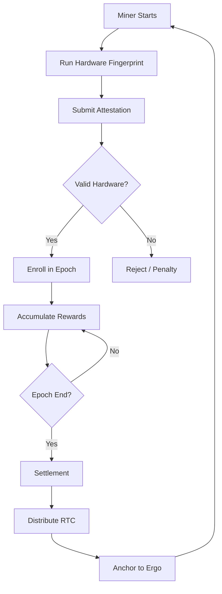
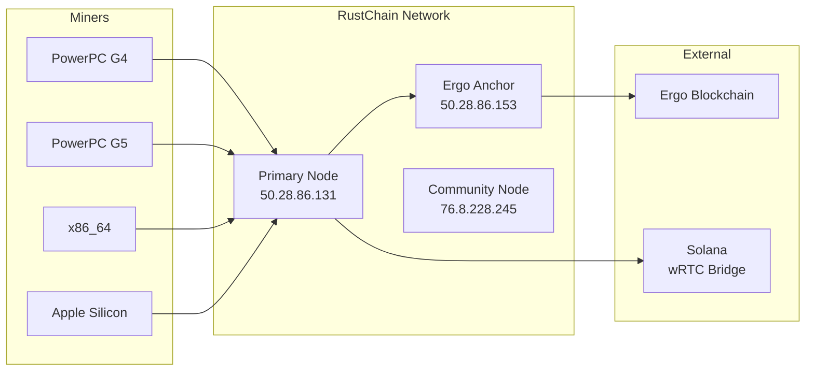

# RustChain Protocol Overview

## Introduction

RustChain is a **Proof-of-Antiquity (PoA)** blockchain that rewards vintage hardware for being old, not fast. Unlike traditional Proof-of-Work systems that favor the newest, most powerful hardware, RustChain implements **RIP-200** (RustChain Iterative Protocol) consensus that validates authentic vintage computing hardware and rewards it with higher mining multipliers.

**Core Philosophy**: Your PowerPC G4 from 1999 earns more than a modern Threadripper. That's the point.

## Key Principles

### 1. One CPU, One Vote

RustChain implements true democratic consensus:
- Each unique physical CPU gets exactly **1 vote** per epoch
- No advantage from running multiple threads or cores
- Hash power is irrelevant — authenticity matters

### 2. Antiquity Over Speed

Hardware age determines reward multipliers:

| Hardware | Era | Multiplier |
|----------|-----|------------|
| PowerPC G4 | 1999-2005 | 2.5× |
| PowerPC G5 | 2003-2006 | 2.0× |
| PowerPC G3 | 1997-2003 | 1.8× |
| IBM POWER8 | 2014 | 1.5× |
| Pentium 4 | 2000-2008 | 1.5× |
| Core 2 Duo | 2006-2011 | 1.3× |
| Apple Silicon | 2020+ | 1.2× |
| Modern x86_64 | Current | 1.0× |

### 3. Hardware Authenticity

Six cryptographic fingerprint checks ensure miners are running on **real physical hardware**, not virtual machines or emulators:

```
┌─────────────────────────────────────────────────────────────┐
│                   6 Hardware Checks                         │
├─────────────────────────────────────────────────────────────┤
│ 1. Clock-Skew & Oscillator Drift   ← Silicon aging pattern  │
│ 2. Cache Timing Fingerprint        ← L1/L2/L3 latency tone  │
│ 3. SIMD Unit Identity              ← AltiVec/SSE/NEON bias  │
│ 4. Thermal Drift Entropy           ← Heat curves are unique │
│ 5. Instruction Path Jitter         ← Microarch jitter map   │
│ 6. Anti-Emulation Checks           ← Detect VMs/emulators   │
└─────────────────────────────────────────────────────────────┘
```

**Anti-VM Penalty**: Emulated hardware receives **1 billionth** of normal rewards (0.0000000025× multiplier).

## RIP-200 Consensus Architecture

### High-Level Flow



### Epoch System

- **Duration**: ~24 hours (144 slots of 10 minutes each)
- **Reward Pool**: 1.5 RTC per epoch
- **Distribution**: Proportional to antiquity multipliers
- **Settlement**: Anchored to Ergo blockchain for immutability

### Example Reward Distribution

With 5 miners in an epoch:

```
G4 Mac (2.5×):     0.30 RTC  ████████████████████
G5 Mac (2.0×):     0.24 RTC  ████████████████
Modern PC (1.0×):  0.12 RTC  ████████
Modern PC (1.0×):  0.12 RTC  ████████
Modern PC (1.0×):  0.12 RTC  ████████
                   ─────────
Total:             0.90 RTC (+ 0.60 RTC returned to pool)
```

## Network Architecture

### Node Topology



### Live Nodes

| Node | Location | Role | Status |
|------|----------|------|--------|
| **Node 1** | 50.28.86.131 | Primary + Explorer | ✅ Active |
| **Node 2** | 50.28.86.153 | Ergo Anchor | ✅ Active |
| **Node 3** | 76.8.228.245 | Community | ✅ Active |

## Token Economics

### Supply Model

| Metric | Value |
|--------|-------|
| **Total Supply** | 8,000,000 RTC |
| **Premine** | 75,000 RTC (dev/bounties) |
| **Epoch Reward** | 1.5 RTC |
| **Epoch Duration** | ~24 hours |
| **Annual Inflation** | ~0.68% (decreasing) |

### wRTC Bridge (Solana)

RustChain Token is bridged to Solana as **wRTC**:
- **Token Mint**: `12TAdKXxcGf6oCv4rqDz2NkgxjyHq6HQKoxKZYGf5i4X`
- **DEX**: [Raydium](https://raydium.io/swap/?inputMint=sol&outputMint=12TAdKXxcGf6oCv4rqDz2NkgxjyHq6HQKoxKZYGf5i4X)
- **Bridge**: [BoTTube Bridge](https://bottube.ai/bridge)

## Security Model

### Sybil Resistance

- **Hardware Binding**: Each physical CPU can only be bound to one wallet
- **Fingerprint Uniqueness**: Silicon aging patterns are unclonable
- **Economic Disincentive**: Vintage hardware is expensive and rare

### Anti-Emulation

VMs and emulators are detected through:
1. **Clock Virtualization Artifacts**: Host clock passthrough is too perfect
2. **Simplified Cache Models**: Emulators flatten cache hierarchy
3. **Missing Thermal Sensors**: VMs report static or host temperatures
4. **Deterministic Execution**: Real silicon has nanosecond-scale jitter

### Cryptographic Security

- **Signatures**: Ed25519 for all transactions
- **Wallet Format**: Simple UTF-8 identifiers (e.g., `scott`, `pffs1802`)
- **Ergo Anchoring**: Epoch settlements written to external blockchain

## Use Cases

### 1. Digital Preservation

Incentivize keeping vintage hardware operational:
- PowerPC Macs from 1999-2006
- IBM POWER8 servers
- Retro x86 systems (Pentium III/4, Core 2)

### 2. AI Agent Economy

RustChain integrates with:
- **BoTTube**: AI video platform
- **Beacon Atlas**: Agent reputation system
- **x402 Protocol**: Machine-to-machine payments

### 3. Bounty System

Contributors earn RTC for:
- Bug fixes (5-15 RTC)
- Features (20-50 RTC)
- Security audits (75-150 RTC)
- Documentation (10-25 RTC)

## Getting Started

### Quick Install

```bash
curl -sSL https://raw.githubusercontent.com/Scottcjn/Rustchain/main/install-miner.sh | bash
```

### Check Balance

```bash
curl -sk "https://50.28.86.131/wallet/balance?miner_id=YOUR_WALLET"
```

### View Network Status

```bash
curl -sk https://50.28.86.131/health
curl -sk https://50.28.86.131/epoch
curl -sk https://50.28.86.131/api/miners
```

## Comparison with Other Consensus Mechanisms

| Feature | RustChain (PoA) | Bitcoin (PoW) | Ethereum (PoS) |
|---------|-----------------|---------------|----------------|
| **Energy Efficiency** | ✅ Low | ❌ Very High | ✅ Low |
| **Hardware Requirements** | Vintage preferred | Latest ASICs | 32 ETH stake |
| **Decentralization** | ✅ 1 CPU = 1 Vote | ❌ Hash power = votes | ⚠️ Wealth = votes |
| **Sybil Resistance** | Hardware binding | Economic cost | Stake slashing |
| **Environmental Impact** | ♻️ Reuses old hardware | ❌ E-waste | ✅ Minimal |

## Future Roadmap

### Phase 1: Network Hardening (Q1 2026)
- Multi-node consensus
- Enhanced VM detection
- Security audits

### Phase 2: Bridge Expansion (Q2 2026)
- Ethereum bridge
- Base L2 integration
- Cross-chain liquidity

### Phase 3: Agent Economy (Q3 2026)
- x402 payment protocol
- Agent wallet system
- Automated bounty claims

## References

- **Whitepaper**: [RustChain_Whitepaper_Flameholder_v0.97-1.pdf](./RustChain_Whitepaper_Flameholder_v0.97-1.pdf)
- **API Documentation**: [API.md](./API.md)
- **Protocol Spec**: [PROTOCOL.md](./PROTOCOL.md)
- **Glossary**: [GLOSSARY.md](./GLOSSARY.md)

---

**Next Steps**:
- Read [attestation-flow.md](./attestation-flow.md) for miner integration
- See [epoch-settlement.md](./epoch-settlement.md) for reward mechanics
- Check [hardware-fingerprinting.md](./hardware-fingerprinting.md) for technical details
