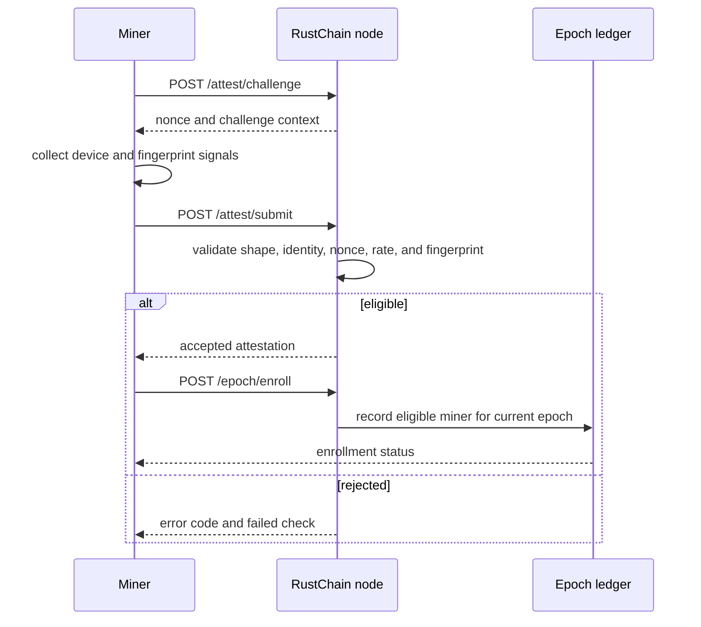
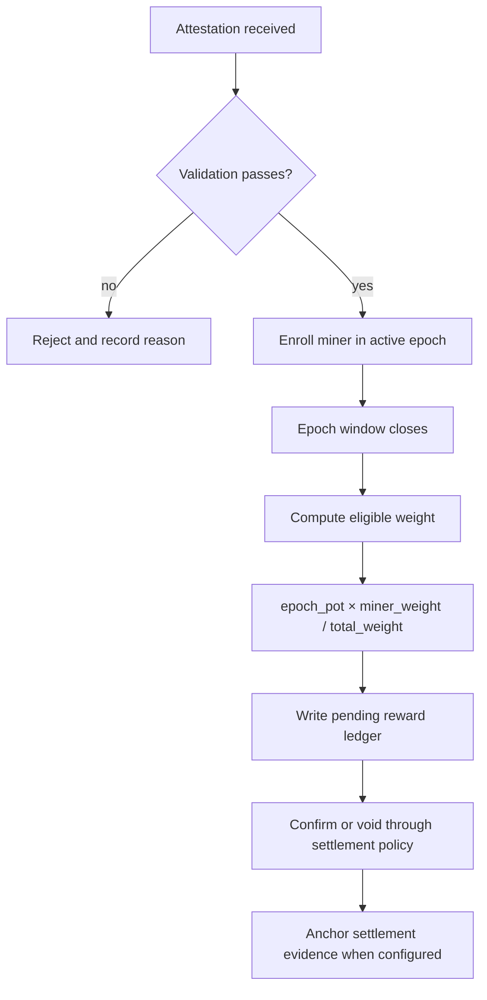
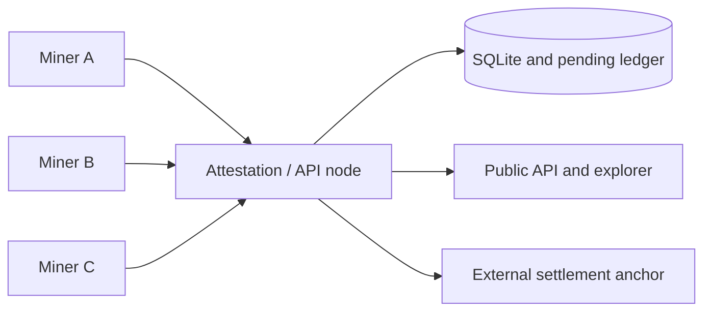
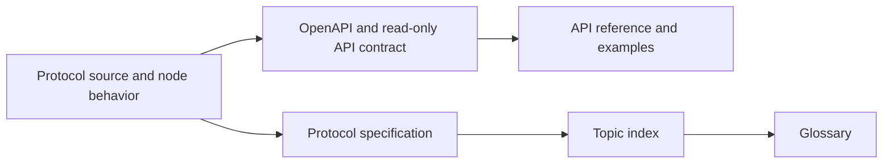

# RustChain Protocol Diagrams

These diagrams are explanatory views of the contracts in [PROTOCOL.md](../PROTOCOL.md), [API.md](../API.md), and [epoch-settlement.md](../epoch-settlement.md).

## Attestation and enrollment

## Consensus and settlement

## Network roles

## Documentation contract

