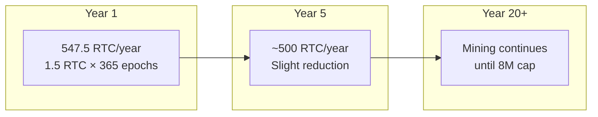
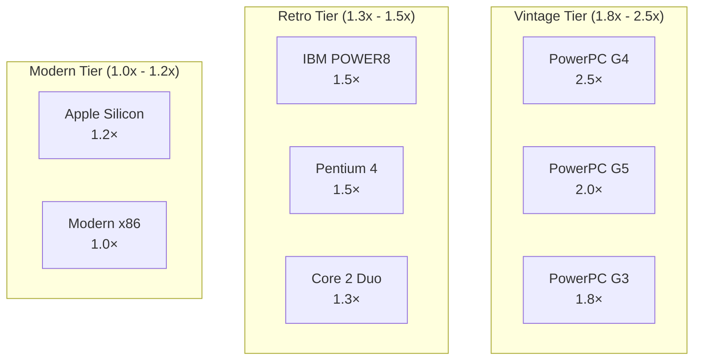
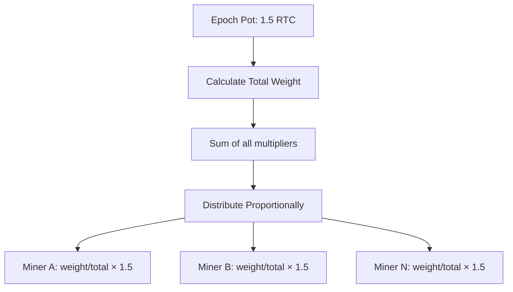
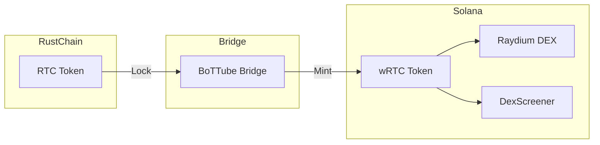

# RustChain Token Economics

## Overview

RustChain Token (RTC) is the native cryptocurrency of the RustChain network. Unlike traditional cryptocurrencies that reward computational power, RTC rewards **hardware antiquity** — the older your hardware, the more you earn.

## Token Supply

### Fixed Supply Model

```
┌─────────────────────────────────────────────────────────────┐
│                    RTC Total Supply                         │
│                      8,000,000 RTC                          │
├─────────────────────────────────────────────────────────────┤
│  Premine (Dev/Bounties)  │  Mining Rewards                  │
│       75,000 RTC         │    7,925,000 RTC                 │
│         0.94%            │       99.06%                     │
└─────────────────────────────────────────────────────────────┘
```

### Supply Breakdown

| Allocation | Amount | Percentage | Purpose |
|------------|--------|------------|---------|
| **Mining Rewards** | 7,925,000 RTC | 99.06% | Epoch rewards for miners |
| **Development** | 50,000 RTC | 0.63% | Core development funding |
| **Bounties** | 25,000 RTC | 0.31% | Community contributions |
| **Total** | 8,000,000 RTC | 100% | Fixed, no inflation |

### Emission Schedule



**At current rate (1.5 RTC/epoch):**
- Daily emission: ~1.5 RTC
- Annual emission: ~547.5 RTC
- Years to full emission: ~14,500 years

## Antiquity Multipliers

### Base Multipliers by Hardware

The core innovation of RustChain: older hardware earns more.



### Complete Multiplier Table

| Hardware | Era | Base Multiplier | Example Earnings/Epoch |
|----------|-----|-----------------|------------------------|
| **PowerPC G4** | 1999-2005 | 2.5× | 0.30 RTC |
| **PowerPC G5** | 2003-2006 | 2.0× | 0.24 RTC |
| **PowerPC G3** | 1997-2003 | 1.8× | 0.21 RTC |
| **IBM POWER8** | 2014 | 1.5× | 0.18 RTC |
| **Pentium 4** | 2000-2008 | 1.5× | 0.18 RTC |
| **Pentium III** | 1999-2003 | 1.4× | 0.17 RTC |
| **Core 2 Duo** | 2006-2011 | 1.3× | 0.16 RTC |
| **Apple M1/M2/M3** | 2020+ | 1.2× | 0.14 RTC |
| **Modern x86_64** | Current | 1.0× | 0.12 RTC |
| **ARM (Raspberry Pi)** | Current | 0.0001× | ~0 RTC |
| **VM/Emulator** | N/A | 0.0000000025× | ~0 RTC |

### Multiplier Rationale

Why reward old hardware?

1. **Digital Preservation**: Incentivize keeping vintage hardware operational
2. **Sybil Resistance**: Vintage hardware is rare and expensive
3. **Environmental**: Reuse existing hardware instead of e-waste
4. **Fairness**: Modern hardware already has advantages everywhere else

## Time Decay Formula

### Vintage Hardware Decay

To prevent permanent advantage, vintage hardware multipliers decay over time:

```
decay_factor = 1.0 - (0.15 × (years_since_launch - 5) / 5)
final_multiplier = 1.0 + (vintage_bonus × decay_factor)
```

**Constraints:**
- Decay starts after 5 years from network launch
- Minimum decay factor: 0.0 (multiplier floors at 1.0×)
- Rate: 15% per year beyond year 5

### Decay Example: PowerPC G4

```
Base multiplier: 2.5×
Vintage bonus: 1.5 (2.5 - 1.0)

Year 1:  decay = 1.0                    → 2.5×
Year 5:  decay = 1.0                    → 2.5×
Year 10: decay = 1.0 - (0.15 × 5/5)     → 2.275× (1.0 + 1.5 × 0.85)
Year 15: decay = 1.0 - (0.15 × 10/5)    → 2.05×  (1.0 + 1.5 × 0.70)
Year 20: decay = 1.0 - (0.15 × 15/5)    → 1.825× (1.0 + 1.5 × 0.55)
Year 30: decay = 0.0 (floor)            → 1.0×
```


## Loyalty Bonus

### Modern Hardware Incentive

Modern hardware (≤5 years old) can earn loyalty bonuses for continuous uptime:

```
loyalty_bonus = min(0.5, uptime_years × 0.15)
final_multiplier = base_multiplier + loyalty_bonus
```

**Constraints:**
- Rate: +15% per year of continuous mining
- Maximum bonus: +50% (capped at 3.33 years)
- Resets if miner goes offline for >7 days

### Loyalty Example: Modern x86

```
Base multiplier: 1.0×

Year 0: 1.0×
Year 1: 1.0 + 0.15 = 1.15×
Year 2: 1.0 + 0.30 = 1.30×
Year 3: 1.0 + 0.45 = 1.45×
Year 4: 1.0 + 0.50 = 1.50× (capped)
```

## Reward Distribution

### Epoch Pot Distribution

Each epoch (24 hours), 1.5 RTC is distributed:



### Distribution Formula

```
miner_reward = epoch_pot × (miner_multiplier / total_weight)
```

### Example Distribution

**Scenario**: 5 miners in epoch

| Miner | Hardware | Multiplier | Weight % | Reward |
|-------|----------|------------|----------|--------|
| A | G4 | 2.5× | 32.5% | 0.487 RTC |
| B | G5 | 2.0× | 26.0% | 0.390 RTC |
| C | x86 | 1.0× | 13.0% | 0.195 RTC |
| D | x86 | 1.0× | 13.0% | 0.195 RTC |
| E | M1 | 1.2× | 15.5% | 0.234 RTC |
| **Total** | | **7.7** | **100%** | **1.501 RTC** |

## wRTC Bridge (Solana)

### Wrapped RTC

RTC can be bridged to Solana as **wRTC** for DeFi access:



### wRTC Details

| Property | Value |
|----------|-------|
| **Token Mint** | `12TAdKXxcGf6oCv4rqDz2NkgxjyHq6HQKoxKZYGf5i4X` |
| **DEX** | [Raydium](https://raydium.io/swap/?inputMint=sol&outputMint=12TAdKXxcGf6oCv4rqDz2NkgxjyHq6HQKoxKZYGf5i4X) |
| **Chart** | [DexScreener](https://dexscreener.com/solana/8CF2Q8nSCxRacDShbtF86XTSrYjueBMKmfdR3MLdnYzb) |
| **Bridge** | [BoTTube Bridge](https://bottube.ai/bridge) |
| **Ratio** | 1:1 (1 RTC = 1 wRTC) |

### Bridge Process

**RTC → wRTC (Lock & Mint)**:
1. Send RTC to bridge address on RustChain
2. Bridge verifies transaction
3. wRTC minted on Solana to your wallet

**wRTC → RTC (Burn & Release)**:
1. Send wRTC to bridge contract on Solana
2. wRTC burned
3. RTC released on RustChain

## wRTC on Base (Ethereum L2)

### Base Integration

wRTC is also available on Base L2:

| Property | Value |
|----------|-------|
| **Contract** | `0x5683C10596AaA09AD7F4eF13CAB94b9b74A669c6` |
| **DEX** | [Aerodrome](https://aerodrome.finance/swap?from=0x833589fCD6eDb6E08f4c7C32D4f71b54bdA02913&to=0x5683C10596AaA09AD7F4eF13CAB94b9b74A669c6) |
| **Bridge** | [bottube.ai/bridge/base](https://bottube.ai/bridge/base) |

## Value Proposition

### Current Valuation

| Metric | Value |
|--------|-------|
| **Reference Price** | $0.10 USD per RTC |
| **Fully Diluted Value** | $800,000 USD |
| **Circulating Supply** | ~75,000 RTC |
| **Market Cap** | ~$7,500 USD |

### Earning Potential

| Hardware | Multiplier | Daily Earnings | Monthly | Yearly |
|----------|------------|----------------|---------|--------|
| G4 (solo) | 2.5× | 1.5 RTC | 45 RTC | 547 RTC |
| G4 (10 miners) | 2.5× | 0.375 RTC | 11.25 RTC | 137 RTC |
| x86 (10 miners) | 1.0× | 0.15 RTC | 4.5 RTC | 55 RTC |

*Earnings depend on total network weight*

## Bounty System

### Contribution Rewards

| Tier | Reward | Examples |
|------|--------|----------|
| **Micro** | 1-10 RTC | Typo fix, small docs |
| **Standard** | 20-50 RTC | Feature, refactor |
| **Major** | 75-100 RTC | Security fix, consensus |
| **Critical** | 100-150 RTC | Vulnerability patch |

### Active Bounty Pools

| Pool | Total | Status |
|------|-------|--------|
| Star Repo | 200 RTC | Open |
| Run Miner 7 Days | 500 RTC | Open |
| Referral Program | 300 RTC | Open |
| Bug Reports | 150 RTC | Open |

## Economic Security

### Sybil Attack Cost

Running multiple miners is economically unfeasible:

| Attack Vector | Cost | Reward | ROI |
|---------------|------|--------|-----|
| Buy 10 G4 Macs | ~$2,000 | ~$137/year | 14.6 years |
| Rent VMs | ~$100/month | ~$0.00001/year | Never |
| Emulate G4 | $0 | ~$0.00001/year | Never |

### Why Vintage Hardware?

1. **Scarcity**: Limited supply of working vintage hardware
2. **Cost**: Expensive to acquire and maintain
3. **Authenticity**: Can't be faked (fingerprinting)
4. **Decay**: Multipliers decrease over time

## Future Considerations

### Potential Adjustments

- **Epoch Pot**: May increase with network growth
- **New Hardware Tiers**: As hardware ages, new tiers added
- **Decay Rates**: Community governance may adjust
- **Bridge Fees**: May introduce small fees for sustainability

### Governance

Currently centralized (core team). Future plans:
- Token-weighted voting
- Proposal system
- Community treasury

---

**Next**: See [api-reference.md](./api-reference.md) for all public endpoints.
