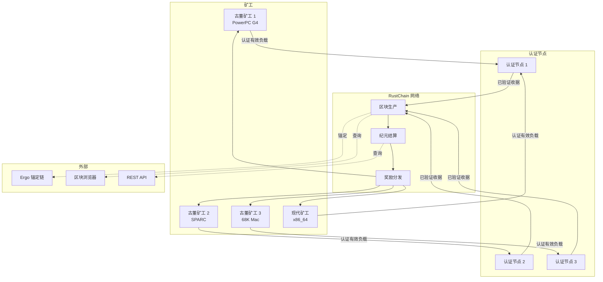
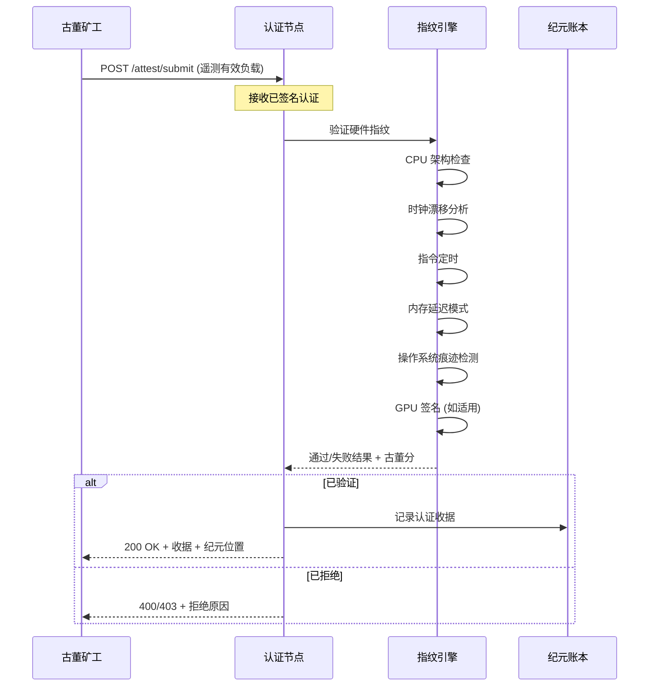
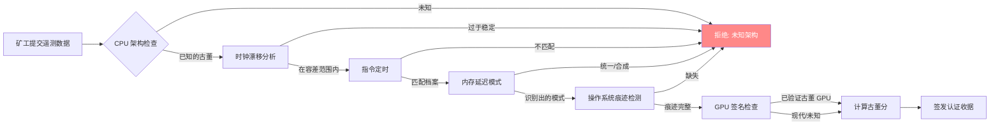
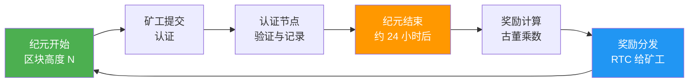

# RustChain 架构概述

> RustChain 协议架构、共识机制、认证流程、硬件指纹识别及网络拓扑的综合指南。

**属于 [文档冲刺 #72](https://github.com/Scottcjn/rustchain-bounties/issues/72)**

---

## 目录

1. [协议概述](#1-协议概述)
2. [RIP-200: 古董证明 (Proof of Antiquity) 共识](#2-rip-200-古董证明共识)
3. [系统架构](#3-系统架构)
4. [网络架构与 P2P 协议](#4-网络架构与-p2p-协议)
5. [认证 (Attestation) 流程](#5-认证流程)
6. [硬件指纹识别](#6-硬件指纹识别)
7. [纪元结算与奖励](#7-纪元结算与奖励)
8. [代币经济学](#8-代币经济学)
9. [古董挖矿](#9-古董挖矿)
10. [与权益证明 (Proof-of-Stake) 的对比](#10-与权益证明的对比)
11. [术语表](#11-术语表)

---

## 1. 协议概述

RustChain 是一个 **古董证明 (Proof-of-Antiquity，PoA)** 区块链，它奖励的是真实的古董硬件，而不是现代机器。网络使用 **6+ 硬件指纹检查** 来防止虚拟机和模拟器获取奖励。目前有 9 个活跃矿工和 3 个认证节点。原生代币是 **RTC (RustChain Token)**。

### 关键属性
- **总供应量:** 830 万 RTC
- **共识:** RIP-200 (古董证明)
- **区块时间:** ~60 秒
- **纪元持续时间:** ~24 小时
- **原生代币:** RTC
- **锚定链:** Ergo (用于跨链桥接)
- **参考汇率:** 1 RTC = $0.15 USD

### 实时网络
- **节点健康状况:** `curl -sk https://50.28.86.131/health`
- **活跃矿工:** `curl -sk https://50.28.86.131/api/miners`
- **区块浏览器:** `https://50.28.86.131/explorer`

---

## 2. RIP-200: 古董证明 (Proof of Antiquity) 共识

RIP-200 (RustChain Improvement Proposal 200) 定义了古董证明共识机制。与工作量证明 (Proof of Work，计算浪费) 或权益证明 (Proof of Stake，资本加权) 不同，古董证明根据可验证的硬件年龄和真实性来奖励**真实的古董硬件**。

### 核心原则
1. **基于年龄的乘数:** 较旧的硬件在每个纪元中获得更高的奖励
2. **反模拟:** 6+ 指纹检查防止虚拟机/虚假提交
3. **认证闸门:** 只有经过认证的矿工才能获得结算奖励
4. **公平分发:** 无预挖，无 VC 分配

### 共识流程
1. 矿工执行工作周期并收集硬件遥测数据
2. 矿工将 **认证有效负载 (attestation payloads)** 提交给认证节点
3. 认证节点验证硬件指纹 (CPU, GPU, OS 等)
4. 验证后的认证收据被包含在区块中
5. 在纪元边界，根据古董乘数计算并分发奖励

---

## 3. 系统架构

### 系统架构图



### 组件角色

| 组件 | 角色 | 数量 |
|-----------|------|----------|
| **古董矿工** | 执行挖矿工作，提交认证有效负载 | 9 个活跃 |
| **认证节点** | 验证硬件指纹，签发收据 | 3 个活跃 |
| **区块生产者** | 基于验证后的认证创建区块 | 网络共识 |
| **纪元结算** | 每 ~24 小时计算并分发奖励 | 协议层 |
| **Ergo 桥接** | 为 Solana 上的 wRTC 提供跨链锚定 | 外部 |

---

## 4. 网络架构与 P2P 协议

### 网络拓扑

RustChain 使用点对点 (P2P) 网络，矿工连接到认证节点，认证节点之间通信达成共识。

### P2P 协议

矿工通过 HTTP/HTTPS REST API 与认证节点通信。协议支持：

- **认证提交:** POST `/attest/submit` (带签名硬件遥测)
- **状态查询:** GET 端点查询纪元、矿工状态、网络健康情况
- **WebSocket 数据流:** 实时区块和纪元事件流

### 节点发现
- 引导节点在启动时配置
- 对等节点列表通过 `/api/peers` 端点交换
- 具有保持连接 (keepalive) 的持久连接

### 消息类型
1. **认证有效负载:** 矿工 → 节点 (硬件遥测 + 签名)
2. **认证收据:** 节点 → 矿工 (验证结果)
3. **区块公告:** 节点 → 对等节点 (新区块通知)
4. **纪元结算:** 网络范围 (奖励计算事件)

---

## 5. 认证 (Attestation) 流程

认证过程是验证真实硬件并防止模拟的核心机制。

### 认证流程图



### 认证有效负载结构

```json
{
  "miner_id": "miner-pubkey-ed25519",
  "epoch": 1234,
  "hardware": {
    "cpu_arch": "ppc",
    "cpu_model": "PowerPC G4 7447A",
    "os": "Linux",
    "fingerprint_hash": "sha256-hash-of-hw-telemetry"
  },
  "work": {
    "cycles_completed": 50000,
    "timestamp_start": 1716800000,
    "timestamp_end": 1716803600
  },
  "signature": "ed25519-signature-of-payload"
}
```

### 拒绝原因
- **时钟偏差过大** — 暗示为虚拟机/模拟器
- **指令定时不一致** — 与声称的 CPU 不匹配
- **内存延迟模式未知** — 未知硬件配置文件
- **操作系统痕迹缺失** — 缺少必需的系统文件
- **签名无效** — 有效负载被篡改或重放

---

## 6. 硬件指纹识别

### 6+1 指纹检查

RustChain 使用多层指纹识别系统来验证挖矿硬件是否为真实的古董设备，而非虚拟机或模拟器。

### 指纹识别管线



### 检查详情

| # | 检查项 | 检测内容 | 古董指标 |
|---|-------|-----------------|-------------------|
| 1 | **CPU 架构** | 不支持的架构声明 | PowerPC, SPARC, 68K, PA-RISC |
| 2 | **时钟漂移** | 完美的时钟 = 虚拟机 | 真实硬件存在微小漂移 |
| 3 | **指令定时** | 模拟器定时模式 | 古董 CPU 具有独特的定时配置 |
| 4 | **内存延迟** | 合成内存模式 | 真实内存具有可变延迟 |
| 5 | **操作系统痕迹** | 缺少系统指标 | 古董操作系统留下特定痕迹 |
| 6 | **GPU 签名** | 旧系统上的现代 GPU | 古董 GPU 有独特的标识符 |
| +1 | **综合评分** | 组合分析 | 整体古董置信度 |

### 支持的架构 (15+)
- **PowerPC:** G3, G4, G4+, G5, POWER8, POWER9
- **SPARC:** SPARCv8, SPARCv9
- **68K:** Motorola 68020, 68030, 68040, 68060
- **x86:** 旧款 (Pentium, 486) — 支持，但乘数较低
- **ARM:** 旧款 ARM9, ARM11
- **MIPS:** R3000, R4000
- **PA-RISC:** PA-7100, PA-8000
- **Alpha:** EV5, EV6

---

## 7. 纪元结算与奖励

### 纪元生命周期



### 结算流程
1. **纪元开始**于定义的区块高度
2. **矿工提交**整个纪元期间的认证有效负载
3. **认证节点验证**每一项提交是否符合指纹指标
4. **已验证收据**被记录在纪元账本中
5. **纪元结束时**，协议计算奖励：
   - 每个工作周期的基础奖励
   - 基于验证硬件年龄的古董乘数
   - 对未通过认证的扣除
6. **自动分发奖励**到矿工钱包

### 古董乘数

| 硬件时代 | 示例 | 预估乘数 |
|-------------|---------|----------------------|
| **1980s** | 68020, SPARCstation 1 | 10x - 20x |
| **1990s** | PowerPC 604, Pentium | 5x - 10x |
| **2000s** | PowerPC G4, Athlon | 2x - 5x |
| **2010s** | x86_64 服务器 | 1x - 2x |
| **现代** | 最新 CPU/GPU | 0.5x - 1x |

---

## 8. 代币经济学

### RTC 代币

| 属性 | 值 |
|----------|-------|
| **名称** | RustChain 代币 |
| **符号** | RTC |
| **总供应量** | 830 万 |
| **分发** | 挖矿奖励 (100%) |
| **参考汇率** | 1 RTC = $0.15 USD |

### 分发模型
- **100% 给矿工** — 无预挖，无团队分配，无 VC
- **古董权重** — 古董硬件赚得更多
- **纪元制** — 每 ~24 小时分发一次奖励
- **发行递减** — 总供应上限为 830 万

### 跨链桥接 (wRTC)
- **桥接类型:** RustChain ↔ Solana (通过 Ergo 锚点)
- **包装代币:** Solana 上的 wRTC
- **锁定机制:** RustChain 上的 RTC 锁定 → Solana 上的 wRTC 铸造

---

## 9. 古董挖矿

### 为什么选择古董硬件？

古董挖矿是 RustChain 的核心创新。通过奖励旧硬件而非新硬件，协议达到以下目的：

1. **减少能源浪费** — 没有哈希算力竞争的动力
2. **保护计算历史** — 为旧机器赋予经济意义
3. **挖矿民主化** — 便宜/旧硬件具有竞争力
4. **防止集中化** — 现代数据中心毫无优势

### 入门
1. 寻找古董硬件 (eBay, 旧货店, 捐赠)
2. 安装 RustChain 矿工软件
3. 配置钱包地址
4. 连接到认证节点
5. 提交认证并赚取 RTC

### 支持的矿工配置
- **原生:** 直接在古董硬件上运行
- **交叉编译:** 在现代机器上构建，部署到古董目标
- **远程认证:** 远程收集硬件遥测数据

---

## 10. 与权益证明 (Proof-of-Stake) 的对比

| 特性 | 权益证明 (以太坊) | 古董证明 (RustChain) |
|--------|--------------------------|-------------------------------|
| **资源** | 资本 (质押 ETH) | 古董硬件 |
| **能源** | 低 | 低 |
| **集中化风险** | 高 (巨鲸主导) | 低 (硬件多样性) |
| **准入门槛** | 高 ($$$ 质押) | 低 (廉价旧硬件) |
| **安全模型** | 经济终结性 | 硬件认证 + 共识 |
| **奖励分发** | 与质押成比例 | 与古董程度成比例 |
| **环境影响** | 低 | 极低 (重复利用旧硬件) |

---

## 11. 术语表

| 术语 | 定义 |
|------|-----------|
| **RIP-200** | RustChain 改进提案 200 — 定义古董证明共识 |
| **认证 (Attestation)** | 通过指纹检查验证硬件真实性的过程 |
| **认证节点** | 接收并验证矿工认证的网络节点 |
| **认证有效负载** | 矿工提交的包含硬件遥测和工作证明的数据 |
| **认证收据** | 认证节点签发的验证结果 |
| **古董乘数** | 基于验证的硬件年龄的奖励乘数 |
| **纪元 (Epoch)** | 计算和分发奖励的 ~24 小时周期 |
| **纪元结算** | 在纪元结束时计算和分发奖励的过程 |
| **指纹哈希** | 用于验证的硬件遥测数据的加密哈希 |
| **锁定账本** | 跟踪用于桥接操作的锁定 RTC |
| **PSE** | 已签名纪元证明 — 纪元验证机制 |
| **RTC** | RustChain Token — 原生加密货币 |
| **wRTC** | Solana 上的包装 RTC (通过跨链桥接) |
| **古董硬件** | 2010 年前的计算设备，有资格获得更高的乘数 |
| **x402** | 高级功能的 HTTP 付款协议集成 |

---

## 相关文档

- [协议规范](../PROTOCOL.md) — 详细的 RIP-200 协议规范
- [快速入门](../QUICKSTART.md) — 5 分钟上手挖矿
- [API 参考](../API_REFERENCE.md) — 完整的 REST API 文档
- [矿工安装指南](../INSTALLATION_WALKTHROUGH.md) — 详细安装指南
- [控制台挖矿设置](../CONSOLE_MINING_SETUP.md) — 通过控制台挖矿
- [硬件指纹识别](../hardware-fingerprinting.md) — 指纹检查深度解析
- [桥接 API](../bridge-api.md) — 跨链桥接端点
- [钱包设置](../WALLET_SETUP.md) — 配置钱包
- [贡献指南](../CONTRIBUTING.md) — 如何向 RustChain 贡献

---

*最后更新: 2026-05-27 | 属于 [文档冲刺 #72](https://github.com/Scottcjn/rustchain-bounties/issues/72)*
