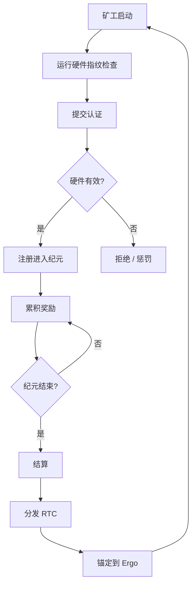
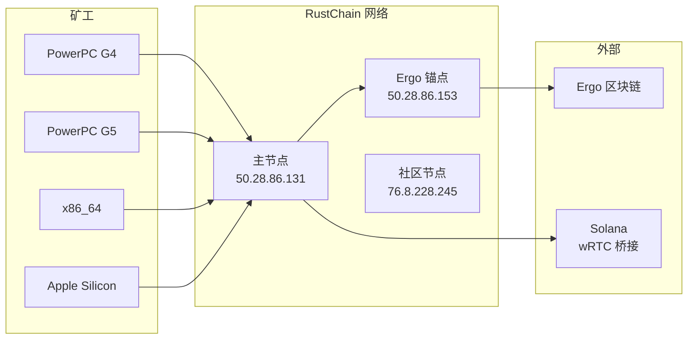

# RustChain 协议概述

## 引言

RustChain 是一个 **Proof-of-Antiquity (PoA，古董证明)** 区块链，它奖励的是老旧的硬件，而不是速度快的硬件。与传统倾向于最新、最强大硬件的 PoW 系统不同，RustChain 实施了 **RIP-200** (RustChain Iterative Protocol) 共识，该共识验证真实的古董计算硬件，并用更高的挖矿乘数来奖励它们。

**核心理念**：您的 1999 年 PowerPC G4 比现代 Threadripper 赚得更多。这就是重点。

## 关键原则

### 1. 一 CPU，一票

RustChain 实现了真正的民主共识：
- 每个独特的物理 CPU 在每个纪元 (epoch) 中获得确切的 **1 票**
- 运行多个线程或核心没有优势
- 哈希算力不重要 —— 真实性才重要

### 2. 古董优于速度

硬件年龄决定奖励乘数：

| 硬件 | 年代 | 乘数 |
|----------|-----|------------|
| PowerPC G4 | 1999-2005 | 2.5× |
| PowerPC G5 | 2003-2006 | 2.0× |
| PowerPC G3 | 1997-2003 | 1.8× |
| IBM POWER8 | 2014 | 1.5× |
| Pentium 4 | 2000-2008 | 1.5× |
| Core 2 Duo | 2006-2011 | 1.3× |
| Apple Silicon | 2020+ | 1.2× |
| 现代 x86_64 | 当前 | 1.0× |

### 3. 硬件真实性

六项加密指纹检查确保矿工是在**真实的物理硬件**上运行，而不是虚拟机或模拟器：

```
┌─────────────────────────────────────────────────────────────┐
│                   6 项硬件检查                               │
├─────────────────────────────────────────────────────────────┤
│ 1. 时钟偏差与振荡器漂移   ← 硅老化模式                        │
│ 2. 缓存定时指纹          ← L1/L2/L3 延迟基调                 │
│ 3. SIMD 单元身份         ← AltiVec/SSE/NEON 偏置             │
│ 4. 热漂移熵              ← 热曲线是唯一的                    │
│ 5. 指令路径抖动          ← 微架构抖动图                      │
│ 6. 反模拟检查            ← 检测虚拟机/模拟器                 │
└─────────────────────────────────────────────────────────────┘
```

**虚拟机惩罚**：模拟硬件获得的奖励是正常的 **十亿分之一** (0.0000000025× 乘数)。   

## RIP-200 共识架构

### 高级流程



### 纪元 (Epoch) 系统

- **持续时间**: ~24 小时（144 个 10 分钟的槽位）
- **奖励池**: 每个纪元 1.5 RTC
- **分配**: 与古董乘数成比例
- **结算**: 锚定到 Ergo 区块链以确保不可篡改

### 奖励分配示例

纪元中有 5 个矿工：

```
G4 Mac (2.5×):     0.30 RTC  ████████████████████
G5 Mac (2.0×):     0.24 RTC  ████████████████
现代 PC (1.0×):    0.12 RTC  ████████
现代 PC (1.0×):    0.12 RTC  ████████
现代 PC (1.0×):    0.12 RTC  ████████
                   ─────────
总计:             0.90 RTC (+ 0.60 RTC 返回奖励池)
```

## 网络架构

### 节点拓扑



### 在线节点

| 节点 | 位置 | 角色 | 状态 |
|------|----------|------|--------|
| **节点 1** | rustchain.org | 主节点 + 浏览器 | ✅ 活动 |
| **节点 2** | 50.28.86.153 | Ergo 锚点 | ✅ 活动 |
| **节点 3** | 76.8.228.245 | 社区节点 | ✅ 活动 |

## 代币经济学

### 供应模型

| 指标 | 值 |
|--------|-------|
| **总供应量** | 8,000,000 RTC |
| **预挖** | 75,000 RTC (开发/赏金) |
| **纪元奖励** | 1.5 RTC |
| **纪元持续时间** | ~24 小时 |
| **年度通胀** | ~0.68% (递减) |

### wRTC 桥接 (Solana)

RustChain 代币桥接至 Solana 作为 **wRTC**：
- **代币铸造地址**: `12TAdKXxcGf6oCv4rqDz2NkgxjyHq6HQKoxKZYGf5i4X`
- **DEX**: [Raydium](https://raydium.io/swap/?inputMint=sol&outputMint=12TAdKXxcGf6oCv4rqDz2NkgxjyHq6HQKoxKZYGf5i4X)
- **桥接**: [BoTTube Bridge](https://bottube.ai/bridge)

## 安全模型

### 抗女巫攻击 (Sybil Resistance)

- **硬件绑定**: 每个物理 CPU 只能绑定到一个钱包
- **指纹唯一性**: 硅老化模式不可克隆
- **经济阻断**: 古董硬件昂贵且稀有

### 反模拟

虚拟机和模拟器通过以下方式检测：
1. **时钟虚拟化伪影**: 主机时钟透传过于完美
2. **简化的缓存模型**: 模拟器扁平化了缓存层次结构
3. **缺失热传感器**: 虚拟机报告静态或主机温度
4. **确定性执行**: 真实硅片具有纳秒级的抖动

### 加密安全

- **签名**: Ed25519 用于所有交易
- **钱包格式**: 简单的 UTF-8 标识符 (例如 `scott`, `pffs1802`)
- **Ergo 锚定**: 纪元结算写入外部区块链

## 使用场景

### 1. 数字保护

激励保持古董硬件运行：
- 1999-2006 年间的 PowerPC Mac
- IBM POWER8 服务器
- 复古 x86 系统 (Pentium III/4, Core 2)

### 2. AI 代理经济

RustChain 集成于：
- **BoTTube**: AI 视频平台
- **Beacon Atlas**: 代理信誉系统
- **x402 协议**: 机器对机器支付

### 3. 赏金系统

贡献者赚取 RTC 用于：
- Bug 修复 (5-15 RTC)
- 功能开发 (20-50 RTC)
- 安全审计 (75-150 RTC)
- 文档编写 (10-25 RTC)

## 入门

### 快速安装

```bash
curl -sSL https://raw.githubusercontent.com/Scottcjn/Rustchain/main/install-miner.sh | bash
```

### 检查余额

```bash
curl -sk "https://rustchain.org/wallet/balance?miner_id=YOUR_WALLET"
```

### 查看网络状态

```bash
curl -sk https://rustchain.org/health
curl -sk https://rustchain.org/epoch
curl -sk https://rustchain.org/api/miners
```

## 与其他共识机制对比

| 特性 | RustChain (PoA) | 比特币 (PoW) | 以太坊 (PoS) |
|---------|-----------------|---------------|----------------|
| **能源效率** | ✅ 低 | ❌ 极高 | ✅ 低 |
| **硬件要求** | 古董优先 | 最新 ASIC | 32 ETH 质押 |
| **去中心化** | ✅ 1 CPU = 1 票 | ❌ 算力 = 投票 | ⚠️ 财富 = 投票 |
| **抗女巫攻击** | 硬件绑定 | 经济成本 | 质押削减 |
| **环境影响** | ♻️ 重复利用老硬件 | ❌ 电子垃圾 | ✅ 极小 |

## 未来路线图

### 第一阶段：网络加固 (Q1 2026)
- 多节点共识
- 增强型虚拟机检测
- 安全审计

### 第二阶段：桥接扩展 (Q2 2026)
- 以太坊桥接
- Base L2 集成
- 跨链流动性

### 第三阶段：代理经济 (Q3 2026)
- x402 支付协议
- 代理钱包系统
- 自动赏金认领

## 参考

- **白皮书**: [WHITEPAPER.md](./WHITEPAPER.md)
- **API 文档**: [API.md](./API.md)
- **协议规范**: [PROTOCOL.md](./PROTOCOL.md)
- **词汇表**: [GLOSSARY.md](./GLOSSARY.md)

---

**下一步**:
- 阅读 [attestation-flow.md](./attestation-flow.md) 进行矿工集成
- 查看 [epoch-settlement.md](./epoch-settlement.md) 了解奖励机制
- 查看 [hardware-fingerprinting.md](./hardware-fingerprinting.md) 了解技术细节
