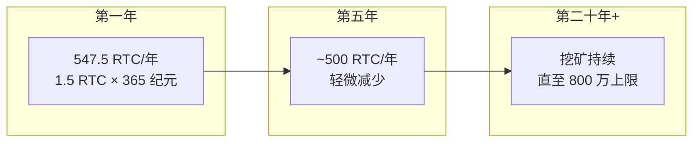
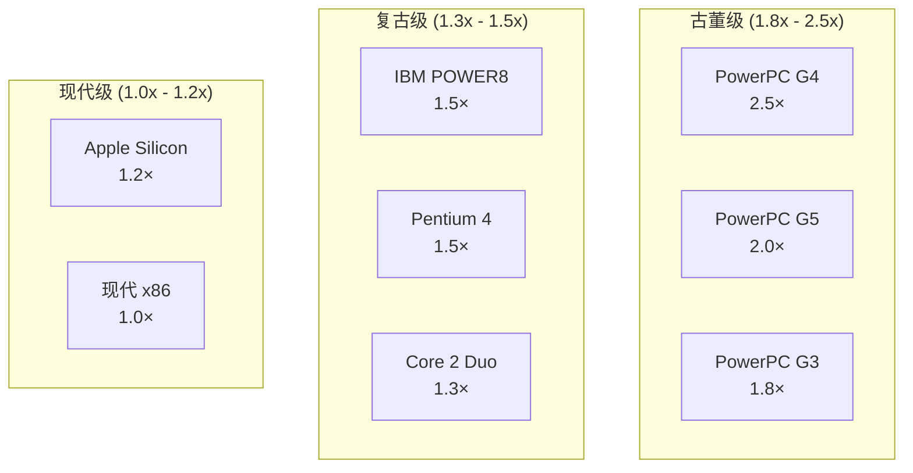
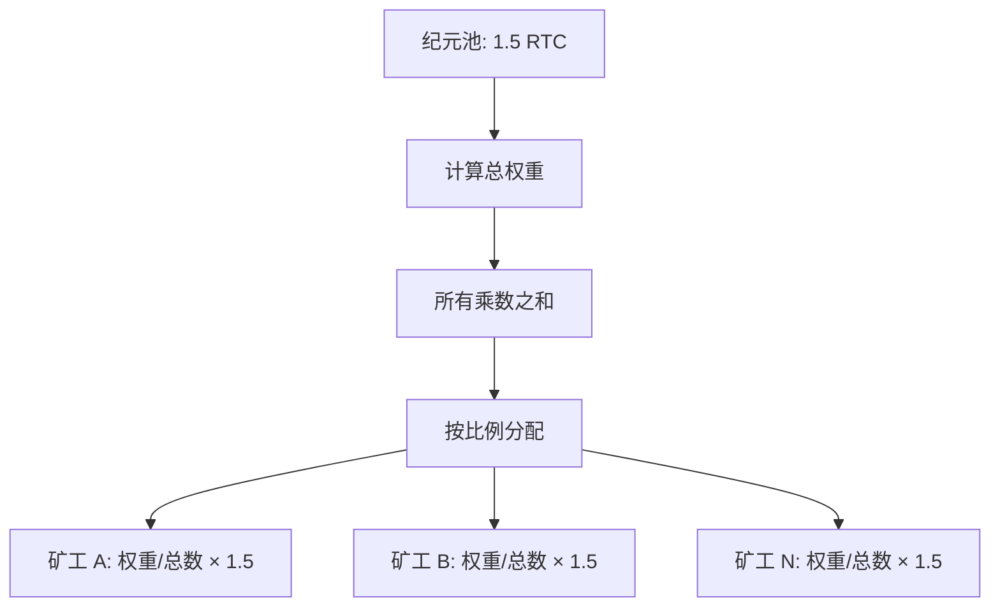
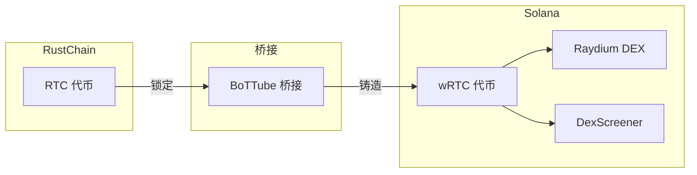

# RustChain 代币经济学

## 概述

RustChain 代币 (RTC) 是 RustChain 网络的原生加密货币。与奖励计算能力的传统加密货币不同，RTC 奖励的是 **硬件的古董程度** —— 硬件越老，您赚得越多。

## 代币供应

### 固定供应模型

```
┌─────────────────────────────────────────────────────────────┐
│                    RTC 总供应量                             │
│                      8,000,000 RTC                          │
├─────────────────────────────────────────────────────────────┤
│  预挖 (开发/赏金)       │  挖矿奖励                         │
│       75,000 RTC         │    7,925,000 RTC                 │
│         0.94%            │       99.06%                     │
└─────────────────────────────────────────────────────────────┘
```

### 供应细分

| 分配 | 金额 | 百分比 | 用途 |
|------------|--------|------------|---------|
| **挖矿奖励** | 7,925,000 RTC | 99.06% | 纪元矿工奖励 |
| **开发** | 50,000 RTC | 0.63% | 核心开发资助 |
| **赏金** | 25,000 RTC | 0.31% | 社区贡献 |
| **总计** | 8,000,000 RTC | 100% | 固定，无通胀 |

### 分发里程碑 (2026年3月)

| 指标 | 值 |
|--------|-------|
| **钱包总数** | **500** |
| **非创始人钱包** | 496 |
| **贡献者 RTC** | ~90,568 RTC |
| **赏金支付** | ~27,000 RTC (支付给 260+ 名贡献者) |
| **单日最大支付** | 1,995 RTC (B1tor, 2026年3月26日) |
| **已分发挖矿奖励** | ~63,000 RTC (纪元结算) |
| **链上交易** | 2,511 |
| **顶级贡献者收益** | 3,258 RTC |

### 发行计划



**按当前速率 (1.5 RTC/纪元):**
- 每日发行: ~1.5 RTC
- 年度发行: ~547.5 RTC
- 完全发行所需年数: ~14,500 年

## 古董乘数

### 基于硬件的基础乘数

RustChain 的核心创新：旧硬件赚得更多。



### 完整乘数表

| 硬件 | 年代 | 基础乘数 | 纪元收益示例 |
|----------|-----|-----------------|------------------------|
| **PowerPC G4** | 1999-2005 | 2.5× | 0.30 RTC |
| **PowerPC G5** | 2003-2006 | 2.0× | 0.24 RTC |
| **PowerPC G3** | 1997-2003 | 1.8× | 0.21 RTC |
| **IBM POWER8** | 2014 | 1.5× | 0.18 RTC |
| **Pentium 4** | 2000-2008 | 1.5× | 0.18 RTC |
| **Pentium III** | 1999-2003 | 1.4× | 0.17 RTC |
| **Core 2 Duo** | 2006-2011 | 1.3× | 0.16 RTC |
| **Apple M1/M2/M3** | 2020+ | 1.2× | 0.14 RTC |
| **现代 x86_64** | 当前 | 1.0× | 0.12 RTC |
| **ARM (树莓派)** | 当前 | 0.0001× | ~0 RTC |
| **虚拟机/模拟器** | N/A | 0.0000000025× | ~0 RTC |

### 乘数理由

为什么要奖励古董硬件？

1. **数字保护**: 激励保持古董硬件处于工作状态
2. **抗女巫攻击**: 古董硬件稀有且昂贵
3. **环境友好**: 重复利用现有硬件，而非产生电子垃圾
4. **公平性**: 现代硬件在其他领域已经占据优势

## 时间衰减公式

### 古董硬件衰减

为防止永久性优势，古董硬件的乘数会随时间衰减：

```
decay_factor = 1.0 - (0.15 × (years_since_launch - 5) / 5)
final_multiplier = 1.0 + (vintage_bonus × decay_factor)
```

**限制:**
- 衰减从网络启动 5 年后开始
- 最低衰减因子: 0.0 (乘数下限为 1.0×)
- 速率: 第 5 年后每年 15%

### 衰减示例: PowerPC G4

```
基础乘数: 2.5×
古董奖励: 1.5 (2.5 - 1.0)

第 1 年:  decay = 1.0                    → 2.5×
第 5 年:  decay = 1.0                    → 2.5×
第 10 年: decay = 1.0 - (0.15 × 5/5)     → 2.275× (1.0 + 1.5 × 0.85)
第 15 年: decay = 1.0 - (0.15 × 10/5)    → 2.05×  (1.0 + 1.5 × 0.70)
第 20 年: decay = 1.0 - (0.15 × 15/5)    → 1.825× (1.0 + 1.5 × 0.55)
第 30 年: decay = 0.0 (基准线)            → 1.0×
```

## 忠诚度奖励

### 现代硬件激励

现代硬件 (≤5 年) 如果持续在线，可获得忠诚度奖励：

```
loyalty_bonus = min(0.5, uptime_years × 0.15)
final_multiplier = base_multiplier + loyalty_bonus
```

**限制:**
- 速率: 每年持续挖矿增加 15%
- 最高奖励: +50% (上限 3.33 年)
- 若离线 >7 天则重置

## 奖励分发

### 纪元奖励池分发

每个纪元 (24 小时)，分发 1.5 RTC：



### 分发公式

```
miner_reward = epoch_pot × (miner_multiplier / total_weight)
```

## wRTC 桥接 (Solana)

### 包装 RTC (Wrapped RTC)

RTC 可桥接至 Solana 作为 **wRTC** 以获取 DeFi 便利：



### wRTC 详情

| 属性 | 值 |
|----------|-------|
| **代币铸造地址** | `12TAdKXxcGf6oCv4rqDz2NkgxjyHq6HQKoxKZYGf5i4X` |
| **DEX** | [Raydium](https://raydium.io/swap/?inputMint=sol&outputMint=12TAdKXxcGf6oCv4rqDz2NkgxjyHq6HQKoxKZYGf5i4X) |
| **图表** | [DexScreener](https://dexscreener.com/solana/8CF2Q8nSCxRacDShbtF86XTSrYjueBMKmfdR3MLdnYzb) |      
| **桥接** | [BoTTube Bridge](https://bottube.ai/bridge) |
| **比例** | 1:1 (1 RTC = 1 wRTC) |

## wRTC on Base (以太坊 L2)

### Base 集成

wRTC 也可在 Base L2 上使用：

| 属性 | 值 |
|----------|-------|
| **合约地址** | `0x5683C10596AaA09AD7F4eF13CAB94b9b74A669c6` |
| **DEX** | [Aerodrome](https://aerodrome.finance/swap?from=0x833589fCD6eDb6E08f4c7C32D4f71b54bdA02913&to=0x5683C10596AaA09AD7F4eF13CAB94b9b74A669c6) |
| **桥接** | [bottube.ai/bridge/base](https://bottube.ai/bridge/base) |

## 价值主张

### 当前估值

| 指标 | 值 |
|--------|-------|
| **参考价格** | $0.10 USD / RTC |
| **完全稀释估值** | $800,000 USD |
| **流通供应量** | ~90,568 RTC |
| **市值** | ~$9,057 USD |
| **钱包持有人** | **500** |

## 赏金系统

### 贡献奖励

| 层级 | 当前费率 | 35K 发放后 | 50K 发放后 |
|------|-------------|---------------|---------------|
| **微型** | 1-10 RTC | 1-8 RTC | 1-5 RTC |
| **标准** | 20-50 RTC | 15-40 RTC | 10-25 RTC |
| **重大** | 75-150 RTC | 55-115 RTC | 40-75 RTC |
| **关键** | 200-400 RTC | 150-300 RTC | 100-200 RTC |

*注：随生态成熟，费率会下调，以保护代币价值。*

---

**下一步**: 查看 [api-reference.md](./api-reference.md) 了解所有公共端点。
