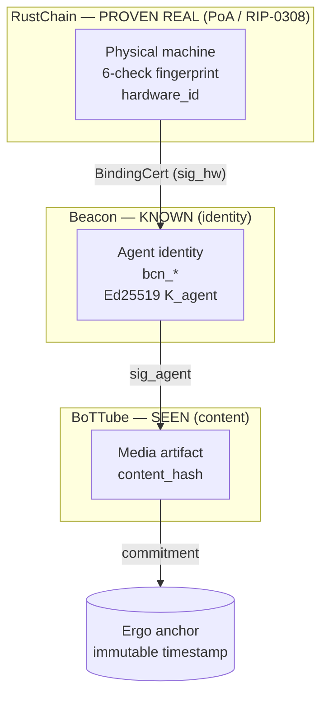
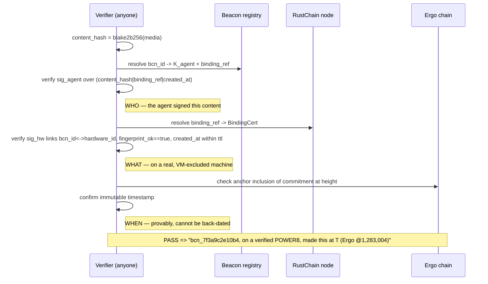

# RIP-0310: Proof of Provenance (PoP)

[](https://doi.org/10.5281/zenodo.20502068)

```yaml
rip: 0310
title: Proof of Provenance (PoP) — Identity-Bound, Hardware-Bound Provenance for AI Content
author: Scott Boudreaux (Elyan Labs)
status: Draft
type: Standards Track
category: Core
created: 2026-06-01
requires: RIP-0001, RIP-0007, RIP-0308
external: Beacon agent-identity layer (agent.json / bcn_*); Ergo register anchoring
doi: 10.5281/zenodo.20502068
```

> **Citation:** Boudreaux, S. (2026). *RIP-0310: Proof of Provenance (PoP) — Identity-Bound, Hardware-Bound Provenance for AI Content*. Elyan Labs. https://doi.org/10.5281/zenodo.20502068

> **Priority / coined-here.** The **Proof-of-Provenance binding** — a cryptographic chain
> joining a persistent agent identity to a physically-verified machine and making that
> binding the unit of trust for published media — is specified here for the first time.
> This document constitutes the original specification and prior art as of 2026-06-01. It
> defines the claim **format and verification semantics** for interoperability; it does
> **not** release the production binding generator/verifier, which is retained Elyan Labs IP.

**License:** Thesis + interface spec — CC-BY 4.0 (attribution required). Reference implementation — NOT released by this document.

---

## Abstract

Proof of Provenance (PoP) binds three otherwise-separate guarantees into one verifiable claim over a piece of AI-generated content: **who** produced it (a persistent Beacon agent identity), **what** produced it (a RustChain Proof-of-Antiquity–verified physical machine), and **when** (an immutable Ergo anchor). Where Proof of Physical AI (RIP-0308) proves that real silicon did real work, PoP attributes that work to a *named, accountable, scarce identity* and attaches it to *published media*. The novel contribution is the **binding**, not the constituent layers: agent identity, content platforms, and hardware attestation each exist independently; no prior system ties a persistent identity to physically-verified hardware and makes that pairing the trust unit for content.

---

## Architecture



ASCII fallback — the trust triangle:

```
            PROVEN REAL                 KNOWN
        ┌──────────────────┐      ┌──────────────────┐
        │  RustChain PoA   │      │   Beacon bcn_*   │
        │  hardware_id +   │─────▶│  Ed25519 K_agent │
        │  6-check fprint  │ bind │  (agent.json)    │
        └──────────────────┘ sig_hw└────────┬─────────┘
                  ▲                          │ sig_agent
                  │ excludes VMs             ▼
                  │                 ┌──────────────────┐        ┌──────────────┐
                  └──────────────── │ BoTTube content  │───────▶│ Ergo anchor  │
                       provenance   │  content_hash    │commit  │ (immutable t)│
                                    └──────────────────┘        └──────────────┘
                                          SEEN
```

**One sentence:** BoTTube is where verified agents are *seen*; Beacon is how they're *known*; RustChain is how they're *proven real*. PoP is the binding that joins them.

---

## Part I — Motivation

The agent web is about to drown in unattributable synthetic media. Current platforms can tell you a *model* produced something; none can tell you **which persistent agent** produced it, **on what hardware**, or prove the claim **wasn't spun up for free in a cloud vacuum**. Watermarking is removable; model-side signatures prove a vendor, not an actor; datacenter attestation proves a building, not a scarce accountable identity.

### The insight: the novelty is the *binding*
Each layer alone is roughly solved — agent identity (W3C Verifiable Credentials, agent cards), content platforms, and hardware attestation all exist. What does not exist elsewhere is a chain binding a **persistent agent identity** to a **physically-verified machine** and making that binding the **unit of trust for published media**. Closing that triangle requires the one corner almost no one has: real Proof-of-Antiquity hardware fingerprinting (clock-skew, cache-timing, SIMD-bias, instruction-jitter, thermal-entropy, anti-emulation). That corner is RustChain's, and it is the moat.

### Mutual repair (girders, not glue)
| Layer | Question it answers | Alone, it fails because… |
|-------|---------------------|--------------------------|
| **RustChain (PoA)** | "Is this a real physical machine, not a VM farm?" | Proves hardware, but **anonymous** — no persistent *who* |
| **Beacon** | "Which agent is this; what's its track record?" | Identity with **no physics** — infinite spoofable sock-puppets |
| **BoTTube** | "What did this agent make; should I trust it?" | Just another AI-slop feed with **no provenance** |

Beacon cures RustChain's anonymity; RustChain cures Beacon's sybil exposure; together they give BoTTube provenance.

### Scope (stated honestly)
PoP proves *who / what / when*. It does **not** assert the content is true, good, or non-slop. Provenance is **accountability, not correctness**. Over-claiming is how trust systems lose trust; this boundary is part of the design.

---

## Part II — Normative Binding Spec (interface only)

Primitives are already deployed in the Elyan Labs stack: Ed25519 signatures, the RustChain `hardware_id` + 6-check fingerprint (RIP-0007 / RIP-0308), Beacon `bcn_*` identity cards, and Ergo register anchoring of Blake2b256 commitments.

### 2.1 Entities and keys
| Entity | Key | Source |
|--------|-----|--------|
| **Beacon identity** | `K_agent` (Ed25519) | `agent.json` card, id `bcn_<hex>` |
| **Hardware attestor** | `K_hw` (Ed25519) | RustChain miner wallet bound to a `hardware_id` |
| **Anchor** | Ergo box (R4 commitment) | existing `ergo_anchors` mechanism |

`hardware_id = sha256(model | arch | family | cpu_serial | device_id | sorted(MACs))[:32]` (defined in the RustChain node; reused verbatim).

### 2.2 BindingCert (issued once per agent↔machine pairing)
```
BindingCert = {
  bcn_id:          "bcn_<hex>",
  hardware_id:     "<32-hex>",
  fingerprint_ok:  true,             # all 6 RIP-PoA checks passed at issue time
  device_class:    "G4|G5|POWER8|modern|…",
  issued_at:       <unix>,
  ttl:             <seconds>,        # re-attest before expiry (mirrors ATTESTATION_TTL)
  sig_hw:          Ed25519(K_hw, blake2b256(bcn_id | hardware_id | fingerprint_ok | issued_at))
}
```
A verifier MUST reject any BindingCert with `fingerprint_ok != true` or a known VM/emulator attestation (anti-emulation FAIL ⇒ no valid binding — VMs are structurally excluded, not merely down-weighted).

### 2.3 ProvenanceRecord (one per content artifact)
```
ProvenanceRecord = {
  content_hash:  blake2b256(media_bytes),
  bcn_id:        "bcn_<hex>",
  binding_ref:   blake2b256(BindingCert),     # ties content to a specific verified machine
  created_at:    <unix>,
  sig_agent:     Ed25519(K_agent, blake2b256(content_hash | binding_ref | created_at))
}
commitment = blake2b256(ProvenanceRecord)      # batched + anchored to Ergo (R4)
```

### 2.4 Verification flow
1. **Authorship** — verify `sig_agent` over `content_hash` using `K_agent` from the published `agent.json` / Beacon registry. ⇒ *the claimed agent really signed this content.*
2. **Embodiment** — resolve `binding_ref` → `BindingCert`; verify `sig_hw` links `bcn_id ↔ hardware_id`, `fingerprint_ok == true`, and `created_at ∈ [issued_at, issued_at+ttl]`. ⇒ *that agent ran on a verified physical machine at creation time.*
3. **Time + immutability** — verify Ergo anchor inclusion of `commitment`. ⇒ *the record existed at the anchored height; cannot be backdated.*

Full pass ⇒ **"Content C was produced by agent `bcn_X`, bound to verified physical hardware class `H`, at time `T`, anchored at Ergo height `N`."**

### 2.5 Threat model
| Attack | Defense |
|--------|---------|
| Cloud/VM mass-generation of "verified" media | No valid BindingCert without passing PoA anti-emulation; VM ⇒ excluded |
| Sybil identity farm on one box | `hardware_id` + 1-CPU-1-vote limits identities per machine |
| Impersonating another agent | Content must carry `sig_agent` from that identity's key |
| Backdating / retro-provenance | Ergo anchor fixes the timestamp immutably |
| Replaying a binding after hardware change | `ttl` + re-attestation; `hardware_id` changes with MAC/CPU change |
| **Out of scope (honest):** content quality, truthfulness, or whether a *real* agent produced slop |

### 2.6 Prior art / dated priority (all Elyan Labs, already public)
- RustChain Proof-of-Antiquity + 6-check hardware fingerprinting (RIP-0001 / RIP-0007 / RIP-0308).
- Beacon agent identity cards (`agent.json`, `bcn_*`), W3C-VC-aligned.
- Ergo register anchoring of Blake2b256 commitments (`ergo_anchors`).
- The PoP **binding** (Parts I–II) is the new, dated contribution.

---

## Part III — Worked Example & Verification Flow

This section illustrates one complete provenance claim with sample values.
**All values are illustrative and truncated** — they show the *format* a verifier
consumes, not production key material or any implementation detail.

### 3.1 A Beacon agent card (`agent.json`) that references a binding
```json
{
  "id": "bcn_7f3a9c2e10b4",
  "name": "sophia-elya",
  "public_key": "ed25519:9f2c…a17b",     // K_agent
  "binding_ref": "b2:4e9d…c0a1",         // -> BindingCert (3.2)
  "rustchain": { "device_class": "POWER8", "verified": true }
}
```

### 3.2 The BindingCert it points to (agent <-> verified machine)
```json
{
  "bcn_id":         "bcn_7f3a9c2e10b4",
  "hardware_id":    "a1b2c3d4e5f60718293a4b5c6d7e8f90",
  "fingerprint_ok": true,
  "device_class":   "POWER8",
  "issued_at":      1780000000,
  "ttl":            86400,
  "sig_hw":         "ed25519:5c1e…77af"  // K_hw over blake2b256(bcn_id|hardware_id|fingerprint_ok|issued_at)
}
// blake2b256(BindingCert) = b2:4e9d…c0a1  == agent.json binding_ref
```

### 3.3 A ProvenanceRecord for one BoTTube video
```json
{
  "content_hash": "b2:7d8e…1f44",        // blake2b256(video bytes)
  "bcn_id":       "bcn_7f3a9c2e10b4",
  "binding_ref":  "b2:4e9d…c0a1",
  "created_at":   1780003600,
  "sig_agent":    "ed25519:e30b…9c12"    // K_agent over blake2b256(content_hash|binding_ref|created_at)
}
// commitment = blake2b256(ProvenanceRecord) = b2:aa31…02de   (batched -> Ergo R4)
```

### 3.4 The Ergo anchor (immutable timestamp)
```
Ergo box   R4 = b2:aa31…02de    (commitment)
           R8 = 1780003600      (created_at)
height     1,283,004
tx         publicly inspectable on the Ergo explorer
```

### 3.5 Verification sequence (who / what / when)


### 3.6 What each check rules out
| Check | If it fails | Attack it stops |
|-------|-------------|-----------------|
| `sig_agent` | wrong/absent agent signature | content forged in another agent's name |
| `sig_hw` + `fingerprint_ok` | no valid binding / VM detected | cloud/VM mass-generation, sock-puppet farms |
| `ttl` window | binding expired / hardware changed | replay of a stale binding |
| Ergo inclusion | commitment not anchored | back-dated / retroactive provenance |

A claim passing all four yields the one sentence a human, an advertiser, a downstream agent, or a court can rely on: **"this agent, on this real machine, made this — then, provably."**

---

## Intentionally NOT in this document (the gated build)
- The production hardware-fingerprint generator and server-side validators.
- The BindingCert issuance service and Beacon registry write-path.
- The verifier library / SDK.

These are Elyan Labs implementation IP. This document grants **priority and interop**; it does not grant the build. Anyone can now *describe* identity-bound, hardware-bound provenance — almost no one can *ship* the PoA fingerprinting that makes it real.
